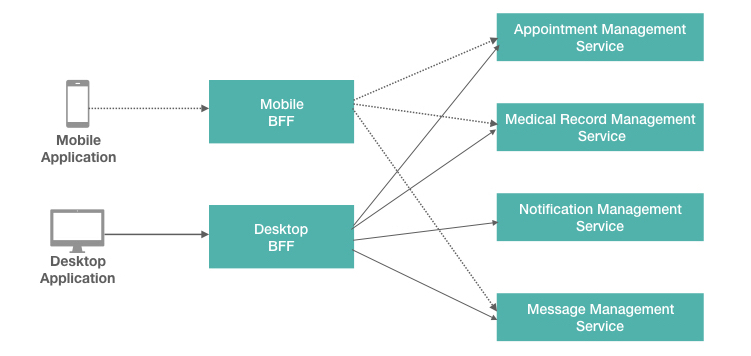

# Backend For Frontend

Backend For Frontend(BFF) is a service design pattern with the core idea of creating separate backend service for specific frontend application. This pattern will allow  each type of user experience to have separate backend service layer(shim). The design pattern has its own advantages and disadvantages and the usage is very much depending on the use case and the requirements [[1](https://samnewman.io/patterns/architectural/bff/)] ,[[2](http://philcalcado.com/2015/09/18/the_back_end_for_front_end_pattern_bff.html)]. 

> In this guide you will learn about using  Backend For Frontend(BFF) design pattern with Ballerina. 

The following are the sections available in this guide.

- [What you'll build](#what-youll-build)
- [Prerequisites](#prerequisites)
- [Implementation](#implementation)
- [Testing](#testing)
- [Deployment](#deployment)
- [Observability](#observability)

## What you’ll build
Let’s take a real world use case of online healthcare management system to understand how BFF works. A health care provider have a Desktop Application and a Mobile Application for their users to have better online experience. Once the user login to the Desktop application the home page information shown in Desktop application and Mobile application may vary. Specially the resource limitations in mobile device such as screen size, battery life and data usage cause the mobile application to show minimal viable information to the end user. Same time the Desktop counterpart can afford more information and do multiple network calls to get required data in place. Different requirements in each application will lead to have a separate BFF for each application. Here the BFF layer consumes existing downstream services and act as a shim to translate the required information for each user experience. Following diagram demonstrates the use case with two BFF services.



In this use case we have two applications called Desktop Application and Mobile Application. For each application, there is specific backend service (BFF) called Desktop BFF and Mobile BFF respectively. These BFFs consumes set of downstream services called Appointment Management Service, Medical Record Management Service, Notification Management Service and Message Management Service.  In this guide, Ballerina is used to build both BFF layer and downstream service layer.

## Prerequisites

- [Ballerina Distribution](https://ballerina.io/learn/getting-started/)
- A Text Editor or an IDE

### Optional requirements
- Ballerina IDE plugins ([IntelliJ IDEA](https://plugins.jetbrains.com/plugin/9520-ballerina), [VSCode](https://marketplace.visualstudio.com/items?itemName=ballerina.ballerina), [Atom](https://atom.io/packages/language-ballerina))
- [Docker](https://docs.docker.com/engine/installation/)
- [Kubernetes](https://kubernetes.io/docs/setup/)

## Implementation

> If you want to skip the basics, you can download the git repo and directly move to the "Testing" section by skipping  "Implementation" section.

### Create the project structure

Ballerina is a complete programming language that supports custom project structures. Let's use the following package structure for this guide.

```
backend-for-frontend
  └── guide
      ├── appointment_mgt
      │   ├── appointment_mgt_service.bal
      │   └── tests
      │       └── appointment_mgt_service_test.bal
      ├── medical_record_mgt
      │   ├── medical_record_mgt_service.bal
      │   └── tests
      │       └── medical_record_mgt_service_test.bal
      ├── notification_mgt
      │   ├── notification_mgt_service.bal
      │   └── tests
      │       └── notification_mgt_service_test.bal
      ├── message_mgt
      │   ├── message_mgt_service.bal
      │   └── tests
      │       └── message_mgt_service_test.bal
      ├── mobile_bff
      │   ├── mobile_bff_service.bal
      │   └── tests
      │       └── mobile_bff_service_test.bal
      ├── desktop_bff
      │   ├── desktop_bff_service.bal
      │   └── tests
      │       └── desktop_bff_service_test.bal
      └── sample_data_publisher
          └── sample_data_publisher.bal
```

- Create the above directories in your local machine and also create empty `.bal` files.

- Then open the terminal and navigate to `backend-for-frontend/guide` and run Ballerina project initializing toolkit.
```bash
   $ ballerina init
```

### Developing the service

Let's implement the set of downstream services first.  

Appointment Management Service (appointment_mgt_service) is a REST API developed to manage health appointments for the members. For demonstration purpose it has a in-memory map to hold appointment data. It has capability to add appointments and retrieve appointments. 

##### Skeleton code for appointment_mgt_service.bal
```ballerina
import ballerina/http;

endpoint http:Listener listener {
   port: 9092
};

// Appointment management is done using an in-memory map.
// Add some sample appointments to 'appointmentMap' at startup.
map<json> appointmentMap;

// RESTful service.
@http:ServiceConfig { basePath: "/appointment-mgt" }
service<http:Service> appointment_service bind listener {

   @http:ResourceConfig {
       methods: ["POST"],
       path: "/appointment"
   }
   addAppointment(endpoint client, http:Request req) {
    // implementation  
   }

   @http:ResourceConfig {
       methods: ["GET"],
       path: "/appointment/list"
   }
   getAppointments(endpoint client, http:Request req) {
    // implementation       
   }

}
```

Medical Record Management Service (medical_record_mgt_service) is a REST API developed to manage medical records for the members. For demonstration purpose it has a in-memory map to hold medical record.  It has capability to add medical records and retrieve them. 

##### Skeleton code for medical_record_mgt_service.bal
```ballerina
import ballerina/http;

endpoint http:Listener listener {
   port: 9093
};

// Medical Record management is done using an in-memory map.
// Add some sample Medical Records to 'medicalRecordMap' at startup.
map<json> medicalRecordMap;

// RESTful service.
@http:ServiceConfig { basePath: "/medical-records" }
service<http:Service> medical_record_service bind listener {

   @http:ResourceConfig {
       methods: ["POST"],
       path: "/medical-record"
   }
   addMedicalRecord(endpoint client, http:Request req) {
       // Implementation 
   }
 
   @http:ResourceConfig {
       methods: ["GET"],
       path: "/medical-record/list"
   }
   getMedicalRecords(endpoint client, http:Request req) {
       // Implementation 
   }
 
}

```

Notification Management Service (notification_mgt_service) is a REST API developed to manage notifications. For demonstration purpose it has a in-memory map to hold notifications.  It has capability to add notifications and retrieve them. 

##### Skeleton code for notification_mgt_service.bal
```ballerina
import ballerina/http;

endpoint http:Listener listener {
   port: 9094
};

// Notification management is done using an in-memory map.
// Add some sample notifications to 'notificationMap' at startup.
map<json> notificationMap;


// RESTful service.
@http:ServiceConfig { basePath: "/notification-mgt" }
service<http:Service> notification_service bind listener {

   @http:ResourceConfig {
       methods: ["POST"],
       path: "/notification"
   }
   addNotification(endpoint client, http:Request req) {
       // Implementation 
   }


   @http:ResourceConfig {
       methods: ["GET"],
       path: "/notification/list"
   }
   getNotifications(endpoint client, http:Request req) {
       // Implementation 
   }


}

```

Message Management Service (message_mgt_service) is a REST API developed to manage messages. For demonstration purpose it has a in-memory map to hold messages.  It has capability to add messages, retrieve all messages and retrieve unread messages. 

##### Skeleton code for message_mgt_service.bal
```ballerina

import ballerina/http;

endpoint http:Listener listener {
   port: 9095
};

// Message management is done using an in-memory map.
// Add some sample messages to 'messageMap' at startup.
map<json> messageMap;


// RESTful service.
@http:ServiceConfig { basePath: "/message-mgt" }
service<http:Service> message_service bind listener {

   @http:ResourceConfig {
       methods: ["POST"],
       path: "/message"
   }
   addMessage(endpoint client, http:Request req) {

      // Implementation 
   }

   @http:ResourceConfig {
       methods: ["GET"],
       path: "/message/list"
   }
   getMessages(endpoint client, http:Request req) {
       // Implementation 
   }

   @http:ResourceConfig {
       methods: ["GET"],
       path: "/unread-message/list"
   }
   getUnreadMessages(endpoint client, http:Request req) {
       // Implementation 

}

```

Now let’s move into the key implementation of this guide which is the BFF implementation. 

Mobile BFF(mobile_bff_service) is a shim used to support Mobile user experience in this use case. When loading mobile application home page, it calls a single resource in Mobile BFF and retrieve appointments, medical records and messages. This will reduce number of backend calls and help to load the home pages in much efficient way. Also the mobile apps having different method of sending notifications hence home page loading does not need to involve notification management service. 

##### Skeleton code for mobile_bff_service.bal
```ballerina

import ballerina/http;

endpoint http:Listener listener {
   port: 9090
};

// Client endpoint to communicate with appointment management service
endpoint http:Client appointmentEP {
   url: "http://localhost:9092/appointment-mgt"
};

// Client endpoint to communicate with medical record service
endpoint http:Client medicalRecordEP {
   url: "http://localhost:9093/medical-records"
};

// Client endpoint to communicate with message management service
endpoint http:Client messageEP {
   url: "http://localhost:9095/message-mgt"
};


// RESTful service.
@http:ServiceConfig { basePath: "/mobile-bff" }
service<http:Service> mobile_bff_service bind listener {

   @http:ResourceConfig {
       methods: ["GET"],
       path: "/profile"
   }
   getUserProfile(endpoint client, http:Request req) {

       // Call Appointment API and get appointment list

       // Call Medical Record API and get medical record list

       // Call Message API and get unread message list

       // Aggregate the responses 

       // Send response to the client.
      
   }

   // This API may have more resources for other functionalities
}

```

Desktop BFF(desktop_bff_service) is a shim used to support Desktop application user experience in this use case. When loading desktop application home page, it can offered to do multiple calls to its desktop_bff_service and retrieve comparatively large amount of data as per desktop application requirements.  In this use case, Desktop application will call Desktop BFF separately to retrieve appointments and medical records. Also it will call Desktop BFF to retrieve Messages and Notifications in a single call. 

##### Skeleton code for desktop_bff_service.bal
```ballerina

import ballerina/http;

endpoint http:Listener listener {
   port: 9091
};

// Client endpoint to communicate with appointment management service
endpoint http:Client appointmentEP {
   url: "http://localhost:9092/appointment-mgt"
};

// Client endpoint to communicate with medical record service
endpoint http:Client medicalRecordEP {
   url: "http://localhost:9093/medical-records"
};

// Client endpoint to communicate with notification management service
endpoint http:Client notificationEP {
   url: "http://localhost:9094/notification-mgt"
};

// Client endpoint to communicate with message management service
endpoint http:Client messageEP {
   url: "http://localhost:9095/message-mgt"
};


// RESTful service.
@http:ServiceConfig { basePath: "/desktop-bff" }
service<http:Service> desktop_bff_service bind listener {

   @http:ResourceConfig {
       methods: ["GET"],
       path: "/alerts"
   }
   getAlerts(endpoint client, http:Request req) {

       // This will return all message and notifications

       // Call Notification API and get notification list

       // Call Message API and get full message list

       // Generate the response from notification and message aggregation 

       // Send response to the client.  
    }

   @http:ResourceConfig {
       methods: ["GET"],
       path: "/appointments"
   }
   getAppoinments(endpoint client, http:Request req) {
       // Call Appointment API and get appointment list

       // Generate the response
      
       // Send response to the client.
           
   }
   @http:ResourceConfig {
       methods: ["GET"],
       path: "/medical-records"
   }
   getMedicalRecords(endpoint client, http:Request req) {

       // Call Medical Record API and get medical record list
    
       // Generate the response

       // Send response to the client.
   }

   // This API may have more resources for other functionalities
}

```

## Testing

### Invoking the service

Navigate to BFF/guide and run following commands in separate terminals to start all downstream services. These commands will start appointment_mgt_service, appointment_mgt_service, notification_mgt_service and notification_mgt_service on ports 9092, 9093, 9094 and 9095 respectively. 

```bash
   $ ballerina run appointment_mgt 
```

```bash
   $ ballerina run medical_record_mgt
```

```bash
   $ ballerina run notification_mgt
```

```bash
   $ ballerina run message_mgt
```

Similarly run bellow commands to start the BFF layer services. These commands will start mobile_bff_service and desktop_bff_service on ports 9090 and 9091 respectively. 


```bash
   $ ballerina run mobile_bff 
```

```bash
   $ ballerina run desktop_bff
```

For demonstration purpose let’s add some data to downstream services. Use following command to load some appointments, medical records, notifications and messages to the services. 

```bash
   $ ballerina run sample_data_publisher
```

Now we have some data loaded into the downstream services hence we can call the BFF layer to retrieve the data as per the requirement. 

Mobile application can call Mobile BFF to retrieve the user profile using a single API call. Following is a sample CURL commands. 

```bash
   $ curl -v -X GET http://localhost:9090/mobile-bff/profile

   Output:

   < HTTP/1.1 200 OK
   < content-type: application/json
   < content-length: 900
   < server: ballerina/0.980.1
 
   {
   "Appointments":[{"ID":"APT01","Name":"Family Medicine","Location":"Main Hospital","Time":"2018-08-23, 08.30AM","Description":"Doctor visit for family medicine"},{"ID":"APT02","Name":"Lab Test Appointment","Location":"Main Lab","Time":"2018-08-20, 07.30AM","Description":"Blood test"}],
   "MedicalRecords":[{"ID":"MED01","Name":"Fasting Glucose Test","Description":"Test Result for Fasting Glucose test is normal"},{"ID":"MED02","Name":"Allergies","Description":"Allergy condition recorded due to Summer allergies"}],
   "Messages":[{"ID":"MSG02","From":"Dr. Sandra Robert","Subject":"Regarding flu season","Content":"Dear member, We highly recommend you to get the flu vaccination to prevent yourself from flu","Status":"Unread"},{"ID":"MSG03","From":"Dr. Peter Mayr","Subject":"Regarding upcoming blood test","Content":"Dear member, Your Glucose test is scheduled in early next month","Status":"Unread"}]
   }
  
```

Desktop application can call Desktop BFF to render user profile using few API calls. Following are set of CURL commands which can use to invoke Desktop BFF. 

```bash
   $ curl -v -X GET http://localhost:9091/desktop-bff/appointments

   Output:

   < HTTP/1.1 200 OK
   < content-type: application/json
   < content-length: 286
   < server: ballerina/0.980.1

   {"Appointments":[{"ID":"APT01","Name":"Family Medicine","Location":"Main Hospital","Time":"2018-08-23, 08.30AM","Description":"Doctor visit for family medicine"},{"ID":"APT02","Name":"Lab Test Appointment","Location":"Main Lab","Time":"2018-08-20, 07.30AM","Description":"Blood test"}]}

```

```bash
   $ curl -v -X GET http://localhost:9091/desktop-bff/medical-records

   Output:

   < HTTP/1.1 200 OK
   < content-type: application/json
   < content-length: 229
   < server: ballerina/0.980.1

   {"MedicalRecords":[{"ID":"MED01","Name":"Fasting Glucose Test","Description":"Test Result for Fasting Glucose test is normal"},{"ID":"MED02","Name":"Allergies","Description":"Allergy condition recorded due to Summer allergies"}]}

```

```bash
   $ curl -v -X GET http://localhost:9091/desktop-bff/alerts

   Output:
   
   < HTTP/1.1 200 OK
   < content-type: application/json
   < content-length: 761
   < server: ballerina/0.980.1

   {
   "Notifications":[{"ID":"NOT01","Name":"Lab Test Result Notification","Description":"Test Result of Glucose test is ready"},{"ID":"NOT02","Name":"Flu Vaccine Status","Description":"Flu vaccines due for this year"}],
   "Messages":[{"ID":"MSG01","From":"Dr. Caroline Caroline","Subject":"Regarding Glucose test result","Content":"Dear member, your test result remain normal","Status":"Read"},{"ID":"MSG02","From":"Dr. Sandra Robert","Subject":"Regarding flu season","Content":"Dear member, We highly recommend you to get the flu vaccination to prevent yourself from flu","Status":"Unread"},{"ID":"MSG03","From":"Dr. Peter Mayr","Subject":"Regarding upcoming blood test","Content":"Dear member, Your Glucose test is scheduled in early next month","Status":"Unread"}]
   }

```


### Writing unit tests

In Ballerina, the unit test cases should be in the same package inside a folder named as 'tests'. When writing the test functions, follow the convention given below.
- Test functions should be annotated with `@test:Config`. See the following example.
```ballerina
   @test:Config
   function testResourceGetUserProfile() {
```

The source code for this guide contains unit test cases for each resource available in the BFF services implemented above.

To run the unit tests, open your terminal and navigate to `backend-for-frontend/guide`, and run the following command.
```bash
   $ ballerina test
```

> The source code for the tests can be found at [mobile_bff_service_test.bal](https://github.com/ranga-siriwardena/backend-for-frontend/blob/master/guide/mobile-bff/tests/mobile_bff_service_test.bal) and [desktop_bff_service_test.bal](https://github.com/ranga-siriwardena/backend-for-frontend/blob/master/guide/desktop-bff/tests/desktop_bff_service_test.bal).


## Deployment

Once you are done with the development, you can deploy the services using any of the methods listed below.

### Deploying locally

- As the first step, you can build Ballerina executable archives (.balx) of the services that we developed above. Navigate to `backend-for-frontend/guide` and run the following command.
```bash
   $ ballerina build <Package_Name>
```

- Once the .balx files are created inside the target folder, you can run them using the following command.
```bash
   $ ballerina run target/<Exec_Archive_File_Name>
```

- The successful execution of a services will show us something similar to the following output.
```
   ballerina: initiating service(s) in 'target/<Exec_Archive_File_Name>'
   ballerina: started HTTP/WS endpoint 0.0.0.0:9090
```

### Deploying on Docker

You can run the service that we developed above as a Docker container. As Ballerina platform includes [Ballerina_Docker_Extension](https://github.com/ballerinax/docker), which offers native support for running ballerina programs on containers, you just need to put the corresponding Docker annotations on your service code.

Let’s deploy the four downstream services to Docker first. 

 - In our downstream services(appointment_mgt_service, medical_record_mgt_service, notification_mgt_service, and message_mgt_service) we need to import ballerinax/docker and use the annotation @docker:Config as shown below to enable Docker image generation during the build time. We will use appointment_mgt_service as a example here and you need to follow the same step for all four services. 

##### Skeleton code for appointment_mgt_service.bal
```ballerina
import ballerina/http;
import ballerinax/docker;

@docker:Config {
    registry:"ballerina.guides.io",
    name:"appointment_mgt_service",
    tag:"v1.0"
}

@docker:Expose{}
endpoint http:Listener listener {
    port: 9092
};

map<json> appointmentMap;


// RESTful service.
@http:ServiceConfig { basePath: "/appointment-mgt" }
service<http:Service> appointment_mgt_service bind listener {
....
```

Now you can build Ballerina executable archives (.balx) of the services that we developed above, using following commands. This will also create the corresponding Docker images using the Docker annotations that you have configured above. Navigate to backend-for-frontend/guide and run the following command.

```
   $ballerina build appointment_mgt

   Output:

   Generating executable
    ./target/appointment_mgt.balx
	@docker 		 - complete 3/3 

	Run following command to start docker container:
	docker run -d -p 9092:9092 ballerina.guides.io/appointment_mgt_service:v1.0
```

- Once you successfully build the Docker images, you can run them with the `` docker run`` command that is shown in the previous step output section. Here we run the Docker images with flag`` -p <host_port>:<container_port>`` argument to map host port with container port which will allow you to access the services through the host port. Also we can use ``–name`` argument to define container name which will later allow BFF Docker containers to communicate with downstream services. Following are the sample commands to start all services in Docker. 


```bash
   $ docker run -d -p 9092:9092 --name appointment-mgt-container ballerina.guides.io/appointment_mgt_service:v1.0
```
```bash
   $ docker run -d -p 9093:9093 --name medical-record-mgt-container ballerina.guides.io/medical_record_mgt_service:v1.0
```
```bash
   $ docker run -d -p 9094:9094 --name notification-mgt-container ballerina.guides.io/notification_mgt_service:v1.0
```
```bash
   $ docker run -d -p 9095:9095 --name message-mgt-container ballerina.guides.io/message_mgt_service:v1.0
```


Let's see how we can deploy the mobile_bff_service and desktop_bff_service we developed above on Docker. When invoking this service make sure that the other four services (appointment_mgt_service, medical_record_mgt_service, notification_mgt_service, and message_mgt_service) are also up and running in Docker. Also we have to change the endpoint URLs as per the Docker container names which is given when starting downstream services in previous step. 


- In our mobile_bff_service and desktop_bff_service, we need to import ballerinax/docker and use the annotation @docker:Config as shown below to enable Docker image generation during the build time.

##### Skeleton code for mobile_bff_service.bal
```ballerina
import ballerina/http;
import ballerinax/docker;

@docker:Config {
   registry:"ballerina.guides.io",
   name:"mobile_bff_service",
   tag:"v1.0"
}

@docker:Expose{}
endpoint http:Listener listener {
   port: 9090
};

// Client endpoint to communicate with appointment management service
endpoint http:Client appointmentEP {
    url: "http://appointment-mgt-container:9092/appointment-mgt"
};

// Client endpoint to communicate with medical record service
endpoint http:Client medicalRecordEP {
    url: "http://medical-record-mgt-container:9093/medical-records"
};

// Client endpoint to communicate with message management service
endpoint http:Client messageEP {
    url: "http://message-mgt-container:9095/message-mgt"
};

// RESTful service.
@http:ServiceConfig { basePath: "/mobile-bff" }
service<http:Service> mobile_bff_service bind listener {
....
```

##### Skeleton code for desktop_bff_service.bal
```ballerina
import ballerina/http;
import ballerinax/docker;


@docker:Config {
    registry:"ballerina.guides.io",
    name:"desktop_bff_service",
    tag:"v1.0"
}

@docker:Expose{}
endpoint http:Listener listener {
    port: 9091
};

// Client endpoint to communicate with appointment management service
endpoint http:Client appointmentEP {
    url: "http://appointment-mgt-container:9092/appointment-mgt"
};

// Client endpoint to communicate with medical record service
endpoint http:Client medicalRecordEP {
    url: "http://medical-record-mgt-container:9093/medical-records"
};

// Client endpoint to communicate with notification management service
endpoint http:Client notificationEP {
    url: "http://notification-mgt-container:9094/notification-mgt"
};

// Client endpoint to communicate with message management service
endpoint http:Client messageEP {
    url: "http://message-mgt-container:9095/message-mgt"
};

// RESTful service.
@http:ServiceConfig { basePath: "/desktop-bff" }
service<http:Service> desktop_bff_service bind listener {
....
```


- Now you can build Ballerina executable archives (.balx) of the services that we developed above, using following commands. This will also create the corresponding Docker images using the Docker annotations that you have configured above. Navigate to backend-for-frontend/guide and run the following command.

```
   $ballerina build mobile_bff

   Output: 
   
   Generating executable
    ./target/mobile_bff.balx
	@docker 		 - complete 3/3 

	Run following command to start docker container:
	docker run -d -p 9090:9090 ballerina.guides.io/mobile_bff_service:v1.0
```

```
   $ballerina build desktop_bff

   Output:
   
   Generating executable
    ./target/desktop_bff.balx
        @docker                  - complete 3/3

        Run following command to start docker container:
        docker run -d -p 9091:9091 ballerina.guides.io/desktop_bff_service:v1.0
```


- Once you successfully build the Docker images, you can run them with the `` docker run`` command that is shown in the previous step output section. Here we run the Docker images with flag`` -p <host_port>:<container_port>``. So that we use the host port 9090 and the container port 9090 for mobile_bff_service and we use the host port 9091 and the container port 9091 for desktop_bff_service. Therefore you can access the services through the host port. Also you can link these BFF services to previously deployed downstream services by adding ``--link``  option so that the BFF services can communicate to downstream services. 

```bash
   $ docker run -d -p 9090:9090 --name mobile-bff-container --link appointment-mgt-container --link medical-record-mgt-container  --link message-mgt-container ballerina.guides.io/mobile_bff_service:v1.0
```

```bash
   $ docker run -d -p 9091:9091 --name desktop-bff-container --link appointment-mgt-container --link medical-record-mgt-container  --link notification-mgt-container --link message-mgt-container ballerina.guides.io/desktop_bff_service:v1.0
```


- Verify Docker container is running with the use of `` $ docker ps`` command. The status of the Docker container should be shown as 'Up'.

```bash
   $ docker ps

   Output: 

   CONTAINER ID        IMAGE                                                 COMMAND                  CREATED              STATUS              PORTS                    NAMES
   4f85a06c1556        ballerina.guides.io/desktop_bff_service:v1.0          "/bin/sh -c 'balleri…"   3 seconds ago        Up 2 seconds        0.0.0.0:9091->9091/tcp   desktop-bff-container
   4e309c368da9        ballerina.guides.io/mobile_bff_service:v1.0           "/bin/sh -c 'balleri…"   About a minute ago   Up About a minute   0.0.0.0:9090->9090/tcp   mobile-bff-container
   6c531a26073b        ballerina.guides.io/message_mgt_service:v1.0          "/bin/sh -c 'balleri…"   4 minutes ago        Up 4 minutes        0.0.0.0:9095->9095/tcp   message-mgt-container
   a59928647216        ballerina.guides.io/notification_mgt_service:v1.0     "/bin/sh -c 'balleri…"   4 minutes ago        Up 4 minutes        0.0.0.0:9094->9094/tcp   notification-mgt-container
   afc7548a1548        ballerina.guides.io/medical_record_mgt_service:v1.0   "/bin/sh -c 'balleri…"   4 minutes ago        Up 4 minutes        0.0.0.0:9093->9093/tcp   medical-record-mgt-container
   0df660f601a2        ballerina.guides.io/appointment_mgt_service:v1.0      "/bin/sh -c 'balleri…"   4 minutes ago        Up 4 minutes        0.0.0.0:9092->9092/tcp   appointment-mgt-container

```

- Now we can publish some data to downstream services so that we consume from BFF layer.  

```bash
   $ ballerina run sample_data_publisher
```

- You can access the service using the same curl commands that we've used above.

```bash
   $ curl -v -X GET http://localhost:9090/mobile-bff/profile

   $ curl -v -X GET http://localhost:9091/desktop-bff/appointments

   $ curl -v -X GET http://localhost:9091/desktop-bff/medical-records

   $ curl -v -X GET http://localhost:9091/desktop-bff/alerts
```

### Deploying on Kubernetes

- You can run the services that we developed above, on Kubernetes. The Ballerina language offers native support for running a ballerina programs on Kubernetes, with the use of Kubernetes annotations that you can include as part of your service code. Also, it will take care of the creation of the Docker images. So you don't need to explicitly create Docker images prior to deploying it on Kubernetes. Refer to [Ballerina_Kubernetes_Extension](https://github.com/ballerinax/kubernetes) for more details and samples on Kubernetes deployment with Ballerina. You can also find details on using Minikube to deploy Ballerina programs.

- Let's now see how we can deploy our BFFs on Kubernetes. When invoking this service make sure that the other four services (appointment_mgt_service, medical_record_mgt_service, notification_mgt_service, and message_mgt_service) are also up and running.

- First we need to import `ballerinax/kubernetes` and use `@kubernetes` annotations as shown below to enable kubernetes deployment for the services we developed above.

> NOTE: You can use Minikube to try this out locally.

##### Skeleton code for mobile_bff_service.bal
```ballerina
import ballerina/http;
import ballerinax/kubernetes;

@kubernetes:Ingress {
  hostname:"ballerina.guides.io",
  name:"ballerina-guides-mobile-bff-service",
  path:"/"
}

@kubernetes:Service {
  serviceType:"NodePort",
  name:"ballerina-guides-mobile-bff-service"
}

@kubernetes:Deployment {
  image:"ballerina.guides.io/mobile_bff_service:v1.0",
  name:"ballerina-guides-mobile-bff-service"
}

endpoint http:Listener listener {
   port: 9090
};

// http:Client endpoint definitions to communicate with other services

// RESTful service.
@http:ServiceConfig { basePath: "/mobile-bff" }
service<http:Service> mobile_bff_service bind listener {
....
```

##### Skeleton code for desktop_bff_service.bal
```ballerina
import ballerina/http;
import ballerinax/kubernetes;

@kubernetes:Ingress {
  hostname:"ballerina.guides.io",
  name:"ballerina-guides-desktop-bff-service",
  path:"/"
}

@kubernetes:Service {
  serviceType:"NodePort",
  name:"ballerina-guides-desktop-bff-service"
}

@kubernetes:Deployment {
  image:"ballerina.guides.io/desktop_bff_service:v1.0",
  name:"ballerina-guides-desktop-bff-service"
}

endpoint http:Listener listener {
    port: 9091
};

// http:Client endpoint definitions to communicate with other services

// RESTful service.
// RESTful service.
@http:ServiceConfig { basePath: "/desktop-bff" }
service<http:Service> desktop_bff_service bind listener {
....
```

- Here we have used ``  @kubernetes:Deployment `` to specify the Docker image name that will be created as part of building this service.
- We have also specified `` @kubernetes:Service `` so that it will create a Kubernetes service, which will expose the Ballerina service that is running on a Pod.
- In addition we have used `` @kubernetes:Ingress ``, which is the external interface to access your service (with path `` /`` and host name ``ballerina.guides.io``)

If you are using Minikube, you need to set a couple of additional attributes to the `@kubernetes:Deployment` annotation.
- `dockerCertPath` - The path to the certificates directory of Minikube (e.g., `/home/ballerina/.minikube/certs`).
- `dockerHost` - The host for the running cluster (e.g., `tcp://192.168.99.100:2376`). The IP address of the cluster can be found by running the `minikube ip` command.

- Now you can build a Ballerina executable archive (.balx) of the service that we developed above, using the following command. This will also create the corresponding Docker image and the Kubernetes artifacts using the Kubernetes annotations that you have configured above.

```
   $ ballerina build mobile_bff

   Output: 
     Run following command to deploy kubernetes artifacts: 
     kubectl apply -f ./target/kubernetes/mobile_bff
```

```
   $ ballerina build desktop_bff

   Output:
     Run following command to deploy kubernetes artifacts:
     kubectl apply -f ./target/kubernetes/desktop_bff
```

- You can verify that the Docker image that we specified in `` @kubernetes:Deployment `` is created, by using `` docker images ``.
- Also the Kubernetes artifacts related our service, will be generated under `` ./target/kubernetes``.
- Now you can create the Kubernetes deployment using:

```bash
   $ kubectl apply -f ./target/kubernetes/mobile_bff

   Output: 

   deployment.extensions "ballerina-guides-mobile-bff-service" configured
   ingress.extensions "ballerina-guides-mobile-bff-service" configured
   service "ballerina-guides-mobile-bff-service" configured
```

```bash
   $ kubectl apply -f ./target/kubernetes/desktop_bff

   Output: 

   deployment.extensions "ballerina-guides-desktop-bff-service" configured
   ingress.extensions "ballerina-guides-desktop-bff-service" configured
   service "ballerina-guides-desktop-bff-service" configured
```

- You can verify Kubernetes deployment, service and ingress are running properly, by using following Kubernetes commands.

```bash
   $ kubectl get service
   $ kubectl get deploy
   $ kubectl get pods
   $ kubectl get ingress
```

- If everything is successfully deployed, you can invoke the service either via Node port or ingress.

Node Port:
```bash
   $ curl -v -X GET http://localhost:<Node_Port>/mobile-bff/profile
```
```bash
   $ curl -v -X GET http://localhost:<Node_Port>/desktop-bff/alerts
```

If you are using Minikube, you should use the IP address of the Minikube cluster obtained by running the `minikube ip` command. The port should be the node port given when running the `kubectl get services` command.

Ingress:

Add `/etc/hosts` entry to match hostname. For Minikube, the IP address should be the IP address of the cluster.
```
   127.0.0.1 ballerina.guides.io
```

Access the service
```bash
   $ curl -v -X GET http://ballerina.guides.io/mobile-bff/profile
```

```bash
   $ curl -v -X GET http://ballerina.guides.io/desktop-bff/alerts
```

## Observability
Ballerina is by default observable. Meaning you can easily observe your services, resources, etc.
However, observability is disabled by default via configuration. Observability can be enabled by adding following configurations to `ballerina.conf` file and starting the ballerina service using it. A sample configuration file can be found in `backend-for-frontend/guide/mobile_bff/`.

```ballerina
[b7a.observability]

[b7a.observability.metrics]
# Flag to enable Metrics
enabled=true

[b7a.observability.tracing]
# Flag to enable Tracing
enabled=true
```

To start the ballerina services using the configuration file, run the following command

```
   $ ballerina run --config mobile_bff/ballerina.conf mobile_bff
```
```
   $ ballerina run --config desktop_bff/ballerina.conf desktop_bff
```
NOTE: The above configuration is the minimum configuration needed to enable tracing and metrics. With these configurations default values are load as the other configuration parameters of metrics and tracing.

### Tracing

You can monitor ballerina services using in built tracing capabilities of Ballerina. We'll use [Jaeger](https://github.com/jaegertracing/jaeger) as the distributed tracing system.
Follow the following steps to use tracing with Ballerina.

- You can add the following configurations for tracing. Note that these configurations are optional if you already have the basic configuration in `ballerina.conf` as described above.
```
   [b7a.observability]

   [b7a.observability.tracing]
   enabled=true
   name="jaeger"

   [b7a.observability.tracing.jaeger]
   reporter.hostname="localhost"
   reporter.port=5775
   sampler.param=1.0
   sampler.type="const"
   reporter.flush.interval.ms=2000
   reporter.log.spans=true
   reporter.max.buffer.spans=1000
```

- Run Jaeger Docker image using the following command
```bash
   $ docker run -d -p5775:5775/udp -p6831:6831/udp -p6832:6832/udp -p5778:5778 \
     -p16686:16686 -p14268:14268 jaegertracing/all-in-one:latest
```

- Navigate to `backend-for-frontend/guide` and run the `mobile_bff_service` and `desktop_bff_service` using the following command
```
   $ ballerina run --config mobile_bff/ballerina.conf mobile_bff
```
```
   $ ballerina run --config desktop_bff/ballerina.conf desktop_bff
```

- Observe the tracing using Jaeger UI using following URL
```
   http://localhost:16686
```

### Metrics
Metrics and alerts are built-in with ballerina. We will use Prometheus as the monitoring tool.
Follow the below steps to set up Prometheus and view metrics for BFF services.

- You can add the following configurations for metrics. Note that these configurations are optional if you already have the basic configuration in `ballerina.conf` as described under `Observability` section.

```
   [b7a.observability.metrics]
   enabled=true
   reporter="prometheus"

   [b7a.observability.metrics.prometheus]
   port=9797
   host="0.0.0.0"
```

- Create a file `prometheus.yml` inside `/tmp/` location. Add the below configurations to the `prometheus.yml` file.
```
   global:
     scrape_interval:     15s
     evaluation_interval: 15s

   scrape_configs:
     - job_name: prometheus
       static_configs:
         - targets: ['172.17.0.1:9797']
```

   NOTE : Replace `172.17.0.1` if your local Docker IP differs from `172.17.0.1`

- Run the Prometheus Docker image using the following command
```
   $ docker run -p 19090:9090 -v /tmp/prometheus.yml:/etc/prometheus/prometheus.yml \
   prom/prometheus
```

- Navigate to `backend-for-frontend/guide` and run the `mobile_bff_service` and `desktop_bff_service` using following commands.
```
  $ ballerina run --config mobile_bff/ballerina.conf mobile_bff
```
```
  $ ballerina run --config desktop_bff/ballerina.conf desktop_bff
```


- You can access Prometheus at the following URL
```
   http://localhost:19090/
```

NOTE:  Ballerina will by default have following metrics for HTTP server connector. You can enter following expression in Prometheus UI
-  http_requests_total
-  http_response_time


### Logging

Ballerina has a log package for logging to the console. You can import ballerina/log package and start logging. The following section will describe how to search, analyze, and visualize logs in real time using Elastic Stack.

- Start the Ballerina Service with the following command from `backend-for-frontend/guide`
```
   $ nohup ballerina run mobile_bff > ballerina.log &
```
   NOTE: This will write the console log to the `ballerina.log` file in the `backend-for-frontend/guide` directory

- Start Elasticsearch using the following command

```
   $ docker run -p 9200:9200 -p 9300:9300 -it -h elasticsearch --name \
   elasticsearch docker.elastic.co/elasticsearch/elasticsearch:6.2.2
```

   NOTE: Linux users might need to run `sudo sysctl -w vm.max_map_count=262144` to increase `vm.max_map_count`
  
- Start Kibana plugin for data visualization with Elasticsearch
```
   $ docker run -p 5601:5601 -h kibana --name kibana --link \
   elasticsearch:elasticsearch docker.elastic.co/kibana/kibana:6.2.2    
```

- Configure logstash to format the ballerina logs

i) Create a file named `logstash.conf` with the following content
```
input { 
 beats{
     port => 5044
 } 
}

filter { 
 grok{ 
     match => {
         "message" => "%{TIMESTAMP_ISO8601:date}%{SPACE}%{WORD:logLevel}%{SPACE}
         \[%{GREEDYDATA:package}\]%{SPACE}\-%{SPACE}%{GREEDYDATA:logMessage}"
     } 
 } 
}  

output { 
 elasticsearch{ 
     hosts => "elasticsearch:9200" 
     index => "store" 
     document_type => "store_logs" 
 } 
} 
```

ii) Save the above `logstash.conf` inside a directory named as `{SAMPLE_ROOT}\pipeline`
    
iii) Start the logstash container, replace the {SAMPLE_ROOT} with your directory name

```
$ docker run -h logstash --name logstash --link elasticsearch:elasticsearch \
-it --rm -v ~/{SAMPLE_ROOT}/pipeline:/usr/share/logstash/pipeline/ \
-p 5044:5044 docker.elastic.co/logstash/logstash:6.2.2
```
 
 - Configure filebeat to ship the ballerina logs

i) Create a file named `filebeat.yml` with the following content
```
filebeat.prospectors:
- type: log
  paths:
    - /usr/share/filebeat/ballerina.log
output.logstash:
  hosts: ["logstash:5044"] 
```
NOTE : Modify the ownership of filebeat.yml file using `$chmod go-w filebeat.yml`

ii) Save the above `filebeat.yml` inside a directory named as `{SAMPLE_ROOT}\filebeat`  

iii) Start the logstash container, replace the {SAMPLE_ROOT} with your directory name

```
$ docker run -v {SAMPLE_ROOT}/filbeat/filebeat.yml:/usr/share/filebeat/filebeat.yml \
-v {SAMPLE_ROOT}/guide/travel_agency/ballerina.log:/usr/share\
/filebeat/ballerina.log --link logstash:logstash docker.elastic.co/beats/filebeat:6.2.2
```

 - Access Kibana to visualize the logs using following URL
```
   http://localhost:5601
```

