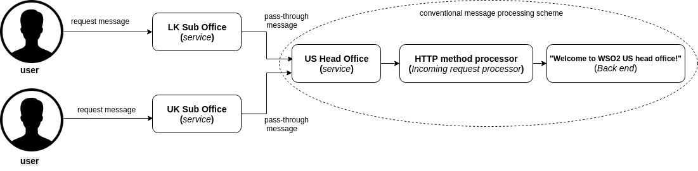

# Pass-through messaging

There are different ways of messaging methods in SOA(Service Oriented Architecture). In this guide we wre focusing on pass-through Messaging between services using example scenario

> This guide describes implementing pass-through messaging using Ballerina programming language as simple steps

The following are the sections available in this guide.

- [What you'll build](#what-youll-build)
- [Prerequisites](#prerequisites)
- [Implementation](#implementation)
- [Testing](#testing)
- [Deployment](#deployment)
- [Observability](#observability)

## What you’ll build

There are diffretent ways of messsaging between services such as pass-through messaging, content-based Routing of messages, header-based Routing of messages, scatter-gather messaging. Almost all methods of messaging occurs delay in messaging while processsing of incommoing message, other than the pass-through messaging. when routing the message without processing/inspecting the message payload the most efficient way is the pass-through messaging. Here are some defferences about conventional message processing vs pass-through messaging.


Conventional message processing methods includes a message processor for process message, but pass-through messsaging skipped the message processor. So it saves the processig time and power and more efficient when camparing with other types.

Now let's get undersatnd about scenario which described here. The company owned two sub offices and head office as LKSubOffice, UKSubOffice and USHeadOffice. When you are connect to a sub office it will automatically redirected to the head office without any latency. To do so, here it used the pass-through messaging method.



The three offices implemented as three seperate services named 'LKSubOffice', 'UKSubOffice' and 'USHeadOffice'. When user calls to 'LKSubOffice' or 'UKSubOffice' using http request, the request redirected to the 'USHeadOffice' serive without processing the incomming request. If it processes the incomming request, it will nolonger a pass-through messaging. So 'LKSubOffice', 'UKSubOffice' services acts as pass-through messaging services. The 'USHeadOffice' service processes the incomming request method such as 'GET', 'POST'. Then call to the back end service, which will give the "Welcome to WSO2 US head office!" message. So the 'USHeadOffice' service is not a pass-through messaging service.

## Prerequisites
 
- [Ballerina Distribution](https://ballerina.io/learn/getting-started/)
- A Text Editor or an IDE 

### Optional Requirements
- Ballerina IDE plugins ([IntelliJ IDEA](https://plugins.jetbrains.com/plugin/9520-ballerina), [VSCode](https://marketplace.visualstudio.com/items?itemName=WSO2.Ballerina), [Atom](https://atom.io/packages/language-ballerina))
- [Docker](https://docs.docker.com/engine/installation/)
- [Kubernetes](https://kubernetes.io/docs/setup/)

## Implementation

> If you are well aware of the implementaion, you can diractly clone the git repository to your own device. Using that, you can skip the the "Implementation" section and straigh forward to "Teasting" section.    

### Create the project structure

Ballerina is a complete programming language that supports custom project structures. Use the following package structure for this guide.
```
 └── guide
     ├── passthrough
     │   └── passthrough.bal
     │  
     └── tests
         └── passthrough_test.bal

```

- Create the above directories in your local machine and also create empty `.bal` files.

- Then open the terminal and navigate to `Pass-through-messaging-ballerina-/guide` and run Ballerina project initializing toolkit.
```bash
   $ ballerina init
```

### Developing the service

To implement the scenario, let's started to implement the passthrough.bal, which is the main file in implementing. Refer to the code attached below. Inline comments added for better understanding.

##### passthrough.bal
```ballerina

import ballerina/http;
import ballerina/log;

//Define end-point for the sub offices as head office link
endpoint http:Client clientEP {
    url: "http://localhost:9092/USHeadOffice"
};

service<http:Service> LKSubOffice bind { port: 9090 } {
    // This service implement as a passthrough servise. So it allows all HTTP methods. So methods are not specified.
    @http:ResourceConfig {
        path: "/"
    }
    passthrough(endpoint caller, http:Request req) {
        // set log message as "the request will be directed to another service" in pass-through method.
        log:printInfo("You will be redirected to US head office from LK sub office  .......");
        //'Forward()' used to call the backend endpoint created above as pass-through method. In forward function,
        //it used the same HTTP method, which used to invoke the primary service.
        // The `forward()` function returns the response from the backend if there are no errors.
        var clientResponse = clientEP->forward("/", req);
        // Inorder to detect the errors in return output of the 'forward()' , it used 'match' to catch those kind of errors
        match clientResponse {
            // Returned response will directed to the outbound endpoint.
            http:Response res => {
                caller->respond(res)
                // If response contains errors, give the error message
                but { error e =>
                log:printError("Error sending response", err = e) };
            }
            // If there was an error, the 500 error response is constructed and sent back to the client.
            error err => {
                http:Response res = new;
                res.statusCode = 500;
                res.setPayload(err.message);
                caller->respond(res) but { error e =>
                log:printError("Error sending response", err = e) };
            }
        }
    }
}


// This service is also implemented as above service to undertand the scenario
service<http:Service> UKSubOffice bind { port: 9091 } {
    @http:ResourceConfig {
        path: "/"
    }
    passthrough(endpoint caller, http:Request req) {
        log:printInfo("You will be redirected to US head office from UK sub office  .......");
        var clientResponse = clientEP->forward("/", req);
        match clientResponse {
            http:Response res => {
                caller->respond(res) but { error e =>
                log:printError("Error sending response", err = e) };
            }
            error err => {
                http:Response res = new;
                res.statusCode = 500;
                res.setPayload(err.message);
                caller->respond(res) but { error e =>
                log:printError("Error sending response", err = e) };
            }
        }
    }
}


//Sample Head office servise service.
service<http:Service> USHeadOffice bind { port: 9092 } {
    //The helloResource only accepts requests made using the specified HTTP methods.
    @http:ResourceConfig {
        methods: ["POST", "GET"],
        path: "/"
    }
    helloResource(endpoint caller, http:Request req) {
        //Set log to view the status to know that the passthrough was successfull.
        log:printInfo("Now You are connected to US head office  .......");
        // Make the response for the request
        http:Response res = new;
        res.setPayload("Welcome to WSO2 US head office!");
        // Pass the response to the caller
        caller->respond(res)
        // Cath the errors occured while passing the response
        but { error e =>
        log:printError("Error sending response", err = e) };
    }
}

```
## Testing 

### Invoking the service

- Navigate to `pass-through` and run the following command in terminal to start  `passthrough.bal .

```bash
   $ ballerina run passthrough.bal
```
   
- Then you may have two options of request, when connecting to a sub office.

#### Case 1

- To connect to LK sub office

```bash

 $ curl -v http://localhost:9090/LKSubOffice -X GET

```
#### Output

When connecting to the LK sub office, the output will be the "Welcome to WSO2 US head office!" from the US head office.

```bash
< HTTP/1.1 200 OK
< content-type: text/plain
< date: Mon, 11 Jun 2018 18:09:21 +0530
< server: ballerina/0.970.1
< content-length: 31
< 
* Connection #0 to host localhost left intact
Welcome to WSO2 US head office!
```

To identify the message flow inside the services, there will be INFO in the notification channel.

```bash
2018-06-11 18:09:21,315 INFO  [] - You will be redirected to US head office from LK sub office  ....... 
2018-06-11 18:09:21,430 INFO  [] - Now You are connected to US head office  ....... 
```

#### Case 2

- To connect to UK sub office

```bash
 $ curl -v http://localhost:9091/UKSubOffice -X GET
```
#### Output

When connecting to the UK sub office, the output will be the "Welcome to WSO2 US head office!" from the US head office.

```bash
< HTTP/1.1 200 OK
< content-type: text/plain
< date: Mon, 11 Jun 2018 18:16:51 +0530
< server: ballerina/0.970.1
< content-length: 31
< 
* Connection #0 to host localhost left intact
Welcome to WSO2 US head office!
```

To identify the message flow inside the services, there will be INFO in the notification channel.

```bash
2018-06-11 18:16:51,396 INFO  [] - You will be redirected to US head office from UK sub office  ....... 
2018-06-11 18:16:51,497 INFO  [] - Now You are connected to US head office  ....... 

```

### Writing unit tests 

In Ballerina, the unit test cases should be in the same package inside a folder named as 'tests'.  When writing the test functions the below convention should be followed.
- Test functions should be annotated with `@test:Config`. See the below example.
```ballerina
   @test:Config
   function testLKSubOffice() {
   }
```
This guide contains unit test case for 'LKSubOffice' service and 'UKSubOffice' service in [passthrough_test.bal](https://github.com/sanethmaduranga/Pass-through-messaging-ballerina-/blob/master/guide/tests/passthrough_test.bal) file.
To run the unit tests, navigate to `Pass-through-messaging-ballerina-/guide/` and run the following command. 
```bash
   $ ballerina test
```

## Deployment

After the development process, you can deploy the services using below methods by selecting as you wish.

### Deploying locally

As the first step, you can build Ballerina executable archives (.balx) of the services that we developed above. Navigate to `Pass-through-messaging-ballerina-/guide` and run the following command.
```bash
   $ ballerina build
```

- Once the .balx files are created inside the target folder, you can run them using the following command. 
```bash
   $ ballerina run target/<Exec_Archive_File_Name>
```

- The successful execution of a service will show us something similar to the following output.
```
   ballerina: initiating service(s) in 'target/passthrough.balx'
   
```

### Deploying on Docker

You can run the service that we developed above as a docker container.
As Ballerina platform includes [Ballerina_Docker_Extension](https://github.com/ballerinax/docker), which offers native support for running ballerina programs on containers,
you just need to put the corresponding docker annotations on your service code.

- In our 'passthrough', we need to import  `ballerinax/docker` and use the annotation `@docker:Config,@docker:Expose` as shown below to enable docker image generation during the build time. 

##### passthrough.bal
```ballerina
import ballerina/http;
import ballerina/log;
import ballerinax/docker;

@docker:Expose {}
endpoint http:Listener LKSubOfficeEP {
    port:9090
};
@docker:Expose {}
endpoint http:Listener UKSubOfficeEP {
    port:9091
};
@docker:Expose {}
endpoint http:Listener USHeadOfficeEP {
    port:9092
};
//Define end-point for the sub offices as head office link
endpoint http:Client clientEP {
    url: "http://localhost:9092/USHeadOffice"
};

@docker:Config {
    registry:"ballerina.guides.io",
    name:"passthrough",
    tag:"v1.0"
}

service<http:Service> LKSubOffice bind LKSubOfficeEP {
.
.
.
}
service<http:Service> UKSubOffice bind UKSubOfficeEP {
.
.
}
service<http:Service> USHeadOffice bind USHeadOfficeEP {
.
.
``` 

- Now you can build a Ballerina executable archive (.balx) of the service that we developed above, using the following command. This will also create the corresponding docker image using the docker annotations that you have configured above. Navigate to `Pass-through-messaging-ballerina-/guide` and run the following command.  
  
```
   $ballerina build passthrough
  
   @docker                  - complete 3/3 

   Run following command to start docker container:
   docker run -d -p 9090:9090 -p 9091:9091 -p 9092:9092 ballerina.guides.io/passthrough:v1.0

```

- Once you successfully build the docker image, you can run it with the `` docker run`` command that is shown in the previous step.  

```bash
   $ docker run -d -p 9090:9090 -p 9091:9091 -p 9092:9092 ballerina.guides.io/passthrough:v1.0
```

   Here we run the docker image with flag`` -p <host_port>:<container_port>`` so that we use the host port 9090 and the container port 9090. Therefore you can access the service through the host port. 

- Verify docker container is running with the use of `` $ docker ps``. The status of the docker container should be shown as 'Up'. 
- You can access 'LKSubOffice' and 'UKSubOffice' services, using the same curl commands that we've used above. 
- for LK sub office
```bash
    curl -v http://localhost:9090/LKSubOffice -X GET
```
- for UK sub office 
```bash
    curl -v http://localhost:9091/UKSubOffice -X GET
```

### Deploying on Kubernetes

- You can run the service that we developed above, on Kubernetes. The Ballerina language offers native support for running a ballerina programs on Kubernetes, with the use of Kubernetes annotations that you can include as part of your service code. Also, it will take care of the creation of the docker images. So you don't need to explicitly create docker images prior to deploying it on Kubernetes. Refer to [Ballerina_Kubernetes_Extension](https://github.com/ballerinax/kubernetes) for more details and samples on Kubernetes deployment with Ballerina. You can also find details on using Minikube to deploy Ballerina programs. 

- Let's now see how we can deploy our `passthrough` on Kubernetes. First we need to import `ballerinax/kubernetes` and use `@kubernetes` annotations as shown below to enable kubernetes deployment for the service we developed above. 

##### passthrough.bal

```ballerina
import ballerina/http;
import ballerina/log;
import ballerinax/kubernetes;

@kubernetes:Ingress {
    hostname:"ballerina.guides.io",
    name:"passthrough",
    path:"/"
}
@kubernetes:Service {
    serviceType:"NodePort",
    name:"LKSubOffice"
}
@kubernetes:Service {
    serviceType:"NodePort",
    name:"UKSubOffice"
}
@kubernetes:Service {
    serviceType:"NodePort",
    name:"USHeadOffice"
}
@kubernetes:Deployment {
    image: "ballerina.guides.io/passthrough:v1.0",
    name: "ballerina-guides-pass-through-messaging"
}
endpoint http:Listener LKSubOfficeEP {
    port:9090
};
endpoint http:Listener UKSubOfficeEP {
    port:9091
};
endpoint http:Listener USHeadOfficeEP {
    port:9092
};

//Define end-point for the sub offices as head office link
endpoint http:Client clientEP {
    url: "http://localhost:9092/USHeadOffice"
};

service<http:Service> LKSubOffice bind LKSubOfficeEP {
.
.
.
}
service<http:Service> UKSubOffice bind UKSubOfficeEP {
.
.
}
service<http:Service> USHeadOffice bind USHeadOfficeEP {
.
.
``` 

- Here we have used ``  @kubernetes:Deployment `` to specify the docker image name which will be created as part of building this service. 
- We have also specified `` @kubernetes:Service `` so that it will create a Kubernetes service, which will expose the Ballerina service that is running on a Pod.  
- In addition we have used `` @kubernetes:Ingress ``, which is the external interface to access your service (with path `` /`` and host name ``ballerina.guides.io``)

- Now you can build a Ballerina executable archive (.balx) of the service that we developed above, using the following command. This will also create the corresponding docker image and the Kubernetes artifacts using the Kubernetes annotations that you have configured above.
  
```
   $ ballerina build passthrough
  
   @kubernetes:Service                      - complete 1/1
   @kubernetes:Ingress                      - complete 1/1
   @kubernetes:Docker                       - complete 3/3 
   @kubernetes:Deployment                   - complete 1/1

   Run following command to deploy kubernetes artifacts: 
   kubectl apply -f /home/saneth/Documents/ballerina/sample_pass-through/guide/target/kubernetes/

```

- You can verify that the docker image that we specified in `` @kubernetes:Deployment `` is created, by using `` docker images ``. 
- Also the Kubernetes artifacts related our service, will be generated under `` /home/saneth/Documents/ballerina/sample_pass-through/guide/target/kubernetes/``. 
- Now you can create the Kubernetes deployment using:

```bash
   $ kubectl apply -f /home/saneth/Documents/ballerina/sample_pass-through/guide/target/kubernetes/ 
 
   deployment.extensions "ballerina-guides-pass-through-messaging" created
   ingress.extensions "passthrough" created
   service "passthrough" created
```

- You can verify Kubernetes deployment, service and ingress are running properly, by using following Kubernetes commands. 

```bash
   $ kubectl get service
   $ kubectl get deploy
   $ kubectl get pods
   $ kubectl get ingress
```

- If everything is successfully deployed, you can invoke the service either via Node port or ingress.
Here curl request for 'LKSubOffice' service is mentioned, you can siply try to 'UKSubOffice' service as well.
 
Node Port:
```bash
   curl -v http://localhost:<Node_Port>/LKSubOffice -X GET  
```

Ingress:

Add `/etc/hosts` entry to match hostname. 
``` 
   127.0.0.1 ballerina.guides.io
```

Access the service 
```bash
   curl -v http://ballerina.guides.io/LKSubOffice -X GET
```


## Observability 
Ballerina is by default observable. Meaning you can easily observe your services, resources, etc.
However, observability is disabled by default via configuration. Observability can be enabled by adding following configurations to `ballerina.conf` file in `Pass-through-messaging-ballerina-/guide/`.

```ballerina
[b7a.observability]

[b7a.observability.metrics]
# Flag to enable Metrics
enabled=true

[b7a.observability.tracing]
# Flag to enable Tracing
enabled=true
```

NOTE: The above configuration is the minimum configuration needed to enable tracing and metrics. With these configurations default values are load as the other configuration parameters of metrics and tracing.

### Tracing 

You can monitor ballerina services using in built tracing capabilities of Ballerina. We'll use [Jaeger](https://github.com/jaegertracing/jaeger) as the distributed tracing system.
Follow the following steps to use tracing with Ballerina.

- You can add the following configurations for tracing. Note that these configurations are optional if you already have the basic configuration in `ballerina.conf` as described above.
```
   [b7a.observability]

   [b7a.observability.tracing]
   enabled=true
   name="jaeger"

   [b7a.observability.tracing.jaeger]
   reporter.hostname="localhost"
   reporter.port=5775
   sampler.param=1.0
   sampler.type="const"
   reporter.flush.interval.ms=2000
   reporter.log.spans=true
   reporter.max.buffer.spans=1000
```

- Run Jaeger docker image using the following command
```bash
   $ docker run -d -p5775:5775/udp -p6831:6831/udp -p6832:6832/udp -p5778:5778 \
   -p16686:16686 -p14268:14268 jaegertracing/all-in-one:latest
```

- Navigate to `Pass-through-messaging-ballerina-/guide` and run the `passthrough` using following command 
```
   $ ballerina run passthrough/
```

- Observe the tracing using Jaeger UI using following URL
```
   http://localhost:16686
```

### Metrics

Metrics and alerts are built-in with ballerina. We will use Prometheus as the monitoring tool.
Follow the below steps to set up Prometheus and view metrics for 'passthrough'.

- You can add the following configurations for metrics. Note that these configurations are optional if you already have the basic configuration in `ballerina.conf` as described under `Observability` section.

```ballerina
   [b7a.observability.metrics]
   enabled=true
   provider="micrometer"

   [b7a.observability.metrics.micrometer]
   registry.name="prometheus"

   [b7a.observability.metrics.prometheus]
   port=9700
   hostname="0.0.0.0"
   descriptions=false
   step="PT1M"
```

- Create a file `prometheus.yml` inside `/tmp/` location. Add the below configurations to the `prometheus.yml` file.
```
   global:
     scrape_interval:     15s
     evaluation_interval: 15s

   scrape_configs:
     - job_name: prometheus
       static_configs:
         - targets: ['172.17.0.1:9797']
```

   NOTE : Replace `172.17.0.1` if your local docker IP differs from `172.17.0.1`
   
- Run the Prometheus docker image using the following command
```
   $ docker run -p 19090:9090 -v /tmp/prometheus.yml:/etc/prometheus/prometheus.yml \
   prom/prometheus
```
   
- You can access Prometheus at the following URL
```
   http://localhost:19090/
```

NOTE:  Ballerina will by default have following metrics for HTTP server connector. You can enter following expression in Prometheus UI
-  http_requests_total
-  http_response_time


### Logging

Ballerina has a log package for logging to the console. You can import ballerina/log package and start logging. The following section will describe how to search, analyze, and visualize logs in real time using Elastic Stack.

- Start the Ballerina Service with the following command from `Pass-through-messaging-ballerina-/guide`
```
   $ nohup ballerina run trip-management/ &>> ballerina.log&
```
   NOTE: This will write the console log to the `ballerina.log` file in the `Pass-through-messaging-ballerina-/guide` directory

- Start Elasticsearch using the following command

- Start Elasticsearch using the following command
```
   $ docker run -p 9200:9200 -p 9300:9300 -it -h elasticsearch --name \
   elasticsearch docker.elastic.co/elasticsearch/elasticsearch:6.2.2 
```

   NOTE: Linux users might need to run `sudo sysctl -w vm.max_map_count=262144` to increase `vm.max_map_count` 
   
- Start Kibana plugin for data visualization with Elasticsearch
```
   $ docker run -p 5601:5601 -h kibana --name kibana --link \
   elasticsearch:elasticsearch docker.elastic.co/kibana/kibana:6.2.2     
```

- Configure logstash to format the ballerina logs

i) Create a file named `logstash.conf` with the following content
```
input {  
 beats{ 
     port => 5044 
 }  
}

filter {  
 grok{  
     match => { 
	 "message" => "%{TIMESTAMP_ISO8601:date}%{SPACE}%{WORD:logLevel}%{SPACE}
	 \[%{GREEDYDATA:package}\]%{SPACE}\-%{SPACE}%{GREEDYDATA:logMessage}"
     }  
 }  
}   

output {  
 elasticsearch{  
     hosts => "elasticsearch:9200"  
     index => "store"  
     document_type => "store_logs"  
 }  
}  
```

ii) Save the above `logstash.conf` inside a directory named as `{SAMPLE_ROOT}\pipeline`
     
iii) Start the logstash container, replace the {SAMPLE_ROOT} with your directory name
     
```
$ docker run -h logstash --name logstash --link elasticsearch:elasticsearch \
-it --rm -v ~/{SAMPLE_ROOT}/pipeline:/usr/share/logstash/pipeline/ \
-p 5044:5044 docker.elastic.co/logstash/logstash:6.2.2
```
  
 - Configure filebeat to ship the ballerina logs
    
i) Create a file named `filebeat.yml` with the following content
```
filebeat.prospectors:
- type: log
  paths:
    - /usr/share/filebeat/ballerina.log
output.logstash:
  hosts: ["logstash:5044"]  
```
NOTE : Modify the ownership of filebeat.yml file using `$chmod go-w filebeat.yml` 

ii) Save the above `filebeat.yml` inside a directory named as `{SAMPLE_ROOT}\filebeat`   
        
iii) Start the logstash container, replace the {SAMPLE_ROOT} with your directory name
     
```
$ docker run -v {SAMPLE_ROOT}/filbeat/filebeat.yml:/usr/share/filebeat/filebeat.yml \
-v {SAMPLE_ROOT}/guide/passthrough/ballerina.log:/usr/share\
/filebeat/ballerina.log --link logstash:logstash docker.elastic.co/beats/filebeat:6.2.2
```
 
 - Access Kibana to visualize the logs using following URL
```
   http://localhost:5601 
```

