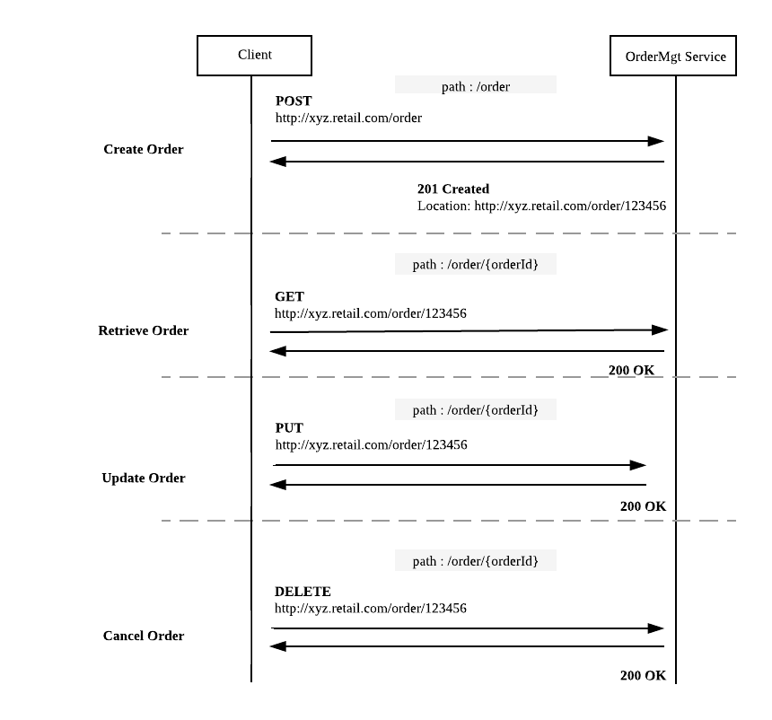

# RESTful Service  

In this guide you will learn about building a comprehensive RESTful Web Service using Ballerina. 

The following are the sections available in this guide.

- [What you'll build](#what-youll-build)
- [Prerequisites](#prerequisites)
- [Developing the service](#developing-the-service)
- [Testing](#testing)
- [Deployment](#deployment)
- [Observability](#observability)

## What you’ll build 
To understanding how you can build a RESTful web service using Ballerina, let’s consider a real world use case of an order management scenario of an online retail application. 
We can model the order management scenario as a RESTful web service; 'OrderMgtService',  which accepts different HTTP request for order management tasks such as order creation, retrieval, updating and deletion.
The following figure illustrates all the required functionalities of the OrderMgt RESTful web service that we need to build. 



- **Create Order** : To place a new order you can use the HTTP POST message that contains the order details, which is sent to the URL `http://xyz.retail.com/order`.The response from the service contains an HTTP 201 Created message with the location header pointing to the newly created resource `http://xyz.retail.com/order/123456`. 
- **Retrieve Order** : You can retrieve the order details by sending an HTTP GET request to the appropriate URL which includes the order ID.`http://xyz.retail.com/order/<orderId>` 
- **Update Order** : You can update an existing order by sending a HTTP PUT request with the content for the updated order. 
- **Delete Order** : An existing order can be deleted by sending a HTTP DELETE request to the specific URL`http://xyz.retail.com/order/<orderId>`. 

## Prerequisites
 
- JDK 1.8 or later
- [Ballerina Distribution](https://github.com/ballerina-lang/ballerina/blob/master/docs/quick-tour.md)
- A Text Editor or an IDE 

### Optional requirements
- Ballerina IDE plugins ([IntelliJ IDEA](https://plugins.jetbrains.com/plugin/9520-ballerina), [VSCode](https://marketplace.visualstudio.com/items?itemName=WSO2.Ballerina), [Atom](https://atom.io/packages/language-ballerina))
- [Docker](https://docs.docker.com/engine/installation/)

## Developing the service 

We can model the OrderMgt RESTful service using Ballerina services and resources constructs. 

- We can get started with a Ballerina service; 'OrderMgtService', which is the RESTful service that serves the order management request. OrderMgtService can have multiple resources and each resource is dedicated for a specific order management functionality.

- You can decide the package structure for the service and then create the service in the corresponding directory structure. For example, suppose that you are going to use the package name 'restful_service', then you need to create the following directory structure and create the service file using the text editor or IDE that you use. 

```
restful-service
  └── src
      └── restful_service
          ├── order_mgt_service.bal
          └── test
              └── order_mgt_service_test.bal          
```

- Once you created your package structure, go to the sample src directory and run the following command to initialize your Ballerina project.

```bash
   $ballerina init
```

  The above command will initialize the project with a `Ballerina.toml` file and `.ballerina` implementation directory that contain a list of packages in the current directory.

- You can add the content to your Ballerina service as shown below. In that code segment you can find the implementation of the service and resource skeletons of 'OrderMgtService'. 
For each order management operation, there is a dedicated resource and inside each resource we can implement the order management operation logic. 

##### order_mgt_service.bal
```ballerina
ppackage restful_service;

import ballerina/http;

endpoint http:Listener listener {
    port:9090
};

// Order management is done using an in memory map.
// Add some sample orders to 'orderMap' at startup.
map<json> ordersMap;

@Description {value:"RESTful service."}
@http:ServiceConfig {basePath:"/ordermgt"}
service<http:Service> order_mgt bind listener {

    @Description {value:"Resource that handles the HTTP GET requests that are directed
    to a specific order using path '/orders/<orderID>'"}
    @http:ResourceConfig {
        methods:["GET"],
        path:"/order/{orderId}"
    }
    findOrder(endpoint client, http:Request req, string orderId) {
        // Implementation
    }

    @Description {value:"Resource that handles the HTTP POST requests that are directed
     to the path '/orders' to create a new Order."}
    @http:ResourceConfig {
        methods:["POST"],
        path:"/order"
    }
    addOrder(endpoint client, http:Request req) {
        // Implementation
    }

    @Description {value:"Resource that handles the HTTP PUT requests that are directed
    to the path '/orders' to update an existing Order."}
    @http:ResourceConfig {
        methods:["PUT"],
        path:"/order/{orderId}"
    }
    updateOrder(endpoint client, http:Request req, string orderId) {
        // Implementation
    }

    @Description {value:"Resource that handles the HTTP DELETE requests, which are 
    directed to the path '/orders/<orderId>' to delete an existing Order."}
    @http:ResourceConfig {
        methods:["DELETE"],
        path:"/order/{orderId}"
    }
    cancelOrder(endpoint client, http:Request req, string orderId) {
        // Implementation
    }
}
```

- You can implement the business logic of each resources as per your requirements. For simplicity we have used an in-memory map to keep all the order details. You can find the full source code of the OrderMgtService below. In addition to the order processing logic, we have also manipulated some HTTP status codes and headers whenever required.  


##### order_mgt_service.bal
```ballerina
package restful_service;

import ballerina/http;

endpoint http:Listener listener {
    port:9090
};

// Order management is done using an in memory map.
// Add some sample orders to 'orderMap' at startup.
map<json> ordersMap;

@Description {value:"RESTful service."}
@http:ServiceConfig {basePath:"/ordermgt"}
service<http:Service> order_mgt bind listener {

    @Description {value:"Resource that handles the HTTP GET requests that are directed
    to a specific order using path '/orders/<orderID>'"}
    @http:ResourceConfig {
        methods:["GET"],
        path:"/order/{orderId}"
    }
    findOrder(endpoint client, http:Request req, string orderId) {
        // Find the requested order from the map and retrieve it in JSON format.
        json? payload = ordersMap[orderId];
        http:Response response;
        if (payload == null) {
            payload = "Order : " + orderId + " cannot be found.";
        }

        // Set the JSON payload in the outgoing response message.
        response.setJsonPayload(payload);

        // Send response to the client.
        _ = client -> respond(response);
    }

    @Description {value:"Resource that handles the HTTP POST requests that are directed
     to the path '/orders' to create a new Order."}
    @http:ResourceConfig {
        methods:["POST"],
        path:"/order"
    }
    addOrder(endpoint client, http:Request req) {
        json orderReq = check req.getJsonPayload();
        string orderId = orderReq.Order.ID.toString() but { () => "" };
        ordersMap[orderId] = orderReq;

        // Create response message.
        json payload = {status:"Order Created.", orderId:orderId};
        http:Response response;
        response.setJsonPayload(payload);

        // Set 201 Created status code in the response message.
        response.statusCode = 201;
        // Set 'Location' header in the response message.
        // This can be used by the client to locate the newly added order.
        response.setHeader("Location", "http://localhost:9090/ordermgt/order/" + orderId);

        // Send response to the client.
        _ = client -> respond(response);
    }

    @Description {value:"Resource that handles the HTTP PUT requests that are directed
    to the path '/orders' to update an existing Order."}
    @http:ResourceConfig {
        methods:["PUT"],
        path:"/order/{orderId}"
    }
    updateOrder(endpoint client, http:Request req, string orderId) {
        json updatedOrder = check req.getJsonPayload();

        // Find the order that needs to be updated and retrieve in JSON format.
        json existingOrder = ordersMap[orderId];

        // Updating existing order with the attributes of the updated order.
        if (existingOrder != null) {
            existingOrder.Order.Name = updatedOrder.Order.Name;
            existingOrder.Order.Description = updatedOrder.Order.Description;
            ordersMap[orderId] = existingOrder;
        } else {
            existingOrder = "Order : " + orderId + " cannot be found.";
        }

        http:Response response;
        // Set the JSON payload to the outgoing response message to the client.
        response.setJsonPayload(existingOrder);
        // Send response to the client.
        _ = client -> respond(response);
    }

    @Description {value:"Resource that handles the HTTP DELETE requests, which are
    directed to the path '/orders/<orderId>' to delete an existing Order."}
    @http:ResourceConfig {
        methods:["DELETE"],
        path:"/order/{orderId}"
    }
    cancelOrder(endpoint client, http:Request req, string orderId) {
        http:Response response;
        // Remove the requested order from the map.
        _ = ordersMap.remove(orderId);

        json payload = "Order : " + orderId + " removed.";
        // Set a generated payload with order status.
        response.setJsonPayload(payload);

        // Send response to the client.
        _ = client -> respond(response);
    }
}
```

- With that we've completed the development of OrderMgtService. 


## Testing 

### Invoking the RESTful service 

You can run the RESTful service that you developed above, in your local environment. You need to have the Ballerina installation in you local machine and simply point to the <ballerina>/bin/ballerina binary to execute all the following steps.  

1. As the first step you can build a Ballerina executable archive (.balx) of the service that we developed above, using the following command. It points to the directory in which the service we developed above located and it will create an executable binary out of that. Navigate to the `<SAMPLE_ROOT>/src/` folder and run the following command. 

```
$ballerina build restful_service
```

2. Once the restful_service.balx is created inside the target folder, you can run that with the following command. 

```
$ballerina run target/restful_service.balx
```

3. The successful execution of the service should show us the following output. 
```
$ ballerina run target/restful_service.balx 

ballerina: deploying service(s) in 'target/restful_service.balx'
ballerina: started HTTP/WS server connector 0.0.0.0:9090
```

4. You can test the functionality of the OrderMgt RESTFul service by sending HTTP request for each order management operation. For example, we have used the curl commands to test each operation of OrderMgtService as follows. 

**Create Order** 
```
curl -v -X POST -d \
'{ "Order": { "ID": "100500", "Name": "XYZ", "Description": "Sample order."}}' \
"http://localhost:9090/ordermgt/order" -H "Content-Type:application/json"

Output :  
< HTTP/1.1 201 Created
< Content-Type: application/json
< Location: http://localhost:9090/ordermgt/order/100500
< Transfer-Encoding: chunked
< Server: wso2-http-transport

{"status":"Order Created.","orderId":"100500"} 
```

**Retrieve Order** 
```
curl "http://localhost:9090/ordermgt/order/100500" 

Output : 
{"Order":{"ID":"100500","Name":"XYZ","Description":"Sample order."}}
```

**Update Order** 
```
curl -X PUT -d '{ "Order": {"Name": "XYZ", "Description": "Updated order."}}' \
"http://localhost:9090/ordermgt/order/100500" -H "Content-Type:application/json"

Output: 
{"Order":{"ID":"100500","Name":"XYZ","Description":"Updated order."}}
```

**Cancel Order** 
```
curl -X DELETE "http://localhost:9090/ordermgt/order/100500"

Output:
"Order : 100500 removed."
```

### Writing unit tests 

In Ballerina, the unit test cases should be in the same package inside a folder named as 'test'. The naming convention should be as follows,

* Test functions should contain test prefix.
  * e.g.: testResourceAddOrder()

This guide contains unit test cases for each resource available in the 'order_mgt_service.bal'.

To run the unit tests, go to the sample src directory and run the following command.
```bash
   $ballerina test
```

To check the implementation of the test file, refer to the [order_mgt_service_test.bal](https://github.com/ballerina-guides/restful-service/blob/master/src/restful_service/test/order_mgt_service_test.bal).


## Deployment

Once you are done with the development, you can deploy the service using any of the methods that we listed below. 

### Deploying locally
You can deploy the RESTful service that you developed above, in your local environment. You can use the Ballerina executable archive (.balx) archive that we created above and run it in your local environment as follows. 

```
$ballerina run target/restful_service.balx
```

### Deploying on Docker


You can run the service that we developed above as a docker container. As Ballerina platform offers native support for running ballerina programs on 
containers, you just need to put the corresponding docker annotations on your service code. 

- In our OrderMgtService, we need to import  `` import ballerinax/docker; `` and use the annotation `` @docker:Config `` as shown below to enable docker image generation during the build time. 

##### order_mgt_service.bal
```ballerina
package restful_service;

import ballerina/http;
import ballerinax/docker;

@docker:Config {
    registry:"ballerina.guides.io",
    name:"restful_service",
    tag:"v1.0"
}

endpoint http:Listener listener {
    port:9090
};

// Order management is done using an in memory map.
// Add some sample orders to 'orderMap' at startup.
map<json> ordersMap;

@Description {value:"RESTful service."}
@http:ServiceConfig {basePath:"/ordermgt"}
service<http:Service> order_mgt bind listener {
``` 

- Now you can build a Ballerina executable archive (.balx) of the service that we developed above, using the following command. It points to the service file that we developed above and it will create an executable binary out of that. 
This will also create the corresponding docker image using the docker annotations that you have configured above. Navigate to the `<SAMPLE_ROOT>/src/` folder and run the following command.  
  
```
   $ballerina build restful_service

   Run following command to start docker container: 
   docker run -d -p 9090:9090 ballerina.guides.io/restful_service:v1.0
```

- Once you successfully build the docker image, you can run it with the `` docker run`` command that is shown in the previous step.  

```   
   docker run -d -p 9090:9090 ballerina.guides.io/restful_service:v1.0
```

  Here we run the docker image with flag`` -p <host_port>:<container_port>`` so that we  use  the host port 9090 and the container port 9090. Therefore you can access the service through the host port. 

- Verify docker container is running with the use of `` $ docker ps``. The status of the docker container should be shown as 'Up'. 
- You can access the service using the same curl commands that we've used above. 
 
```
   curl -v -X POST -d '{ "Order": { "ID": "100500", "Name": "XYZ", "Description": "Sample order."}}' \
   "http://localhost:9090/ordermgt/order" -H "Content-Type:application/json"    
```


### Deploying on Kubernetes

- You can run the service that we developed above, on Kubernetes. The Ballerina language offers native support for running a ballerina programs on Kubernetes, 
with the use of Kubernetes annotations that you can include as part of your service code. Also, it will take care of the creation of the docker images. 
So you don't need to explicitly create docker images prior to deploying it on Kubernetes.   

- We need to import `` import ballerinax/kubernetes; `` and use `` @kubernetes `` annotations as shown below to enable kubernetes deployment for the service we developed above. 

##### order_mgt_service.bal

```ballerina
package restful_service;

import ballerina/http;
import ballerinax/kubernetes;

@kubernetes:Ingress {
    hostname:"ballerina.guides.io",
    name:"ballerina-guides-restful-service",
    path:"/"
}

@kubernetes:Service {
    serviceType:"NodePort",
    name:"ballerina-guides-restful-service"
}

@kubernetes:Deployment {
    image:"ballerina.guides.io/restful_service:v1.0",
    name:"ballerina-guides-restful-service"
}

endpoint http:Listener listener {
    port:9090
};

// Order management is done using an in memory map.
// Add some sample orders to 'orderMap' at startup.
map<json> ordersMap;

@Description {value:"RESTful service."}
@http:ServiceConfig {basePath:"/ordermgt"}
service<http:Service> order_mgt bind listener {    
``` 

- Here we have used ``  @kubernetes:Deployment `` to specify the docker image name which will be created as part of building this service. 
- We have also specified `` @kubernetes:Service {} `` so that it will create a Kubernetes service which will expose the Ballerina service that is running on a Pod.  
- In addition we have used `` @kubernetes:Ingress `` which is the external interface to access your service (with path `` /`` and host name ``ballerina.guides.io``)

- Now you can build a Ballerina executable archive (.balx) of the service that we developed above, using the following command. It points to the service file that we developed above and it will create an executable binary out of that. 
This will also create the corresponding docker image and the Kubernetes artifacts using the Kubernetes annotations that you have configured above.
  
```
   $ballerina build restful_service
  
   Run following command to deploy kubernetes artifacts:  
   kubectl apply -f ./target/restful_service/kubernetes
```

- You can verify that the docker image that we specified in `` @kubernetes:Deployment `` is created, by using `` docker ps images ``. 
- Also the Kubernetes artifacts related our service, will be generated in `` ./target/restful_service/kubernetes``. 
- Now you can create the Kubernetes deployment using:

```
   $ kubectl apply -f ./target/restful_service/kubernetes 
 
   deployment.extensions "ballerina-guides-restful-service" created
   ingress.extensions "ballerina-guides-restful-service" created
   service "ballerina-guides-restful-service" created
```

- You can verify Kubernetes deployment, service and ingress are running properly, by using following Kubernetes commands.

```
   $kubectl get service
   $kubectl get deploy
   $kubectl get pods
   $kubectl get ingress
```

- If everything is successfully deployed, you can invoke the service either via Node port or ingress. 

Node Port:
 
```
curl -v -X POST -d \
'{ "Order": { "ID": "100500", "Name": "XYZ", "Description": "Sample order."}}' \
"http://<Minikube_host_IP>:<Node_Port>/ordermgt/order" -H "Content-Type:application/json"  
```

Ingress:

Add `/etc/hosts` entry to match hostname. 
``` 
127.0.0.1 ballerina.guides.io
```

Access the service 

``` 
curl -v -X POST -d \
'{ "Order": { "ID": "100500", "Name": "XYZ", "Description": "Sample order."}}' \
"http://ballerina.guides.io/ordermgt/order" -H "Content-Type:application/json" 
```

## Observability 
Ballerina is by default observable. Meaning you can easily observe your services, resources, etc.
However, observability is disabled by default via configuration. Observability can be enabled by adding following configurations to `ballerina.conf` file in `restful-service/src/`.

```ballerina
[observability]

[observability.metrics]
# Flag to enable Metrics
enabled=true

[observability.tracing]
# Flag to enable Tracing
enabled=true
```

### Tracing 
You can monitor ballerina services using in built tracing capabilities of Ballerina. We'll use [Jaeger](https://github.com/jaegertracing/jaeger) as the distributed tracing system.
Follow the following steps to use tracing with Ballerina.

- Run Jaeger docker image using the following command
```bash
   docker run -d -p5775:5775/udp -p6831:6831/udp -p6832:6832/udp -p5778:5778 -p16686:16686
   -p14268:14268 jaegertracing/all- in-one:latest
```

- Navigate to `restful-service/src/` and run the restful-service using following command 
```
   $ballerina run restful_service/
```

- Observe the tracing using Jaeger UI using following URL
```
   http://localhost:16686
```

- You should see the Jaeger UI as follows

   
 

### Metrics
Metrics and alarts are built-in with ballerina. We will use Prometheus as the monitoring tool.
Follow the below steps to set up Prometheus and view metrics for Ballerina restful service.

- Set the below configurations in the `ballerina.conf` file in the project root.
```ballerina
   [observability.metrics.prometheus]
   # Flag to enable Prometheus HTTP endpoint
   enabled=true
   # Prometheus HTTP endpoint port. Metrics will be exposed in /metrics context.
   # Eg: http://localhost:9797/metrics
   port=9797
   # Flag to indicate whether meter descriptions should be sent to Prometheus.
   descriptions=false
   # The step size to use in computing windowed statistics like max. The default is 1 minute.
   step="PT1M"
```

- Create a file `prometheus.yml` inside `/etc/` location. Add the below configurations to the `prometheus.yml` file.
```
   global:
   scrape_interval:     15s
   evaluation_interval: 15s

   scrape_configs:
    - job_name: 'prometheus'
   
   static_configs:
        - targets: ['172.17.0.1:9797']
```

   NOTE : Replace `172.17.0.1` if your local docker IP differs from `172.17.0.1`
   
- Run the Prometheus docker image using the following command
```
   docker run -p 19090:9090 -v /tmp/prometheus.yml prom/prometheus
```
   
- You can access Prometheus at the following URL
```
   http://localhost:19090/
```

- Promethues UI with metrics for restful_service
   
   

### Logging
Ballerina has a log package for logging to the console. You can import ballerina/log package and start logging. The following section will describe how to search, analyze, and visualize logs in real time using Elastic Stack.

- Start Elasticsearch using the following command
```
   docker run -p 9200:9200 -p 9300:9300 -it -h elasticsearch --name 
   elasticsearch docker.elastic.co/elasticsearch/elasticsearch:6.2.2 
```

   NOTE: Linux users might need to run `sudo sysctl -w vm.max_map_count=262144` to increase `vm.max_map_count` 
   
- Start Kibana plugin for data visualization with Elasticsearch
```
   docker run -p 5601:5601 -h kibana --name kibana --link elasticsearch:elasticsearch 
   docker.elastic.co/kibana/kibana:6.2.2     
```

- Configure logstash to format the ballerina logs
   i) Create a file named `logstash.conf` with the following content
 ```
      input {  
       beats { 
	       port => 5044 
	      }  
      }
      
      filter {  
       grok  {  
	       match => { 
                  "message" => "%{TIMESTAMP_ISO8601:date}%{SPACE}%{WORD:logLevel}%{SPACE}
                  \[%{GREEDYDATA:package}\]%{SPACE}\-%{SPACE}%{GREEDYDATA:logMessage}"
                 }  
       }  
      }   
      
      output {  
       elasticsearch {  
    	   hosts => "elasticsearch:9200"  
    	   index => "store"  
        document_type => "store_logs"  
	      }  
      }  
```
     ii) Save the above `logstash.conf` inside a directory named as `{SAMPLE_ROOT_DIRECTORY}\pipeline`
     
     iii) Start the logstash container, replace the {SAMPLE_ROOT_DIRECTORY} with your directory name
     
```
        docker run -h logstash --name logstash --link elasticsearch:elasticsearch -it --rm 
        -v ~/{SAMPLE_ROOT_DIRECTIRY}/pipeline:/usr/share/logstash/pipeline/ 
        -p 5044:5044 docker.elastic.co/logstash/logstash:6.2.2
```
  
 - Configure filebeat to ship the ballerina logs
    
     i) Create a file named `filebeat.yml` with the following content
 ```
       filebeat.prospectors:
          - type: log
       paths:
          - /usr/share/filebeat/ballerina.log
       output.logstash:
            hosts: ["logstash:5044"]
 ```
     ii) Save the above `filebeat.yml` inside a directory named as `{SAMPLE_ROOT_DIRECTORY}\filebeat`   
        
     
     iii) Start the logstash container, replace the {SAMPLE_ROOT_DIRECTORY} with your directory name
     
 ```
        docker run -v {SAMPLE_ROOT_DIRECTORY}/filebeat/filebeat.yml:/usr/share/filebeat/filebeat.yml 
        -v {SAMPLE_ROOT_DIRECTORY}/src/restful_service/ballerina.log:/usr/share/filebeat/ballerina.log
	--link logstash:logstash docker.elastic.co/beats/filebeat:6.2.2
 ```
 
 - Access Kibana to visualize the logs using following URL
 ```
     http://localhost:5601 
 ```
 
 - Kibana log visualization for the restful service sample
 
     
 
  
