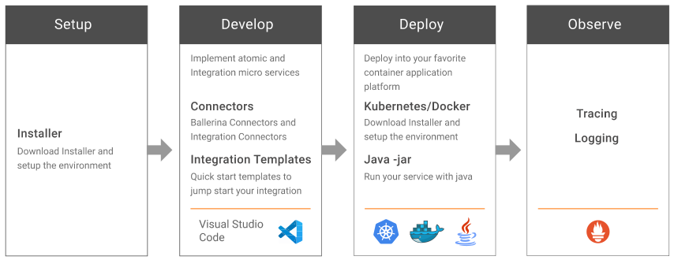

# Developing Integration Solutions

The contents on this page will walk you through the topics related to developing integration micro services for the WSO2 Ballerina Integrator.

## Development workflow

Integration developers will follow the workflow illustrated by the following diagram.

<table>
	<tr>
		<td><b>Step 1: Set up the workspace</b></td>
		<td>
			To start developing micro services, you need to first set up your workspace:
			<ul>
				<li> <a href="https://wso2.com/integration/">Install Ballerina Integrator</a> from the installer, which you will use to build and test your micro services.</li>
				<li><a href="https://www.docker.com/">Install Docker</a> if you want to test your solution in a containerized environment.</li>
				<li><a href="https://curl.haxx.se/">Install CURL</a> to test the integration solution by triggering the integration flow.</li>
			</ul>
		</td>
	</tr>
	<tr>
		<td><b>Step 2: Develop micro service</b></td>
		<td>
			To implement micro service, there are number of Ballerina connectors and Integration connectors. Also, you can start with Integration templates in the VS Code. Use the following resources:
			<ul>
				<li>
					<a href="../../learn/use-cases">Tutorials</a> will walk you through the process of developing the most common integration use cases.
				</li>
				<li>
					<a href="../../learn/examples">Examples</a> will provide a quick demo that will help you understand the Ballerina language for implementing specific functions.
				</li>
			</ul>
		</td>
	</tr>
	<tr>
		<td><b>Step 3: Build and Run the micro service</b></td>
		<td>
		    Docker and Kubernetes supports comes out of the box with the Ballerina language. You can easily build micro service ready to deploy as a container.
			<ul>
				<li><a href="../../develop/deploy-on-docker">Deploy on docker</a> of your micro services</li>
				<li><a href="../../develop/deploy-on-kubernetes">Deploy on Kubernetes</a> of your micro services</li>
				<li><a href="../../develop/running-as-a-java-program">Running as a Java program</a> of your micro services</li>
			</ul>
		</td>
	</tr>
	<tr>
		<td><b>Step 4: Observe your micro service</b></td>
		<td>
			As you build and run the micro services, you may need collecting and visualizing the metrics, collecting and storing logs and tracing transactions.
			<ul>
				<li>
					<a href="../../observability/observing-a-service">Observing a Service</a> with Prometheus.
				</li>
				<li>
					<a href="../../observability/logstash-kibana">Logging</a> using Logstash and Kibana
				</li>
			</ul>
		</td>
	</tr>
</table>
