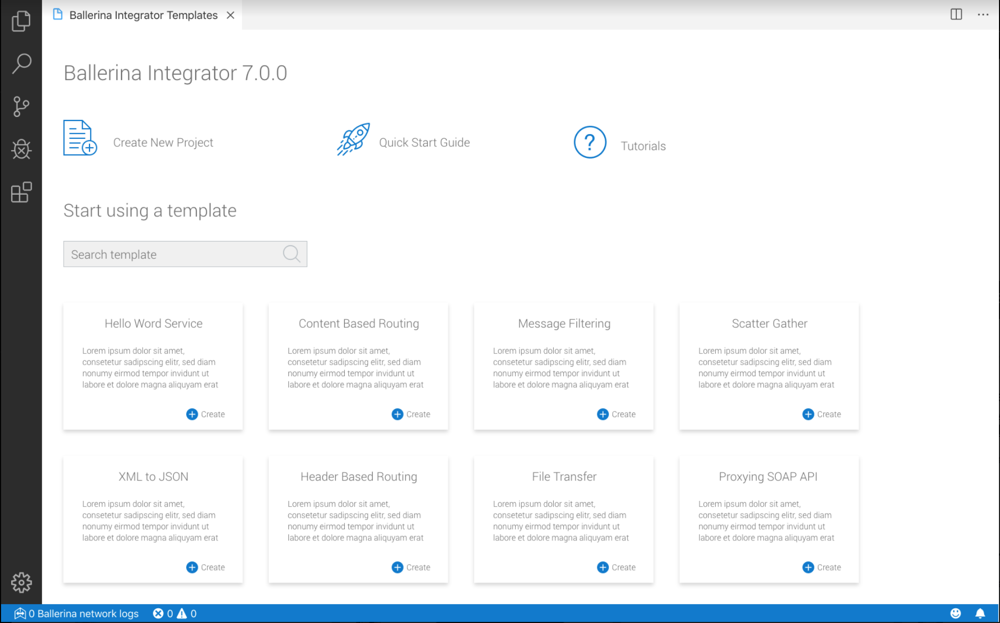

# Setting up the Developer Environment


* Download and install [Ballerina Integrator](https://wso2.com/integration/ballerina-integrator/) based on the Operating System
* Oracle JDK 1.8.*
* A Text Editor or an IDE
> **Tip**: For a better development experience, download and install [VS Code](https://code.visualstudio.com/Download) from Visual Studio website
if you do not have it already, and install the [Ballerina Integrator Extension](https://marketplace.visualstudio.com/items?itemName=WSO2.ballerina-integrator) in VS Code Marketplace.


Once installed, the `Ballerina Integrator Dashboard` shown below could be used for creating new Ballerina
projects, adding new modules using module templates, and for browsing available module templates. The sequence
diagram of Ballerina code could be viewed using `Ballerina: Show File Overview` command. Refer the Ballerina
Integrator VS Code extension's [home page](https://marketplace.visualstudio.com/items?itemName=WSO2.ballerina-integrator)
for more instructions on how to use the extension.



## Installing Ballerina Integrator via Installers

### Installing on OS X

Download the package file and double-click on it to launch the installer. The installer guides you through the installation process and installs the Ballerina distribution to `/Library/Ballerina`.

The package automatically sets your PATH environment variable for you. You may need to restart any open Terminal sessions for the change to take effect.

### Installing on Windows

Download the MSI file and double-click on it to launch the installer. The installer guides you through the installation process and installs the Ballerina distribution to `C:\Program Files\Ballerina\`.

The installer puts the `C:\Program Files\Ballerina\<ballerina-directory>\bin` directory in your PATH environment variable. You may have to restart any open command prompts for the change to take effect.

### Installing on Linux

Download the DEB file and use the following command to install the Ballerina Integrator. Replace `<ballerina-home>/<ballerina-binary>.deb` with the actual file path. This installs the Ballerina Integrator in the `/usr/lib/ballerina` directory.
```
dpkg -i <ballerina-binary>.deb
```

## What's Next
Once you have successfully installed Ballerina, try out the [Quick Start Guide](../get-started/quick-start-guide.md) and take Ballerina Integrator for its first spin.
