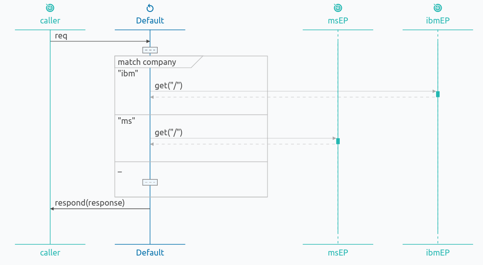

# Content-Based Routing

## About

Content-based routing is an integration pattern where the message received from a client is routed to different channels/paths/endpoints based on the content of the message. This guide demonstrates a simple content-based routing scenario where, based on the company name provided in the request, the relevant company’s service endpoint is called to get the stock quote.

## What you'll build

We shall have a service ‘stockQuote’ which accepts an http request from a client. The client appends as a query parameter in the request, the company name of which he wants to know the price of the stock. The stockQuote service identifies the company, routes the request to the relevant company’s stock quote service, obtain the response from the company’s service and returns the response to the client. If the company name is not available in the request, the service will simply respond with a 400 - Bad Request.



## Prerequisites

- [Ballerina Distribution](https://ballerina.io/learn/getting-started/)
- A Text Editor or an IDE 
> **Tip**: For a better development experience, install the Ballerina IDE plugin for [VS Code](https://marketplace.visualstudio.com/items?itemName=ballerina.ballerina)
	
## Implementation

* Create a new ballerina project named ‘content-based-routing’.

```bash
$ ballerina new content-based-routing
```

* Navigate to the directory content-based-routing.

* Add a new module named ‘stockquote_service’ to the project.

```bash
$ ballerina add stockquote_service
```

* Open the project with VSCode. The project structure will be like the following.

```shell
.
├── Ballerina.toml
└── src
    └── stockquote_service
        ├── main.bal
        ├── Module.md
        ├── resources
        └── tests
            ├── main_test.bal
            └── resources
```

We can remove the file `main_test.bal` at the moment, since we're not writing any tests for our service.

First let's create the services that we shall be using as backend endpoints. 

* Create a new file named `ibmService.bal` file under 'stockquote_service' with the following content.

```ballerina
import ballerina/http;

@http:ServiceConfig {
    basePath: "/ibm"
}
service ibm on new http:Listener(8081) {
    @http:ResourceConfig {
        methods: ["GET"],
        path: "quote"
    }
    resource function quote(http:Caller caller, http:Request request) {
        http:Response response = new;
        response.setTextPayload("10000.00");
        error? respond = caller->respond(response);
    }
}
```

This is simply a service that will run on port 8081 responding a text payload `10000.00`.

* Likewise, let's create another file `msService.bal` with the following content.

```ballerina
import ballerina/http;

@http:ServiceConfig {
    basePath: "/ms"
}
service ms on new http:Listener(8082) {
    @http:ResourceConfig {
        methods: ["GET"],
        path: "quote"
    }
    resource function quote(http:Caller caller, http:Request request) {
        http:Response response = new;
        response.setTextPayload("12000.00");
        error? respond = caller->respond(response);
    }
}
```

* Now let's open the main.bal file and add the following content. This is going to be our integration logic.

```ballerina
import ballerina/http;

http:Client ibmEP = new("http://localhost:8081/ibm/quote");
http:Client msEP = new("http://localhost:8082/ms/quote");

@http:ServiceConfig {
    basePath: "/stocktrading"
}
service stockQuote on new http:Listener(9090) {
    @http:ResourceConfig {
        methods: ["GET"],
        path: "/stockquote"
    }
    resource function getQuote(http:Caller caller, http:Request req) returns error?{
        var company = req.getQueryParamValue("company");
        http:Response response = new;
        match company {
            "ibm" => {
                response = checkpanic ibmEP->get("/");
            }
            "ms" => {
                response = checkpanic msEP->get("/");
            }
            _ => {
                response.statusCode = http:STATUS_BAD_REQUEST;
                response.setTextPayload("No matching company found.");
            }
        }        
        error? respond = caller->respond(response);
    }    
}
```
Here we’re calling two services we created earlier, using the endpoints ‘ibmEP’ and ‘msEP’.

In the stockQuote service, the ‘company’ is retrieved as a query parameter. Then the value of the ‘company’ is checked. If it is ‘ibm’, the ‘ibmEP’ is called and its response is saved. If it is ‘ms’, the ‘msEP’ is called. If there is no value set, we’re simply setting a 400-Bad Request response. Finally the response is sent back to the client.

## Run the Integration

* First let’s build the module. While being in the content-based-routing directory, execute the following command.

```bash
$ ballerina build stockquote_service
```

This would create the executables. 

* Now run the jar file created in the above step.

```bash
$ java -jar target/bin/stockquote_service.jar
```

Now we can see that three service have started on ports 8081, 8082 and 9090. 

* Let’s access the stockQuote service by executing the following curl command.

```bash
$ curl http://localhost:9090/stocktrading/stockquote?company=ibm
```

We will get a text value 10000.00 as the response.
