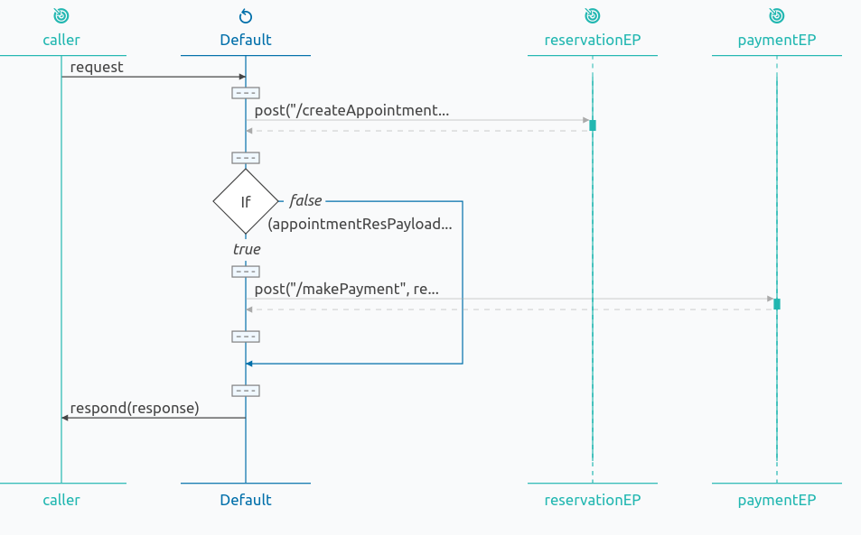

# Service Orchestration

## About

Service orchestration is a common integration scenario where, upon a request from a client, a service calls multiple other services/endpoints. This guide demonstrates a simple service orchestration scenario where a client makes a doctor's appointment and the service invokes other two services to make a reservation and to do the payment for the reservation fee, respectively.

## What you'll build

We shall have a service ‘doctorAppointment’ which accepts a client request for a doctor’s appointment. The service calls the reservation service with the request payload sent by the client to reserve the appointment, gets the response, checks if the appointment is confirmed and if confirmed, calls the payment endpoint to settle the fee of the appointment. Finally, if the payment is successful, it will merge both the responses from the appointment service and the payment service and respond back to the client. If the appointment reservation is not successful, it sends back a payload saying the appointment failed.



## Prerequisites

- [Ballerina Distribution](https://ballerina.io/learn/getting-started/)
- A Text Editor or an IDE 
> **Tip**: For a better development experience, install the Ballerina IDE plugin for [VS Code](https://marketplace.visualstudio.com/items?itemName=ballerina.ballerina)
	
## Implementation

* Create a new ballerina project named ‘service-orchestration’.

```bash
$ ballerina new service-orchestration
```

* Navigate to the directory service-orchestration.

* Add a new module named ‘appointment_service’ to the project.

```bash
$ ballerina add appointment_service
```

* Open the project with VSCode. The project structure will be like the following.

```shell
.
├── Ballerina.toml
└── src
    └── appointment_service
        ├── main.bal
        ├── Module.md
        ├── resources
        └── tests
            ├── main_test.bal
            └── resources
```

We can remove the file `main_test.bal` at the moment, since we're not writing any tests for our service.

First let's create the services that we shall be using as backend endpoints.

* Create a new file named `reservation.bal` under 'appointment_service' with the following content.

```ballerina
import ballerina/http;

@http:ServiceConfig {
    basePath: "reservation"
}
service reservation on new http:Listener(8081) {
    @http:ResourceConfig {
        methods: ["POST"],
        path: "/createAppointment"
    }
    resource function createAppointment(http:Caller caller, http:Request request) {
        json responsePayload = {
            "appointmentId": "1001",
            "patient_name": "Thomas Colins",
            "date": "30-09-2019",
            "time": "3.00pm",
            "doctor_name": "John Doe",
            "fee": "1000.00"
        };
        http:Response response = new ();
        response.setJsonPayload(responsePayload);
        error? respond = caller->respond(response);
    }
}
```

This is a simple service that would run on port 8081 and respond a json payload.

* Likewise, let's create a file named `payment.bal` with the following content.

```ballerina
import ballerina/http;

@http:ServiceConfig {
    basePath: "/payment"
}
service payment on new http:Listener(8082) {
    @http:ResourceConfig {
        methods: ["POST"],
        path: "/makePayment"
    }
    resource function makePayment(http:Caller caller, http:Request request) {
        json responsePayload = {"payment_status":"settled", "payment_id":"b7981676-c1ca-4380-bc31-1725eb121d1a"};
        http:Response response = new();
        response.setJsonPayload(responsePayload);
        error? respond = caller->respond(response);
    }
}
```

* Now let's open the main.bal file and add the following content. This is going to be our integration logic.

```ballerina
import ballerina/http;

http:Client reservationEP = new ("http://localhost:8081/reservation");
http:Client paymentEP = new("http://localhost:8082/payment");

@http:ServiceConfig {
    basePath: "/doctorAppoinment"
}
service doctorAppoinment on new http:Listener(9090) {
    @http:ResourceConfig {
        methods: ["POST"],
        path: "/reservation"
    }
    resource function makeReservation(http:Caller caller, http:Request request) {
        json requestPaylod = checkpanic request.getJsonPayload();
        json finalResponsePayload = {
            "appointment_status": "failure",
            "name":checkpanic requestPaylod.name,
            "doctor":checkpanic requestPaylod.doctor,
            "date":checkpanic requestPaylod.date
        };
        http:Response response = checkpanic reservationEP->post("/createAppointment", request);
        json appointmentResPayload = checkpanic response.getJsonPayload();
        if (appointmentResPayload.appointmentId is json) {
            json paymentReqPayload = {
                "name":checkpanic requestPaylod.name,
                "cardNum":checkpanic requestPaylod.cardNum,
                "amount":checkpanic appointmentResPayload.fee
            };
            request.setJsonPayload(<@untainted>paymentReqPayload);
            response = checkpanic paymentEP->post("/makePayment", request);
            json paymentResPayload = checkpanic response.getJsonPayload();
            finalResponsePayload = checkpanic paymentResPayload.mergeJson(appointmentResPayload);
        }
        response.setJsonPayload(<@untainted>finalResponsePayload);
        error? respond = caller->respond(response);
    }
}
```

Here we’re calling the two services we created earlier, using the endpoints ‘reservationEP’ and ‘paymentEP’.

## Run the Integration

* First let’s build the module. While being in the service-orchestration directory, execute the following command.

```bash
$ ballerina build appointment_service
```

This would create the executables without running the test cases. 

* Now run the jar file created in the above step.

```bash
$ java -jar target/bin/appointment_service.jar
```

Now we can see three service have started on ports 8081, 8082 and 9090. 

* Let’s access the doctorAppoinment service by executing the following curl command.

```bash
$ curl -H 'Content-Type:application/json' http://localhost:9090/doctorAppoinment/reservation --data '{"name":"Thomas Colins", "doctor":"John Doe", "date":"30-09-2019", "cardNum":"1234567"}'
```

We shall get a json response like the following.

```json
{
            "payment_status": "settled",
            "payment_id": "b7981676-c1ca-4380-bc31-1725eb121d1a",
            "appointmentId": "1001",
            "patient_name": "Thomas Colins",
            "date": "30-09-2019",
            "time": "3.00pm",
            "doctor_name": "John Doe",
            "fee": "1000.00"
 }
```