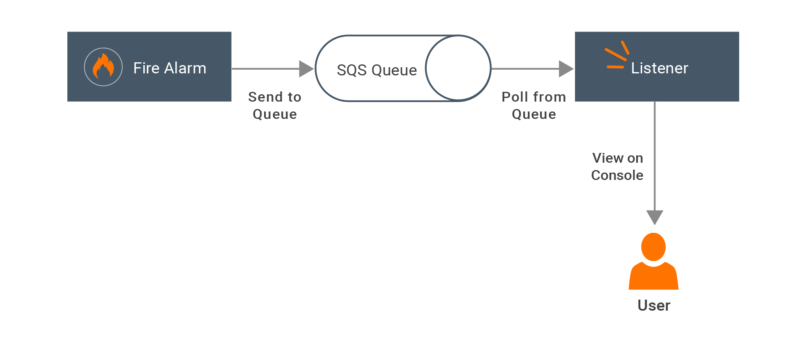

# Notifying a Fire Alarm using Amazon SQS

This guide demonstrates how to use Amazon SQS Connector to notify alerts.

The high level sections of this guide are as follows:

- [What you'll build](#What-youll-build)
- [Prerequisites](#Prerequisites)
- [Implementation](#Implementation)
  - [Creating the project structure](#Creating-the-project-structure)
  - [Developing the scenario](#Developing-the-scenario)
- [Deployment](#Deployment)
  - [Deploying locally](#Deploying-locally)

## What you'll build

The following diagram illustrates the scenario:



Let's consider a scenario where a fire alarm sends fire alerts to an Amazon SQS queue. As message duplication is not an issue, an Amazon SQS Standard Queue is used as the queue. A fire alarm listener is polling the messages in the SQS queue. When fire alerts are available, it will consume the messages from the queue and remove the messages from the queue. Consumed messages are showed in the console to the User.

Here, the fire alarm is sending fire alerts periodically from a Ballerina worker where listener polls in another worker. Both sent messages and received messages are printed in the console.

As there can be multiple alert messages available in the queue, the listener is configured to consume more than one message at a time.

## Prerequisites
- [Ballerina Distribution](https://ballerina.io/learn/getting-started/)
- A Text Editor or an IDE
  > **Tip**: For a better development experience, install one of the following Ballerina IDE plugins: [VSCode](https://marketplace.visualstudio.com/items?itemName=ballerina.ballerina), [IntelliJ IDEA](https://plugins.jetbrains.com/plugin/9520-ballerina)
- [Amazon SQS Account](https://aws.amazon.com/sqs/)


## Implementation

Take a look at the code samples below to understand how to implement the scenario.

The following code creates a new queue in Amazon SQS with the configuration provided in a file.

**create_notification_queue.bal**
<!-- INCLUDE_CODE: src/guide/create_notification_queue.bal -->

The following code generates fire alert notifications periodically and these are sent to the above created SQS queue.

**notify_fire.bal**
<!-- INCLUDE_CODE: src/guide/notify_fire.bal -->

The following code listens to the SQS queue and if there are any notifications, it would receive from the queue and delete the existing messages in the queue.

**listen_to_fire_alarm.bal**
<!-- INCLUDE_CODE: src/guide/listen_to_fire_alarm.bal -->

In the following code, the `main` method would implement the workers related to creating a queue, sending a message to the queue, and consuming and receiving/deleting messages from the queue.

**main.bal**
<!-- INCLUDE_CODE: src/guide/main.bal -->

### Creating the project structure

1. Create a new project.

    ```bash
    $ ballerina new notifying-fire-alarm-using-sqs
    ```

2. Create a module.

    ```bash
    $ ballerina add guide
    ```

To implement the scenario in this guide, you can use the following package structure:

```
  notifying-fire-alarm-using-sqs
  ├── Ballerina.toml
  └── src
      └── guide
          ├── Module.md
          ├── create_notification_queue.bal
          ├── notify_fire.bal
          ├── listen_to_fire_alarm.bal
          └── main.bal

```

Now that you have created the project structure, the next step is to develop the scenario.

### Developing the scenario

1. Configure parameters in `create_notification_queue.bal`, which will create a new queue. In order to create a queue initialize the `amazonsqs:Client` with configuration parameters and invoke the `createQueue` method of it. `ACCESS_KEY_ID` and `SECRET_ACCESS_KEY` can be obtained from the Amazon account you have created. When a queue is created you can find the `ACCOUNT_NUMBER` of the SQS account.

2. Configure/develop `notify_fire.bal`, which will send periodic fire alerts to the created SQS queue. Instead of the `while` loop added, you can add some custom logic to trigger fire alarm. Create a client as described in step 1 and invoke `sendMessage` method to send alert message to the SQS queue.

3. Configure/develop `listen_to_fire_alarm.bal`, which will listen to the above created queue with polling. `sleep` method in the `while` loop can be called according to the polling interval. Then create the client as described in step 1 and invoke `receiveMessage` method. Depending on the `MaxNumberOfMessages` parameter set in the `attributes` array, maximum number of messages received per API invocation will be restricted. Each message can be accessed with `receiptHandle` value in the response. Once the message is read it can be deleted by invoking the `deleteMessage` method.

4. Configure/develop `main.bal`, which will implement the different workers for each of the above cases and run the system. There the workers can be replaced with the relevant code. `queueCreator` code should be called once to setup the queue. Code in the `fireNotifier` can be called from the fire alarm triggering side while `fireListener` should reside in the alarm polling/listening code.

## Deployment

Once you are done with the development, you can deploy the scenario using any of the methods listed below.

### Deploying locally

To deploy locally, navigate to `notifying-fire-alarm-using-sqs` directory, and execute the following command.

```bash
  $ ballerina build guide
```
This builds a JAR file (.jar) in the target folder. You can run this by using the `java -jar` command.

```bash
  $ java -jar target/bin/guide.jar
```

You see the SQS queue creation, sending fire alerts to the queue, consuming process of queues and subsequent deletion process on console.
