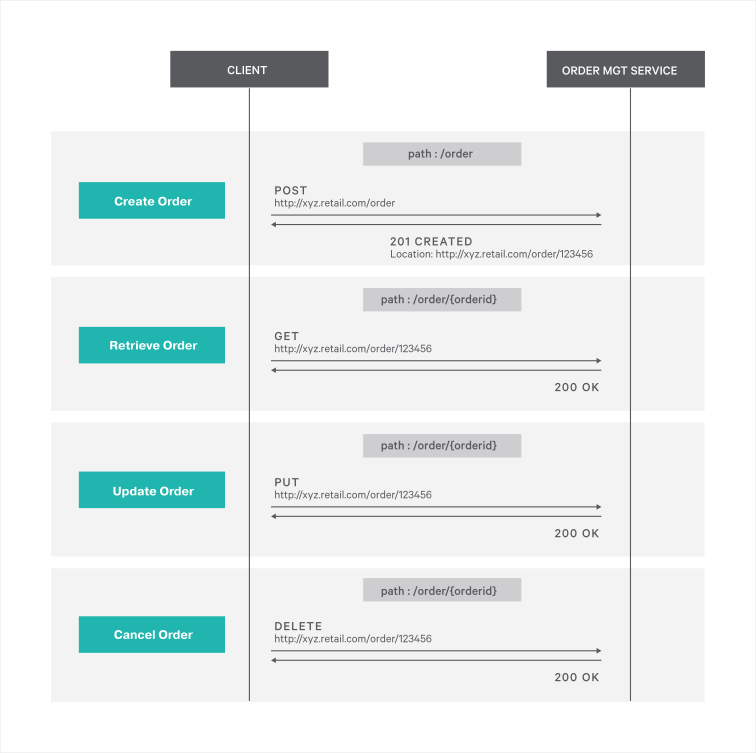

# RESTful Service  

REST (REpresentational State Transfer) is an architectural style for developing web services. It defines a set of constraints and properties based on HTTP. 

> In this guide you will learn about building a comprehensive RESTful Web Service using Ballerina. 

The following are the sections available in this guide.

- [What you'll build](#what-youll-build)
- [Prerequisites](#prerequisites)
- [Implementation](#implementation)
- [Testing](#testing)
- [Deployment](#deployment)
- [Observability](#observability)

## What you’ll build 
To understand how you can build a RESTful web service using Ballerina, let’s consider a real world use case of an order management scenario of an online retail application.
You can model the order management scenario as a RESTful web service; 'order_mgt_service',  which accepts different HTTP request for order management tasks such as order creation, retrieval, updating and deletion.
The following diagram illustrates all the required functionality of the Order Management RESTful web service that you are going to build.



- **Create Order** : To place a new order, use an HTTP POST request that contains order details, and then send the request to the http://xyz.retail.com/order endpoint. If the request is successful, the service should respond with a 201 Created HTTP response that has the location header pointing to the newly created resource at http://xyz.retail.com/order/123456.
- **Retrieve Order** : To retrieve order details, send an HTTP GET request to the appropriate URL that includes the order ID.http://xyz.retail.com/order/.
- **Update Order** : To update an existing order, send an HTTP PUT request with content for the order update.
- **Delete Order** : To delete an existing order, send an HTTP DELETE request to the http://xyz.retail.com/order/ endpoint.

## Prerequisites
 
- [Ballerina Distribution](https://ballerina.io/learn/getting-started/)
- A Text Editor or an IDE 
> **Tip**: For a better development experience, install one of the following Ballerina IDE plugins: [VSCode](https://marketplace.visualstudio.com/items?itemName=ballerina.ballerina), [IntelliJ IDEA](https://plugins.jetbrains.com/plugin/9520-ballerina)

### Optional requirements
- [Docker](https://docs.docker.com/engine/installation/)
- [Kubernetes](https://kubernetes.io/docs/setup/)

## Implementation

> If you want to skip the basics, you can download the git repo and directly move to the "Testing" section by skipping  "Implementation" section.

### Create the project structure

Let's use the following module structure for this project.

```
restful-service
 └── exposing-a-rest-service
      └── guide
           └── restful_service
                ├── order_mgt_service.bal
       	        └── tests
	                 └── order_mgt_service_test.bal
```

- Create the above directories in your local machine, along with the empty `.bal` files.

- Then open the terminal, navigate to restful-service/exposing-a-rest-service/guide, and run the Ballerina project initializing toolkit.
```bash
   $ ballerina init
```

### Developing the RESTful web service

- You can start by defining a Ballerina HTTP service for the order management service `orderMgt`. The `orderMgt` service can comprise of multiple resources where each resource is responsible for a specific order management functionality.

You can add the following code segment to your `order_mgt_service.bal` file. It contains a service skeleton based on which you can build the order management service.
For each order management operation, there is a dedicated resource. You can implement the order management operation logic inside each resource.

##### Skeleton code for order_mgt_service.bal
```ballerina
import ballerina/http;

listener http:Listener httpListener = new(9090);

// Order management is done using an in-memory map.
// Add some sample orders to 'ordersMap' at startup.
map<json> ordersMap = {};

// RESTful service.
@http:ServiceConfig { basePath: "/ordermgt" }
service orderMgt on httpListener {

    // Resource that handles the HTTP GET requests that are directed to a specific
    // order using path '/order/<orderId>'
    @http:ResourceConfig {
        methods: ["GET"],
        path: "/order/{orderId}"
    }
    resource function findOrder(http:Caller caller, http:Request req, string orderId) {
        // Implementation
    }

    // Resource that handles the HTTP POST requests that are directed to the path
    // '/order' to create a new order.
    @http:ResourceConfig {
        methods: ["POST"],
        path: "/order"
    }
    resource function addOrder(http:Caller caller, http:Request req) {
        // Implementation
    }

    // Resource that handles the HTTP PUT requests that are directed to the path
    // '/order/<orderId>' to update an existing Order.
    @http:ResourceConfig {
        methods: ["PUT"],
        path: "/order/{orderId}"
    }
    resource function updateOrder(http:Caller caller, http:Request req, string orderId) {
        // Implementation
    }

    // Resource that handles the HTTP DELETE requests, which are directed to the path
    // '/order/<orderId>' to delete an existing Order.
    @http:ResourceConfig {
        methods: ["DELETE"],
        path: "/order/{orderId}"
    }
    resource function cancelOrder(http:Caller caller, http:Request req, string orderId) {
        // Implementation
    }
}
```

- You can implement the business logic of each resource depending on your requirements. For simplicity, you can use an in-memory map to keep all the order details.
  Following is the full source code of the order management service. Here, you will see how certain HTTP status codes and headers are manipulated whenever required in addition to the order processing logic.


##### order_mgt_service.bal
```ballerina
import ballerina/http;
import ballerina/log;

listener http:Listener httpListener = new(9090);

// Order management is done using an in-memory map.
// Add some sample orders to 'ordersMap' at startup.
map<json> ordersMap = {};

// RESTful service.
@http:ServiceConfig { basePath: "/ordermgt" }
service orderMgt on httpListener {

    // Resource that handles the HTTP GET requests that are directed to a specific
    // order using path '/order/<orderId>'.
    @http:ResourceConfig {
        methods: ["GET"],
        path: "/order/{orderId}"
    }
    resource function findOrder(http:Caller caller, http:Request req, string orderId) {
        // Find the requested order from the map and retrieve it in JSON format.
        json? payload = ordersMap[orderId];
        http:Response response = new;
        if (payload == null) {
            payload = "Order : " + orderId + " cannot be found.";
        }

        // Set the JSON payload in the outgoing response message.
        response.setJsonPayload(untaint payload);

        // Send response to the client.
        var result = caller->respond(response);
        if (result is error) {
            log:printError("Error sending response", err = result);
        }
    }

    // Resource that handles the HTTP POST requests that are directed to the path
    // '/order' to create a new Order.
    @http:ResourceConfig {
        methods: ["POST"],
        path: "/order"
    }
    resource function addOrder(http:Caller caller, http:Request req) {
        http:Response response = new;
        var orderReq = req.getJsonPayload();
        if (orderReq is json) {
            string orderId = orderReq.Order.ID.toString();
            ordersMap[orderId] = orderReq;

            // Create response message.
            json payload = { status: "Order Created.", orderId: orderId };
            response.setJsonPayload(untaint payload);

            // Set 201 Created status code in the response message.
            response.statusCode = 201;
            // Set 'Location' header in the response message.
            // This can be used by the client to locate the newly added order.
            response.setHeader("Location", 
                "http://localhost:9090/ordermgt/order/" + orderId);

            // Send response to the client.
            var result = caller->respond(response);
            if (result is error) {
                log:printError("Error sending response", err = result);
            }
        } else {
            response.statusCode = 400;
            response.setPayload("Invalid payload received");
            var result = caller->respond(response);
            if (result is error) {
                log:printError("Error sending response", err = result);
            }
        }
    }

    // Resource that handles the HTTP PUT requests that are directed to the path
    // '/order/<orderId>' to update an existing Order.
    @http:ResourceConfig {
        methods: ["PUT"],
        path: "/order/{orderId}"
    }
    resource function updateOrder(http:Caller caller, http:Request req, string orderId) {
        var updatedOrder = req.getJsonPayload();
        http:Response response = new;
        if (updatedOrder is json) {
            // Find the order that needs to be updated and retrieve it in JSON format.
            json existingOrder = ordersMap[orderId];

            // Updating existing order with the attributes of the updated order.
            if (existingOrder != null) {
                existingOrder.Order.Name = updatedOrder.Order.Name;
                existingOrder.Order.Description = updatedOrder.Order.Description;
                ordersMap[orderId] = existingOrder;
            } else {
                existingOrder = "Order : " + orderId + " cannot be found.";
            }
            // Set the JSON payload to the outgoing response message to the client.
            response.setJsonPayload(untaint existingOrder);
            // Send response to the client.
            var result = caller->respond(response);
            if (result is error) {
                log:printError("Error sending response", err = result);
            }
        } else {
            response.statusCode = 400;
            response.setPayload("Invalid payload received");
            var result = caller->respond(response);
            if (result is error) {
                log:printError("Error sending response", err = result);
            }
        }
    }

    // Resource that handles the HTTP DELETE requests, which are directed to the path
    // '/order/<orderId>' to delete an existing Order.
    @http:ResourceConfig {
        methods: ["DELETE"],
        path: "/order/{orderId}"
    }
    resource function cancelOrder(http:Caller caller, http:Request req, string orderId) {
        http:Response response = new;
        // Remove the requested order from the map.
        _ = ordersMap.remove(orderId);

        json payload = "Order : " + orderId + " removed.";
        // Set a generated payload with order status.
        response.setJsonPayload(untaint payload);

        // Send response to the client.
        var result = caller->respond(response);
        if (result is error) {
            log:printError("Error sending response", err = result);
        }
    }
}
```

- With that you have completed the development of the order management service.


## Testing 

### Invoking the RESTful service 

You can run the RESTful service that you developed above, in your local environment. Open your terminal and navigate to `restful-service/exposing-a-rest-service/guide`, and execute the following command.
```bash
    $ ballerina run restful_service
```
Successful startup of the service results in the following output.
```
   Initiating service(s) in 'restful_service'
   [ballerina/http] started HTTP/WS endpoint 0.0.0.0:9090
```

To test the functionality of the orderMgt RESTFul service, send HTTP requests for each order management operation.
Following are sample cURL commands that you can use to test each operation of the order management service.

**Create Order** 
```bash
    $ curl -v -X POST -d \
    '{ "Order": { "ID": "100500", "Name": "XYZ", "Description": "Sample order."}}' \
    "http://localhost:9090/ordermgt/order" -H "Content-Type:application/json"

    Output :  
    < HTTP/1.1 201 Created
    < Content-Type: application/json
    < Location: http://localhost:9090/ordermgt/order/100500
    < content-length: 46
    < server: ballerina/0.982.0
    
    {"status":"Order Created.","orderId":"100500"} 
```

**Retrieve Order** 
```bash
    $ curl "http://localhost:9090/ordermgt/order/100500"

    Output : 
    {"Order":{"ID":"100500","Name":"XYZ","Description":"Sample order."}}
```

**Update Order** 
```bash
    $ curl -X PUT -d '{ "Order": {"Name": "XYZ", "Description": "Updated order."}}' \
    "http://localhost:9090/ordermgt/order/100500" -H "Content-Type:application/json"
    
    Output: 
    {"Order":{"ID":"100500","Name":"XYZ","Description":"Updated order."}}
```

**Cancel Order** 
```bash
    $ curl -X DELETE "http://localhost:9090/ordermgt/order/100500"

    Output:
    "Order : 100500 removed."
```

### Writing unit tests 

In Ballerina, the unit test cases should be in the same module inside a folder named as 'tests'. When writing the test functions, follow the convention given below.
- Test functions should be annotated with `@test:Config`. See the following example.
```ballerina
   @test:Config
   function testResourceAddOrder() {
```
  
The source code for this guide contains unit test cases for each resource available in the 'orderMgt' service implemented above.

To run the unit tests, open your terminal and navigate to `restful-service/exposing-a-rest-service/guide`, and run the following command.
```bash
    $ ballerina test
```

> The source code for the tests can be found at [order_mgt_service_test.bal](https://github.com/wso2/ballerina-integrator/tree/master/docs/learn/guides/services/restful-service/exposing-a-rest-service/guide/restful_service/tests/order_mgt_service_test.bal).


## Deployment

Once you are done with the development, you can deploy the service using any of the methods listed below.

### Deploying locally

- As the first step, you can build a Ballerina executable archive (.balx) of the service that you developed. Navigate to `restful-service/exposing-a-rest-service/guide` and run the following command.
```bash
    $ ballerina build restful_service
```

- Once the restful_service.balx is created inside the target folder, you can run that with the following command. 
```bash
    $ ballerina run target/restful_service.balx
```

- Successful startup of the service results in the following output.
```
   Initiating service(s) in 'target/restful_service.balx'
   [ballerina/http] started HTTP/WS endpoint 0.0.0.0:9090
```

### Deploying on Docker

You can package and deploy services as Docker containers if necessary. You can use the [Ballerina Docker Extension](https://github.com/ballerinax/docker) (provided in the Ballerina Platform) to provide native support to run Ballerina programs in containers. You just need to add the relevant Docker annotations to your listener endpoints.

- In the `order_mgt_service.bal` file, you need to import `ballerinax/docker`, and add the `@docker:Config` annotation to the listener endpoint as shown below to enable Docker image generation when you build the service.

##### order_mgt_service.bal
```ballerina
import ballerina/http;
import ballerinax/docker;

@docker:Config {
    registry:"ballerina.guides.io",
    name:"restful_service",
    tag:"v1.0"
}
@docker:Expose{}
listener http:Listener httpListener = new(9090);

// Order management is done using an in-memory map.
// Add some sample orders to 'ordersMap' at startup.
map<json> ordersMap = {};

// RESTful service.
@http:ServiceConfig { basePath: "/ordermgt" }
service orderMgt on httpListener {
``` 

- `@docker:Config` annotation is used to provide the basic Docker image configurations for the sample. `@docker:Expose {}` is used to expose the port to which the listener is bound to.

- Now you can build a Ballerina executable archive (.balx) of the service that you developed above. This also creates the corresponding Docker image using the configurations provided through the annotations. Navigate to `restful-service/exposing-a-rest-service/guide` and run the following command:
```bash
   $ ballerina build restful_service

   Compiling source
       restful_service:0.0.0

   Running tests
       restful_service:0.0.0
   [ballerina/http]  started HTTP/WS endpoint 0.0.0.0:9090
            [pass] testResourceAddOrder
            [pass] testResourceUpdateOrder
            [pass] testResourceFindOrder
            [pass] testResourceCancelOrder

            4 passing
            0 failing
            0 skipped
   [ballerina/http] stopped HTTP/WS endpoint 0.0.0.0:9090
   Generating executable
       ./target/restful_service.balx
   	@docker 		 - complete 3/3

            Run following command to start docker container:
            docker run -d -p 9090:9090 ballerina.guides.io/restful_service:v1.0
```

- Once you have successfully built the Docker image, you can run it using the `docker run` command that you see at the end of the build
```bash   
    $ docker run -d -p 9090:9090 ballerina.guides.io/restful_service:v1.0
```

You have to run the Docker container with the `-p <host_port>:<container_port>` flag so that the container's port 9090 maps to the host's port 9090, and the service is accessible through the same port on the host

- Verify that the container is up and running with the use of `docker ps`. The status of the container should be shown as 'Up'.
- You can invoke the service using the same cURL commands that you used above.
```bash
    $ curl -v -X POST -d \
    '{ "Order": { "ID": "100500", "Name": "XYZ", "Description": "Sample order."}}' \
    "http://localhost:9090/ordermgt/order" -H "Content-Type:application/json"    
```

### Deploying on Kubernetes

- You can deploy the service that you developed above on Kubernetes. The Ballerina language provides native support to run Ballerina programs on Kubernetes, and allows you to include Kubernetes annotations as part of your service code.
Ballerina also takes care of the creation of Docker images so that you do not need to explicitly create Docker images prior to deploying it on Kubernetes.
For more details and samples on Kubernetes deployment with Ballerina, see [Ballerina Kubernetes Extension](https://github.com/ballerinax/kubernetes). You can also find details on using Minikube to deploy Ballerina programs.

- Now let's take a look at how you can deploy the orderMgt service on Kubernetes.

- To enable Kubernetes deployment for the service, first you need to import `ballerinax/kubernetes` and add the `@kubernetes` annotations as shown below:"

> NOTE: Linux users can use Minikube to try this out locally.

##### order_mgt_service.bal

```ballerina
import ballerina/http;
import ballerinax/kubernetes;

@kubernetes:Ingress {
    hostname:"ballerina.guides.io",
    name:"ballerina-guides-restful-service",
    path:"/"
}
@kubernetes:Service {
    serviceType:"NodePort",
    name:"ballerina-guides-restful-service"
}
@kubernetes:Deployment {
    image:"ballerina.guides.io/restful_service:v1.0",
    name:"ballerina-guides-restful-service"
}
listener http:Listener httpListener = new(9090);

// Order management is done using an in-memory map.
// Add some sample orders to 'ordersMap' at startup.
map<json> ordersMap = {};

// RESTful service.
@http:ServiceConfig { basePath: "/ordermgt" }
service orderMgt on httpListener {
``` 

- `@kubernetes:Deployment` is used to specify the Docker image name that should be created as part of building the service.
- `@kubernetes:Service` is specified to create a Kubernetes service that exposes the Ballerina service that is running on a Pod.
- `@kubernetes:Ingress` is used as the external interface to access your service (with path `/` and host name `ballerina.guides.io`).

If you are using Minikube, you need to set a couple of additional attributes to the `@kubernetes:Deployment` annotation.
- `dockerCertPath` - The path to the certificates directory of Minikube (e.g., `/home/ballerina/.minikube/certs`).
- `dockerHost` - The host for the running cluster (e.g., `tcp://192.168.99.100:2376`). The IP address of the cluster can be found by running the `minikube ip` command.

Now, use the following command to build a Ballerina executable archive (.balx) of the service that you developed above.
This creates the corresponding Docker image and the Kubernetes artifacts using the Kubernetes annotations that you have configured.
```
   $ ballerina build restful_service
   Compiling source
       restful_service:0.0.0

   Running tests
       restful_service:0.0.0
   ballerina: started HTTP/WS endpoint 0.0.0.0:9090
            [pass] testResourceAddOrder
            [pass] testResourceUpdateOrder
            [pass] testResourceFindOrder
            [pass] testResourceCancelOrder

            4 passing
            0 failing
            0 skipped

   [ballerina/http] stopped HTTP/WS endpoint 0.0.0.0:9090
   Generating executable
       ./target/restful_service.balx
            @kubernetes:Service 			 - complete 1/1
            @kubernetes:Ingress 			 - complete 1/1
            @kubernetes:Deployment 			 - complete 1/1
            @kubernetes:Docker 			 - complete 3/3
            @kubernetes:Helm      - complete 1/1


            Run the following command to deploy the Kubernetes artifacts: 
            kubectl apply -f /home/ballerina/restful-service/exposing-a-rest-service/guide/target/kubernetes/restful_service
            
            Run the following command to install the application using Helm: 
            helm install --name ballerina-guides-restful-service /home/ballerina/restful-service/exposing-a-rest-service/guide/target/kubernetes/restful_service/ballerina-guides-restful-service
            
```

- Use the `docker images` command to verify whether the Docker image that you specified in `@kubernetes:Deployment` was created.
- The Kubernetes artifacts related to the service are generated in the `./target/kubernetes/restful_service` directory.
- Now you can create the Kubernetes deployment using:

```bash
    $ kubectl apply -f ./target/kubernetes/restful_service
 
    deployment "ballerina-guides-restful-service" created
    ingress "ballerina-guides-restful-service" created
    service "ballerina-guides-restful-service" created
```

- You can verify that the Kubernetes deployment, service and ingress are functioning as expected by using the following Kubernetes commands.

```bash
    $ kubectl get service
    $ kubectl get deploy
    $ kubectl get pods
    $ kubectl get ingress
```

- If all artifacts are successfully deployed, you can invoke the service either via Node Port or Ingress.

Node Port:
 
```bash
   $ curl -v -X POST -d \
   '{ "Order": { "ID": "100500", "Name": "XYZ", "Description": "Sample order."}}' \
   "http://localhost:<Node_Port>/ordermgt/order" -H "Content-Type:application/json"  
```

If you are using Minikube, you should use the IP address of the Minikube cluster obtained by running the `minikube ip` command. The port should be the node port given when running the `kubectl get services` command.
```bash
    $ minikube ip
    192.168.99.100

    $ kubectl get services
    NAME                               TYPE        CLUSTER-IP       EXTERNAL-IP   PORT(S)          AGE
    ballerina-guides-restful-service   NodePort    10.100.226.129   <none>        9090:30659/TCP   3h
```
The endpoint URL for the above case would be as follows: `http://192.168.99.100:30659/ordermgt/order`

Ingress:

Add `/etc/hosts` entry to match hostname. For Minikube, the IP address should be the IP address of the cluster.
``` 
   127.0.0.1 ballerina.guides.io
```

Invoke the service
```bash 
    $ curl -v -X POST -d \
    '{ "Order": { "ID": "100500", "Name": "XYZ", "Description": "Sample order."}}' \
    "http://ballerina.guides.io/ordermgt/order" -H "Content-Type:application/json" 
```

## Observability 
Ballerina comes with support for observability built-in to the language.
Observability is disabled by default.
To enable Observability, add the following configurations to the `ballerina.conf` file in `restful-service/exposing-a-rest-service/guide/`.
A sample configuration file can be found in `restful-service/exposing-a-rest-service/guide/restful_service`.

```ballerina
[b7a.observability]

[b7a.observability.metrics]
# Flag to enable Metrics
enabled=true

[b7a.observability.tracing]
# Flag to enable Tracing
enabled=true
```

To start the ballerina service using the configuration file, run the following command
```
   $ ballerina run --config restful_service/ballerina.conf restful_service
```

>NOTE: The configuration provided above is the minimum configuration required to enable tracing and metrics. When you use the minimum configuration, the default values are loaded for the rest of the configuration parameters of metrics and tracing.

### Tracing 

You can monitor Ballerina services using the built-in tracing capability of Ballerina. Let's use [Jaeger](https://github.com/jaegertracing/jaeger) as the distributed tracing system here.
Follow the steps below to use tracing with Ballerina

- You can add the following configurations for tracing. Note that these configurations are optional if you already have the basic configuration in `ballerina.conf` as described above.
```
   [b7a.observability]

   [b7a.observability.tracing]
   enabled=true
   name="jaeger"

   [b7a.observability.tracing.jaeger]
   reporter.hostname="localhost"
   reporter.port=5775
   sampler.param=1.0
   sampler.type="const"
   reporter.flush.interval.ms=2000
   reporter.log.spans=true
   reporter.max.buffer.spans=1000
```

- Run Jaeger Docker image using the following command
```bash
   $ docker run -d -p5775:5775/udp -p6831:6831/udp -p6832:6832/udp -p5778:5778 \
   -p16686:16686 p14268:14268 jaegertracing/all-in-one:latest
```

- Navigate to `restful-service/exposing-a-rest-service/guide` and run the restful-service using the following command
```
   $ ballerina run --config restful_service/ballerina.conf restful_service
```

- Use the following URL to analyze tracing using Jaeger.
```
   http://localhost:16686
```

### Metrics

Metrics and alerts are built-in with Ballerina. We will use Prometheus as the monitoring tool here.
Follow the below steps to set up Prometheus and view metrics for the `restful_service`.

- You can add the following configurations for metrics. Note that these configurations are optional if you already have the basic configuration in `ballerina.conf` as described under the `Observability` section.

```ballerina
   [b7a.observability.metrics]
   enabled=true
   provider="micrometer"

   [b7a.observability.metrics.micrometer]
   registry.name="prometheus"

   [b7a.observability.metrics.prometheus]
   port=9700
   hostname="0.0.0.0"
   descriptions=false
   step="PT1M"
```

- Create a file `prometheus.yml` inside `/tmp/` location. Add the below configurations to the `prometheus.yml` file.
```
   global:
     scrape_interval:     15s
     evaluation_interval: 15s

   scrape_configs:
     - job_name: prometheus
       static_configs:
         - targets: ['172.17.0.1:9797']
```

> NOTE : Replace `172.17.0.1` if your local Docker IP differs from `172.17.0.1`
   
- Use the following command to start a Prometheus Docker container:
```
   $ docker run -p 19090:9090 -v /tmp/prometheus.yml:/etc/prometheus/prometheus.yml \
   prom/prometheus
```

- Navigate to `restful-service/exposing-a-rest-service/guide` and run the restful-service using following command
```
  $ ballerina run --config restful_service/ballerina.conf restful_service
```

- You can access Prometheus at the following URL
```
   http://localhost:19090/
```


### Logging

Ballerina has a log module that allows you to log messages to the console. You can import the `ballerina/log` module and start logging.
The following section describes how to search, analyze, and visualize logs in real time using Elastic Stack.

- Start the Ballerina service with the following command from `restful-service/exposing-a-rest-service/guide`
```
   $ nohup ballerina run restful_service &>> ballerina.log&
```
> NOTE: This writes the console log to the `ballerina.log` file in the `restful-service/exposing-a-rest-service/guide` directory

- Start Elasticsearch using the following command
```
   $ docker run -p 9200:9200 -p 9300:9300 -it -h elasticsearch --name \
   elasticsearch docker.elastic.co/elasticsearch/elasticsearch:6.5.1 
```

> NOTE: Linux users might need to run `sudo sysctl -w vm.max_map_count=262144` to increase `vm.max_map_count`
   
- Start the Kibana plugin for data visualization with Elasticsearch
```
   $ docker run -p 5601:5601 -h kibana --name kibana --link \
   elasticsearch:elasticsearch docker.elastic.co/kibana/kibana:6.5.1     
```

- Configure Logstash to format the Ballerina logs

i) Create a file named `logstash.conf` with the following content
```
input {  
 beats{ 
     port => 5044 
 }  
}

filter {  
 grok{  
     match => { 
	 "message" => "%{TIMESTAMP_ISO8601:date}%{SPACE}%{WORD:logLevel}%{SPACE}
	 \[%{GREEDYDATA:package}\]%{SPACE}\-%{SPACE}%{GREEDYDATA:logMessage}"
     }  
 }  
}   

output {  
 elasticsearch{  
     hosts => "elasticsearch:9200"  
     index => "store"  
     document_type => "store_logs"  
 }  
}  
```

ii) Save the above `logstash.conf` inside a directory named as `{SAMPLE_ROOT}\pipeline`
     
iii) Start the Logstash container, replace `{SAMPLE_ROOT}` with your directory name
     
```
$ docker run -h logstash --name logstash --link elasticsearch:elasticsearch \
-it --rm -v ~/{SAMPLE_ROOT}/pipeline:/usr/share/logstash/pipeline/ \
-p 5044:5044 docker.elastic.co/logstash/logstash:6.5.1
```
  
 - Configure Filebeat to ship the Ballerina logs
    
i) Create a file named `filebeat.yml` with the following content
```
filebeat.prospectors:
- type: log
  paths:
    - /usr/share/filebeat/ballerina.log
output.logstash:
  hosts: ["logstash:5044"]  
```
> NOTE: Modify the ownership of `filebeat.yml` file using `$chmod go-w filebeat.yml`

ii) Save the above `filebeat.yml` inside a directory named as `{SAMPLE_ROOT}\filebeat`   
        
iii) Start the Logstash container, replace the `{SAMPLE_ROOT}` with your directory name
     
```
$ docker run -v {SAMPLE_ROOT}/filbeat/filebeat.yml:/usr/share/filebeat/filebeat.yml \
-v {SAMPLE_ROOT}/guide/restful_service/ballerina.log:/usr/share\
/filebeat/ballerina.log --link logstash:logstash docker.elastic.co/beats/filebeat:6.5.1
```
 
 - Access Kibana to visualize the logs using following URL
```
   http://localhost:5601 
```

