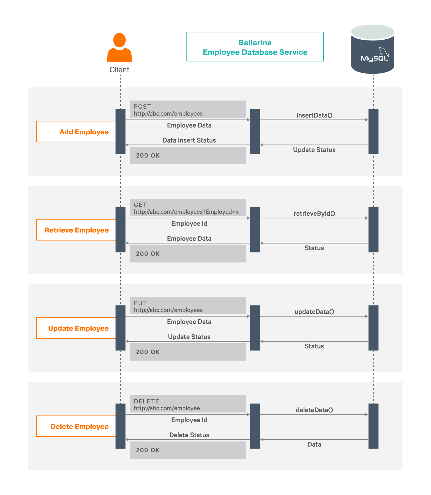

# Database Interaction

Ballerina is an open-source programming language that empowers developers to integrate their system easily with the support of connectors. In this guide, we are mainly focusing on building a database-backed RESTful web service with Ballerina. You can find other integration modules from the [wso2-ballerina](https://github.com/wso2-ballerina) GitHub repository.

Data inside a database can be exposed to the outside world by using a database-backed RESTful web service. RESTful API calls enable you to add, view, update, and remove data stored in a database from the outside world.

## What you'll build

You'll build an employee data management REST service that performs CRUD Operations (Create, Read, Update, Delete) on a MySQL database. Also, this guide walks you through the process of accessing relational data via the Ballerina language. The service will have the following functionalities.

* Add new employees to the database via HTTP POST method.
* Retrieve details of an existing employee from the database via HTTP GET method.
* Update an existing employee in the database via the HTTP PUT method.
* Delete an existing employee from the database via the HTTP DELETE method.

This service will deal with a MySQL database and expose the data operations as a web service. Refer to the following diagram to understand the complete end-to-end scenario.



<!-- INCLUDE_MD: ../../../../tutorial-prerequisites.md -->
* [MySQL version 5.6 or later](https://www.mysql.com/downloads/)
* [Official JDBC driver](https://dev.mysql.com/downloads/connector/j/) for MySQL   

<!-- INCLUDE_MD: ../../../../tutorial-get-the-code.md -->

## Implementation

> If you want to skip the basics, you can download the git repo and directly move to the `Testing` section by skipping the `Implementation` section.

Create a project.
 ```bash
 $ ballerina new data-backed-service
 ```

Navigate into the project directory and add a new module.
 ```bash
 $ ballerina add data_backed_service
 ```

Create a folder called `lib` under the project root path. Copy the [JDBC driver for MySQL](https://dev.mysql.com/downloads/connector/j/) into the `lib` folder.

Add the following under the `[dependencies]` section in Ballerina.toml file in the root directory of the project.

```ballerina
[platform]
target = "java8"
[[platform.libraries]]
module = "querying_mysql_database"
path = "./lib/mysql-connector-java-8.0.17.jar"
```

Add a ballerina.conf file and rename the .bal files with meaningful names as shown in the project structure given below.

```bash
data-backed-service
├── Ballerina.toml
├── ballerina.conf
├── lib
│    └── mysql-connector-java-x.x.x.jar
└── src
    └── data_backed_service
        ├── resources
        ├── Module.md
        ├── employee_db_service.bal
        └── tests
            ├── resources
            └── employee_db_service_test.bal
```
Open the project with VS Code and write the integration implementation and tests in the `employee_db_service.bal` and `employee_db_service_test.bal` files respectively.

### Developing the SQL Data-Backed Web Service
Ballerina language has built-in support for writing web services. The `service` keyword in Ballerina simply defines a web service. Inside the service block, we can have all the required resources. You can define a resource function inside the service. You can implement the business logic inside a resource function using Ballerina language syntax.

The Ballerina code for the employee data service with resource functions to add, retrieve, update, and delete employee data can be found in the `employee_db_service.bal` file.

<!-- INCLUDE_CODE: src/data_backed_service/employee_db_service.bal -->

A remote function in Ballerina indicates that it communicates with some remote service through the network. In this case, the remote service is a MySQL database. `employeeDB` is the reference name for the MySQL client object that encapsulates the aforementioned set of remote functions. The rest of the code is for preparing SQL queries and executing them by calling these remote functions of the Ballerina MySQL client.

You can implement custom functions in Ballerina that perform specific tasks. For this scenario, we have included the following functions to interact with the MySQL database.

- insertData
- retrieveById
- updateData
- deleteData

## Testing 

### Before you begin
- Download & run the SQL script `initializeDataBase.sql` provided inside the `resources` directory, to initialize the database and to create the required table.
    ```bash
    $ mysql -u username -p <initializeDataBase.sql 
    ``` 

- Add database configurations to the `ballerina.conf` file
- `ballerina.conf` file can be used to provide external configurations to Ballerina programs. Since this guide needs MySQL database integration, a Ballerina configuration file is used to provide the database connection properties to our Ballerina program.
This configuration file has the following fields. Change these configurations with your connection properties accordingly.
  ```
  DATABASE_URL = "jdbc:mysql://127.0.0.1:3306/EMPLOYEE_RECORDS"
  DATABASE_USERNAME = "root"
  DATABASE_PASSWORD = "root"
  ```

### Invoking the employee database service

Let’s build the module. Navigate to the project directory and execute the following command.

```bash
$ ballerina build data_backed_service
```

The build command would create an executable .jar file. Now run the .jar file created in the above step. Path to the ballerina.conf could be provided using the `--b7a.config.file` option.

```bash
$ java -jar target/bin/data_backed_service.jar --b7a.config.file=path/to/ballerina.conf/file
```

- Now you can test the functionality of the employee database management RESTFul service by sending HTTP requests for each database operation. For example, this guide uses the cURL commands to test each operation of the `employeeService` as follows.

**Add new employee** 
```bash
curl -v -X POST -d '{"name":"Alice", "age":20,"ssn":123456789,"employeeId":1}' \
"http://localhost:9090/records/employee" -H "Content-Type:application/json"
```
Output:
```json
{"Status": "Data Inserted Successfully"}
```  

**Retrieve employee data** 
```bash
curl -v "http://localhost:9090/records/employee/1"
```
Output: 
```json
[{"EmployeeID": 1, "Name": "Alice", "Age": 20, "SSN": 123456789}]
```
**Update an existing employee data** 
```bash
curl -v -X PUT -d '{"name":"Alice Updated", "age":30,"ssn":123456789,"employeeId":1}' \
"http://localhost:9090/records/employee" -H "Content-Type:application/json"
```
Output: 
```json
{"Status": "Data Updated Successfully"}
```

**Delete employee data** 
```bash
curl -v -X DELETE "http://localhost:9090/records/employee/1"
```
Output: 
```json
{"Status": "Data Deleted Successfully"}
```
