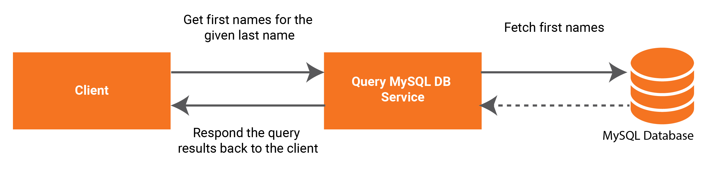

# Querying MySQL Database

Ballerina is an open-source programming language that empowers developers to integrate their system easily with the support of connectors. In this guide, we are mainly focusing on how to expose MySQL database as a service in Ballerina and do a select query upon it.

`ballerinax/java.jdbc` module allows you to perform CRUD operations using JDBC Client. You can find other integration modules from the [wso2-ballerina](https://github.com/wso2-ballerina) Github repository. 

## What you'll build

Here the caller will send the last name of the employee for whom he wants to fetch the first name as a path parameter. Then the select query will be performed on the MySQL database and the results will be returned.



<!-- INCLUDE_MD: ../../../../tutorial-prerequisites.md -->
* Download MySQL JDBC driver

<!-- INCLUDE_MD: ../../../../tutorial-get-the-code.md -->

## Implementation

The Ballerina project is created for the integration use case explained above. Please follow the steps given below. You can learn about the Ballerina project and module by following the [documentation on creating a project and using modules](../../../../develop/using-modules/).

Create a project.
```bash
$ ballerina new querying-mysql-database
```
Navigate to the querying-mysql-database directory.

Add a module.
```bash
$ ballerina add querying_mysql_database
```

Create a folder called `lib` under the project root path. Copy the [JDBC driver for MySQL](https://dev.mysql.com/downloads/connector/j/) into the `lib` folder.

The project structure should look like below.
```shell
├── querying-mysql-database
    ├── lib
        └── mysql-connector-java-8.0.17.jar
    ├── ballerina.conf    
    ├── Ballerina.toml
    └── src
        └── querying_mysql_database
            ├── main.bal
            ├── Module.md
            ├── resources
            └── tests
                └── resources
```

Add the following under the `[dependencies]` section in Ballerina.toml file in the root directory of the project.

  ```ballerina
  [platform]
  target = "java8"
  
  [[platform.libraries]]
  module = "querying_mysql_database"
  path = "./lib/mysql-connector-java-8.0.17.jar"
  ```
Run the sampleScript.sql script inside resources folder to create the table and insert data required for the guide.

 - `ballerina.conf` file can be used to provide external configurations to Ballerina programs. Since this guide needs 
    MySQL database integration, a Ballerina configuration file is used to provide the database connection properties to 
    our Ballerina program. This configuration file has the following fields. Change these configurations with your 
    connection properties accordingly.
   
    ```
    DATABASE_URL = "jdbc:mysql://127.0.0.1:3306/bankDB"
    DATABASE_USERNAME = "root"
    DATABASE_PASSWORD = "root"
    ```


Write your integration.

You can open the project with VS Code. The implementation will be written in the `main.bal` file.

<!-- INCLUDE_CODE: src/querying_mysql_database/main.bal -->

## Testing

First, let’s build the module. While being in the querying_mysql_db directory, execute the following command.

```bash
$ ballerina build querying_mysql_database
```

The build command would create an executable .jar file. Now run the .jar file created in the above step.

```bash
$ java -jar target/bin/querying_mysql_database.jar
```

Send the following request where the last name is set as a path param.
```
curl -X GET http://localhost:9095/staff/employee/collins -H 'Content-Type: application/json'
```

This will return the following response to the client if the request is successful.
```json
[{"firstName":"thomas"}, {"firstName":"abner"}]
```
