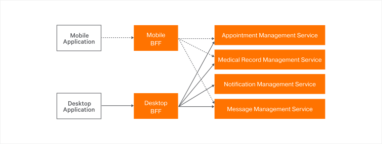

# Backend for Frontend

Backend for frontend(BFF) is a service design pattern that provides the core idea to create separate back-end services for specific front-end applications. This pattern allows you to have separate back-end service layers(shim) depending on the user experience you expect to have in the front-end application. The BFF design pattern has its own advantages and disadvantages. The usage of the pattern depends on your use case and requirements. For more information on the BFF design pattern, see [Pattern: Backends For Frontends by Sam Newman](https://samnewman.io/patterns/architectural/bff/) and [The Back-end for Front-end Pattern (BFF) by Phil Calçado](http://philcalcado.com/2015/09/18/the_back_end_for_front_end_pattern_bff.html). 

## What you’ll build

Let’s take a real world use case of an online healthcare management system to understand how BFF works. Assume that the healthcare provider needs to have a desktop application as well as a mobile application to provide users a quality online experience. The manner in which information is displayed to a user can vary depending on whether the user signs in to the desktop application or mobile application. This is because the resource limitations such as screen size, battery life, and data usage in mobile devices can cause the mobile application to show minimal viable information to an end user, whereas when it comes to desktop applications, it is possible to display more information and allow multiple network calls to get the required information. The difference in requirements when it comes to each application leads to the need to have a separate BFF for each application. Here, the BFF layer consumes existing downstream services and acts as a shim to translate the required information depending on the user experience.  

The following diagram illustrates the scenario:



For this scenario, lets assume we have two applications called desktop application and mobile application. For each application, there is a specific back-end service (BFF) called desktop BFF and mobile BFF respectively. These BFFs consume a set of downstream services called appointment management service, medical record management service, notification management service, and message management service. In this guide, Ballerina is used to build both the BFF layer and the downstream service layer.

## Prerequisites

- [Ballerina Distribution](https://ballerina.io/learn/getting-started/)
- A Text Editor or an IDE 
> **Tip**: For a better development experience, install one of the following Ballerina IDE plugins: [VSCode](https://marketplace.visualstudio.com/items?itemName=ballerina.ballerina), [IntelliJ IDEA](https://plugins.jetbrains.com/plugin/9520-ballerina)

## Implementation

* Create a new Ballerina project named `backend-for-frontend`.

   ```bash
   $ ballerina new backend-for-frontend
   ```

* Navigate to the `backend-for-frontend` directory.

* Add a new module named `healthcare_service` to the project.

   ```bash
   $ ballerina add healthcare_service
   ```

* Open the project with VS Code. The project structure will be similar to the following.

   ```bash
   .
   ├── Ballerina.toml
   └── src
      └── healthcare_service
         ├── main.bal
         ├── Module.md
         ├── resources
         └── tests
               ├── main_test.bal
               └── resources
   ```
   We can remove the file `main_test.bal` for the moment, since we are not writing any tests for our service. Also let's remove the `main.bal` file and add two directories under `healthcare_service` named `downstream_services` and `backends_for_frontends`.

   The final directory structure should be similar to the following.

   ```bash
   .
   ├── Ballerina.toml
   └── src
      └── healthcare_service
         ├── backends_for_frontends
         ├── downstream_services
         ├── Module.md
         ├── resources
         └── tests
               └── resources
   ```

* Now that we have created the project structure, the next step is to develop the services.

   First let’s implement the set of downstream services under `downstream_services` directory. Here we're going to create four services appointment_mgt_service, medical_record_mgt_service, message_mgt_service, and notification_mgt_service, each responding with pre-defined JSON payloads for demonstration purpose.

**appointment_mgt_service.bal**

<!-- INCLUDE_CODE: src/healthcare_service/downstream_services/appointment_mgt_service.bal -->

**medical_record_mgt_service.bal**

<!-- INCLUDE_CODE: src/healthcare_service/downstream_services/medical_record_mgt_service.bal -->

**message_mgt_service.bal**

<!-- INCLUDE_CODE: src/healthcare_service/downstream_services/message_mgt_service.bal -->

**notification_mgt_service.bal**
<!-- INCLUDE_CODE: src/healthcare_service/downstream_services/notification_mgt_service.bal -->

* Now let’s move to the key implementation of BFF services under `backends_for_frontends` directory. 

The first BFF is the `mobile_bff_service`, which is a shim used to support Mobile user experience in this use case. When loading mobile application's home page, it calls a single resource in Mobile BFF and retrieves appointments, medical records, and messages. This will reduce the number of backend calls and will help to load the home pages in a more efficient way. Since different mobile apps have different methods of sending notifications, we are not using the notification management service.

**mobile_bff_service.bal**

<!-- INCLUDE_CODE: src/healthcare_service/backends_for_frontends/mobile_bff_service.bal -->

The second BFF is the `desktop_bff_service`, which is a shim used to support desktop application user experience. When a user loads the desktop application home page, there can be multiple calls to the `desktop_bff_service` to retrieve comparatively large amounts of data based on the desktop application requirement. The desktop application can call the desktop BFF separately to retrieve appointments and medical records. The desktop application can also call desktop BFF to retrieve messages and notifications in a single call. 

   **desktop_bff_service.bal**

   <!-- INCLUDE_CODE: src/healthcare_service/backends_for_frontends/desktop_bff_service.bal -->

## Run the Integration

* First let’s build the module. While being in the `backend-for-frontend` directory, execute the following command.

    ```bash
    $ ballerina build healthcare_service
    ```

   This creates the executables.

* Now run the .jar file created in the above step.

    ```bash
    $ java -jar target/bin/healthcare_service.jar
    ```

   Now we can see that six services have started on ports 9090, 9091, 9092, 9093, 9094, and 9095. 

* Let's access the Mobile BFF with the following curl command.

   ```bash
   $ curl http://localhost:9090/mobile/data
   ```
   
   We receive a JSON payload similar to the following

   ```json
   {  
      "Appointments":[  
         {  
            "id":"APT01",
            "name":"Family Medicine",
            "location":"Main Hospital",
            "time":"2018-08-23, 08.30AM",
            "description":"Doctor visit for family medicine"
         },
         {  
            "id":"APT02",
            "name":"Lab Test Appointment",
            "location":"Main Lab",
            "time":"2018-08-20, 07.30AM",
            "description":"Blood test"
         }
      ],
      "Messages":[  
         {  
            "id":"MED01",
            "name":"Fasting Glucose Test",
            "description":"Test Result for Fasting Glucose test is normal"
         },
         {  
            "id":"MED02",
            "name":"Allergies",
            "description":"Allergy condition recorded due to Summer allergies"
         }
      ],
      "MedicalRecords":[  
         {  
            "id":"NOT01",
            "name":"Lab Test Result Notification",
            "description":"Test Result of Glucose test is ready"
         },
         {  
            "id":"NOT02",
            "name":"Flu Vaccine Status",
            "description":"Flu vaccines due for this year"
         }
      ]
   }
   ```

* Now let's access each resource of the Desktop BFF. The response of each call is given below the Curl request.

   ```bash
   $ curl http://localhost:9091/desktop/alerts
   ```

   ```json
   {  
      "Notifications":[  
         {  
            "id":"NOT01",
            "name":"Lab Test Result Notification",
            "description":"Test Result of Glucose test is ready"
         },
         {  
            "id":"NOT02",
            "name":"Flu Vaccine Status",
            "description":"Flu vaccines due for this year"
         }
      ],
      "Messages":[  
         {  
            "id":"NOT01",
            "name":"Lab Test Result Notification",
            "description":"Test Result of Glucose test is ready"
         },
         {  
            "id":"NOT02",
            "name":"Flu Vaccine Status",
            "description":"Flu vaccines due for this year"
         }
      ]
   }
   ```


   ```bash
   $ curl http://localhost:9091/desktop/appointments
   ```

   ```json
   [  
      {  
         "id":"APT01",
         "name":"Family Medicine",
         "location":"Main Hospital",
         "time":"2018-08-23, 08.30AM",
         "description":"Doctor visit for family medicine"
      },
      {  
         "id":"APT02",
         "name":"Lab Test Appointment",
         "location":"Main Lab",
         "time":"2018-08-20, 07.30AM",
         "description":"Blood test"
      }
   ]
   ```


   ```bash
   $ curl http://localhost:9091/desktop/medicalRecords
   ```

   ```json
   [  
      {  
         "id":"MED01",
         "name":"Fasting Glucose Test",
         "description":"Test Result for Fasting Glucose test is normal"
      },
      {  
         "id":"MED02",
         "name":"Allergies",
         "description":"Allergy condition recorded due to Summer allergies"
      }
   ]
   ```
