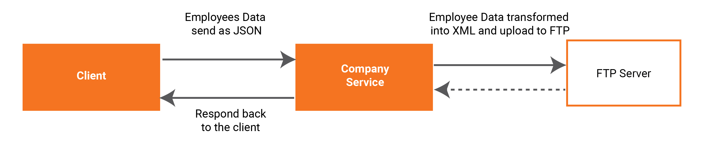

# Convert JSON to XML and Upload to FTP

Ballerina is an open-source programming language that empowers developers to integrate their system easily with the support of connectors. In this guide, we are mainly focusing on connecting to a file server with the FTP connector. You can find other integration modules from the [wso2-ballerina](https://github.com/wso2-ballerina) GitHub repository.

The FTP connector offers support as a listener, where it listens to the given remote location and is triggered when a file is added or deleted. Also, it supports connecting to a file server as the client and performing various operations such as get, put, delete, etc. The FTP connector can be used to connect to your remote file server with FTP, SFTP, FTPS protocols.

## What you'll build
Ballerina has first-class support for HTTP and implementing an HTTP service is straightforward. The caller will send a JSON payload that consists of employees data. The HTTP service reads the JSON payload and transforms it to XML. Then with the support of FTP connector, the employee's data in XML format gets uploaded to the FTP server.



<!-- INCLUDE_MD: ../../../../tutorial-prerequisites.md -->

<!-- INCLUDE_MD: ../../../../tutorial-get-the-code.md -->

## Implementation
The Ballerina project is created for the integration use case explained above. Please follow the steps given below. You can learn about the Ballerina project and module in this link.

####1. Create a project.
```bash
$ ballerina new converting-json-to-xml-and-upload-to-ftp
```
Change directory to converting-json-to-xml-and-upload-to-ftp.

####2. Add a module.
```bash
$ ballerina add uploadtoftp
```

The project structure should look like below.
```shell
converting-json-to-xml-and-upload-to-ftp
├── Ballerina.toml
└── src
    └── uploadtoftp
        ├── main.bal
        ├── Module.md
        ├── resources
        └── tests
            └── resources
```

####3. Write the integration.
You can open the project with VS Code. The integration implementation will be written in the `main.bal` file.  

<!-- INCLUDE_CODE: src/uploadtoftp/main.bal -->

The `ftpConfig` created provides the file server credentials. Here it reads from the config file. You have to create a file called `ballerina.conf` under the root path of the project structure. The file should have the following configurations.

```
[ftp]
  host="<file_server_url>"
  port=<file_server_port>
  username="<file_server_username>"
  password="<file_server_password>"
```

The username and password are sensitive data. Usually, we do not expose this data to the outside. Ballerina supports encrypting sensitive data and uses them in the program.

```shell
$ ballerina encrypt
```

When you execute the encrypt action, it will ask for the value and secret key. Once you input this, it will provide the encrypted value that can directly use in the config file.

```shell
Enter value: 

Enter secret: 

Re-enter secret to verify: 

Add the following to the configuration file:
<key>="@encrypted:{aoIlSvOPeBEZ0COma+Wz2uWznlNn1IWz4StiWQCO6g4=}"

Or provide it as a command line argument:
--<key>=@encrypted:{aoIlSvOPeBEZ0COma+Wz2uWznlNn1IWz4StiWQCO6g4=}
```

Use the encrypted value in the `ballerina.conf` file.

```
[ftp]
  host="<file_server_url>"
  port=<file_server_port>
  username="<file_server_username>"
  password="@encrypted:{3SCS/ET4uaJKVZwh+/If3rvU9ImbZSCmrruroMF5Sig=}"
```

After that `ftp:Client` is created with `ftpConfig`. The HTTP listener service will run on 8080 port when you start running the program. When the request is received by the HTTP service, it gets the JSON payload and transforms it to XML. Since Ballerina language is a type-safe language, we have to check if the transformed result returns XML or error. If XML is returned, then we write the XML to the remote FTP location specified in the top with the FTP client. If the return result of the `ftp:put` operation was successful, respond to the call by building JSON payload using `http:Response`. If any error is returned from the above actions, the relevant error message builds with the error reason and responds to the caller. 

## Testing
First, let’s build the module. While being in the converting-json-to-xml-and-upload-to-ftp directory, execute the following command.

```bash
$ ballerina build uploadtoftp
```

The build command would create an executable .jar file. Now run the .jar file created in the above step.

```bash
$ java -jar target/bin/uploadtoftp.jar
```

Create an employees.json file with the below payload.
```json
{
   "employees":{
      "employee":[
         {
            "firstname":"Peter",
            "lastname":"Pan",
            "Age":25,
            "addresses":{
               "address":[
                  {
                     "street":"123 Town hall",
                     "city":"Colombo"
                  },
                  {
                     "street":"987 Palm Grove",
                     "city":"Colombo"
                  }
               ]
            }
         },
         {
            "firstname":"Alex",
            "lastname":"Stuart",
            "Age":30,
            "addresses":{
               "address":[
                  {
                     "street":"456 Flower Road",
                     "city":"Galle"
                  },
                  {
                     "street":"654 Sea Street",
                     "city":"Galle"
                  }
               ]
            }
         }
      ]
   }
}
```

Now we can see that the service has started on port 8080. Let’s access this service by executing the following curl command.

```bash
$ curl -H "application/json" -d @employees.json http://localhost:8080/company/employees
```

You will see the following response in a successful invocation. Also, the remote file server location should have the `employee.xml` file with the employees as XML records.

```json
{"Message":"Employee records uploaded successfully."}
```
