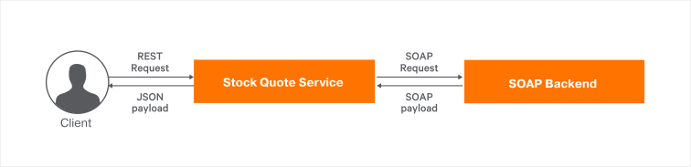

# REST to SOAP

## About

This guide demonstrates a scenario where Ballerina is used to call a SOAP backend. Here, a SOAP backend is fronted by a Ballerina service that accepts a REST request and converts it to a SOAP request. The SOAP connector is used to call the SOAP backend.

## What you'll build

We create a service `stockQuote` that fronts a SOAP backend. The service has two resources `getQuote` and `placeOrder`, which calls respectively the relevant services from the SOAP backend. The response received from the backend is finally sent back to the client.



## Prerequisites

- [Ballerina Distribution](https://ballerina.io/learn/getting-started/)
- A Text Editor or an IDE 
> **Tip**: For a better development experience, install the Ballerina IDE plugin for [VS Code](https://marketplace.visualstudio.com/items?itemName=ballerina.ballerina)

## Implementation

* Create a new Ballerina project named `exposing-soap-service`.
    ```bash
    $ ballerina new exposing-soap-service
    ```

* Navigate to the exposing-soap-service directory.

* Add a new module named `stockquote_service` to the project.

    ```bash
    $ ballerina add stockquote_service
    ```

* Open the project with VS Code. The project structure will be similar to the following.

    ```shell
    .
    ├── Ballerina.toml
    └── src
        └── stockquote_service
            ├── main.bal
            ├── Module.md
            ├── resources
            └── tests
                ├── main_test.bal
                └── resources
    ```

    We can remove the file `main_test.bal` for the moment, since we are not writing any tests for our service.

First let's create a mock SOAP service. Please note that Ballerina does not support writing SOAP services. Therefore, we're creating mock service that would mimic SOAP responses.

* Create a file named `mock_soap_service.bal` under `stockquote_service` with the following content.

**mock_soap_service.bal**

<!-- INCLUDE_CODE: src/stockquote_service/mock_soap_service.bal -->

This service checks the SOAPAction header in the request, calls the relevant method, and responds with a SOAP envelope.

* Now let's open the `main.bal` file and add the following content. This is going to be our integration logic.

**main.bal**

<!-- INCLUDE_CODE: src/stockquote_service/main.bal -->

Here we create a SOAP client with the mock SOAP service we created earlier. There are two resources in the service - `getQuote` and `placeOrder`. In the `getQuote` resource, we construct an XML payload with the path parameter `company` and pass the payload to the SOAP client. Then we receive the response, convert it to JSON and respond back to the client. The resource `placeOrder` also has a similar logic except the XML payload is constructed from the values in the request payload.

## Run the Integration

* First let’s build the module. While being in the exposing-soap-service directory, execute the following command.

    ```bash
    $ ballerina build stockquote_service
    ```

This creates the executables.

* Now run the .jar file created in the above step.

    ```bash
    $ java -jar target/bin/stockquote_service.jar
    ```

Now we can see that two services have started on ports 9000 and 9090. 

* Let’s access the `stockQuote` service's `getQuote` resource by executing the following curl command.

    ```bash
    $ curl http://localhost:9090/stockQuote/quote/xyz
    ```

    We receive a JSON payload similar to the following.

    ```json
    {  
    "getQuoteResponse":{  
        "change":"-2.86843917118114",
        "earnings":"-8.540305401672558",
        "high":"-176.67958828498735",
        "last":"177.66987465262923",
        "low":"-176.30898912339075",
        "marketCap":"5.649557998178506E7",
        "name":"xyz Company",
        "open":"185.62740369461244",
        "peRatio":"24.341353665128693",
        "percentageChange":"-1.4930577008849097",
        "prevClose":"192.11844053187397",
        "symbol":"xyz",
        "volume":"7791"
    }
    }
    ```

* Now let's access the `placeOrder` resource by executing the following curl command.

    ```bash
    $ curl http://localhost:9090/stockQuote/order -H 'Content-Type:application/json' --data '{"price":"1000.00", "quantity":"2", "symbol":"abc"}'
    ```

    We receive a JSON payload similar to the following.

    ```json
    {
        "placeOrderResponse":{
            "status":"created"
        }
    }
    ```