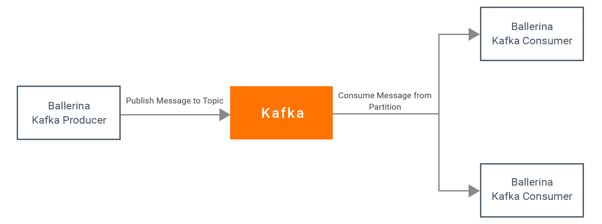

# Messaging with Kakfa

Kafka is a distributed, partitioned, replicated commit log service. It provides the functionality of a publish-subscribe messaging system with a unique design. Kafka mainly operates based on a topic model. A topic is a category or feed name to which records get published. Topics in Kafka are always multi-subscriber.

This guide walks you through the process of messaging with Apache Kafka using Ballerina language. 

## What you'll build

To understand how you can use Kafka for 'publish-subscribe' messaging, lets consider a real-world use case of a Product Management System. This product management system consists of a product admin portal where the product administrator can update the price for a product. Based on the content of the message sent to the product admin service, it is filtered to different partitions in the Kafka Topic.  

The following figure illustrates the publish-subscribe messaging use-case. 



<!-- INCLUDE_MD: ../../../../tutorial-prerequisites.md -->
* [Install Kafka server](https://kafka.apache.org/quickstart)

<!-- INCLUDE_MD: ../../../../tutorial-get-the-code.md -->

## Implementation

#### 1. Create a new Ballerina project

```bash
$ ballerina new messaging-with-kafka
```

#### 2. Navigate to the messaging-with-kafka directory 
Add a new module named `product_management_system` to the project.

```bash
$ ballerina add product_management_system
```

####3. Open the project with VS Code. 
The project structure will be similar to the following.

```shell
messaging-with-kafka
├── Ballerina.toml
└── src
    └── product_management_system
        ├── main.bal
        ├── Module.md
        ├── resources
        └── tests
            ├── main_test.bal
            └── resources
```
We can remove the file `main-test.bal` for the moment, since we are not writing any tests for our service.

####4. Write the integration

Open the project in VS Code.

The `product_admin_service` is a Kafka topic publisher which accepts HTTP requests and routes the serialized message to a partition in the topic based on the content of the recieved payload. In this case it filters for product type.

The integration implementation is written in the `src/product_management_system/product_admin_service.bal` file.

* Create a new file named `product_admin_service.bal` with the following content

**product_admin_service.bal**

<!-- INCLUDE_CODE: src/product_management_system/product_admin_service.bal -->

The `fruit_consumer` and `vegetable_consumer` are Kafka topic subscribers which consume messages from individual partitions in the topic. 

* Create a new file named `fruit_consumer.bal` file under `product_management_system` with the following content.

**fruit_consumer.bal**
<!-- INCLUDE_CODE: src/product_management_system/fruit_consumer.bal -->

* Likewise, let's create another file `vegetable_consumer.bal` with the following content.

**vegetable_consumer.bal**
<!-- INCLUDE_CODE: src/product_management_system/vegetable_consumer.bal -->


## Testing

* First, start the `ZooKeeper` instance with the default configurations by entering the following command in a terminal from `<KAFKA_HOME_DIRECTORY>`.

 ```bash
   $ bin/zookeeper-server-start.sh -daemon config/zookeeper.properties
 ```
 
 For Windows

 ```
   .\bin\windows\zookeeper-server-start.bat .\config\zookeeper.properties
 ```

**Tip**: `-daemon` flag is optional, use this if you want to run kafka server as a daemon) 

  Here we start a zookeeper with default configurations (on `port:2181`).

* Start a single `Kafka broker` instance with the default configurations by entering the following command  in a terminal from `<KAFKA_HOME_DIRECTORY>`.

```bash
   $ bin/kafka-server-start.sh -daemon config/server.properties
```

For Windows

```
   .\bin\windows\kafka-server-start.bat .\config\server.properties
```

**Tip**: `-daemon` flag is optional, use this if you want to run Kafka server as a daemon) 
  
  Here we started the Kafka server on `host:localhost` and `port:9092`. Now we have a working Kafka cluster.

* Create a new topic called `product-price` on the Kafka cluster by entering the following command in a terminal from `<KAFKA_HOME_DIRECTORY>`.

```bash
   $ bin/kafka-topics.sh --create --topic product-price --zookeeper \
   localhost:2181 --replication-factor 1 --partitions 2
```

For Windows

```
   .\bin\windows\kafka-topics.bat --create --topic product-price --zookeeper \
   localhost:2181 --replication-factor 1 --partitions 2
```

Here we created a new topic that consists of two partitions with a single replication factor.

* Now we shall build the module. Navigate to the messaging-with-kafka directory and execute the following command.

```bash
   $ ballerina build product_management_system
```

This would create the executables.

* Run the `product_management_system.jar` created in the above step.

```bash
   $ java -jar target/bin/product_management_system.jar
```

* Invoke the `product_admin_service` by sending a valid POST request

```bash
   $ curl -XPOST -H "Content-type: application/json" -d "{\"Product\":\"Apple\",\"Type\":\"Fruit\",\"Price\":\"100.00\"}" "http://localhost:9090/product/updatePrice"
```

Based on the 'Type' specified in the request, the message is filtered into two partitions. One consumer is subscribed to one partition, which receives products of Type 'Vegetable' while the other receives products of Type 'Fruit'.

The following message will be displayed on the terminal.

```
ProductManagementService : Received payload
ProductManagementService : Sending message to Partition 0
ProductConsumerService1 : Product Received
Name : Apple
Price : Fruit

```

The `{"Status": "Success"}` message is received from the product_admin_service.
