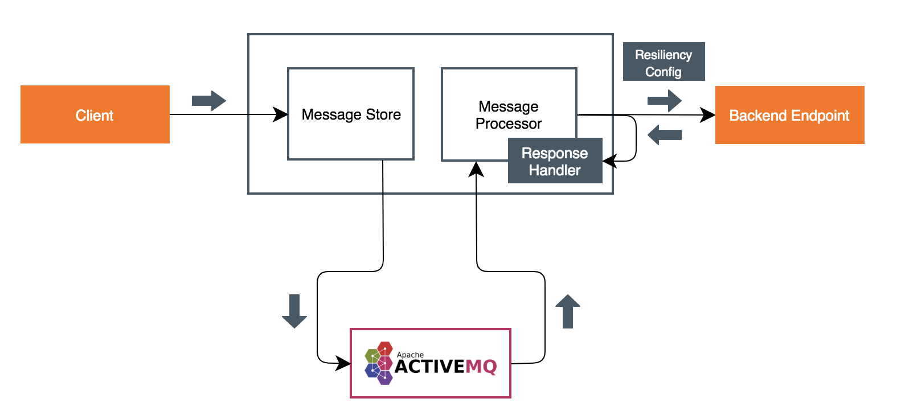

Implements the message processor for reliable delivery tutorial.

# Reliable Message Delivery

## About

Ballerina is an open-source programming language that empowers developers to integrate their system easily with the 
support of connectors. In this guide, we will look into using WSO2 Store Forward Connector to achieve reliable message delivery using Ballerina. 
You can find other integration modules from the [wso2-ballerina](https://github.com/wso2-ballerina) GitHub repository.

The WSO2 Store Forward Connector provides a **Message Storing Client** and a **Message Forwarding Processor** to handle messages 
received at an API endpoint. The Storing Client will store the received messages in a queue in a message broker for later processing, 
and the Message Processor will listen to the message broker and forward any new messages to the desired HTTP endpoint.

Reliable delivery is achieved by removing the message from the queue only after successfully delivering the message. If the receiving 
endpoint is not available at the moment, the service will retry to send the message. After several retries, if the 
message is still not delivered, message forwarder will back up the message, and continue with the next message. 

You can find more about the Store Forward Connector from [here](https://github.com/wso2-ballerina/module-storeforward).

## What you'll build

To understand how to implement reliable delivery for your HTTP service, consider a scenario where you have an API 
for managing orders at an online shop. When an order is received at the `/orders/new-order` endpoint, it will send the request to 
`/sales/save-order` endpoint for persisting the request. When transferring the order requests, reliable delivery should be ensured, 
as messages can fail to deliver to the backend order service due to various reasons such as difference of processing 
speeds in services and endpoint failures. 



## Prerequisites
 
* Ballerina Integrator
* Oracle JDK 1.8.*
* A Text Editor or an IDE 
> **Tip**: For a better development experience, install the [Ballerina Integrator Extension](https://marketplace.visualstudio.com/items?itemName=WSO2.ballerina-integrator) in VS Code.
* A message broker to store messages in a queue. You can download and install Apache ActiveMQ from 
[here](http://activemq.apache.org/getting-started.html).

## Get the code

Pull the modules from [Ballerina Central](https://central.ballerina.io/) using the following commands.

```bash
ballerina pull wso2/message_store
ballerina pull wso2/message_processor
```

## Implementation

Follow the steps given below to implement the above scenario.

####1. Create the project structure

Ballerina is a complete programming language that supports custom project structures. 

Create the Ballerina project `reliable-delivery` and add the `message_store` and `message_processor` modules using the below commands.

```bash
$ ballerina new reliable-delivery
$ cd reliable-delivery
$ ballerina add message_store
$ ballerina add message_processor
```

Create the `msg_store.bal` and `msg_processor.bal` files inside each Ballerina module. 

####2. Implement message store

The message storing service will accept any incoming HTTP message and store it in the defined queue in message broker. 
Note the following when configuring the message store client.

1. `MessageStoreConfiguration` is specified with required Message Broker detail when creating message store client.
2. A fail-over store client is also defined and set to the primary message store client (optional). If message could not be forwarded
   to the primary store, then this store is used to store the message.
3. `MessageStoreRetryConfig` specifies resiliency parameters in case if message is not stored successfully.
4. Upon receiving the response from the backend, user can define any action to be performed upon the response. This 
   action can be passed as a Lambda (function pointer) to the message processor when it is created.

<!-- INCLUDE_CODE: src/message_store/msg_store.bal -->

Once received message is handled, the calling client will get *202-accepted* message, or *500-internal server error*, 
notifying the user of the status of storing the message.

####3. Implement message processor

Message processor will poll the message broker and listen for any new messages on the queue. If new messages are added, 
it will dequeue the message, and forward it to the backend endpoint for further processing.

When configuring the `MessageForwardingProcessor`, there are a few things you need to consider.

1. Same `MessageStoreConfiguration` you used to specify `messageStore` to store message in the above service should be
   used in `ForwardingProcessorConfiguration`. Notice in this example we are using the same pointing to the queue `myStore`.
2. You can specify the speed for message polling or specify a cron. Here we configure it to poll a message
   every 2 seconds by the cron expression `0/2 * * * * ?`. You can leverage this to run the processor at a specified time
   of the day.
3. You can configure the message processor to retry forwarding the messages it polls from the broker. In this example, message will
   retry `5 times` with an interval of `3 seconds` between each retry. If backend responds with `500` or `400` status codes,
   processor will consider them as failed to forward messages.
4. Once all retries to forward the message to the backend are over, you can either stop the message processor or drop the message and
   continue. Optionally, if a DLC store (another messageStore) is configured, message will be forwarded to it, and processor
   will move to the next message. In this example, we have specified a DLC store.
5. In case of connection failure to the message broker, message processor will retry to regain the connection and initialize
   message consumer back. You also have the freedom to configure that retry. In here, once every `15 seconds`, it will try
   to connect to the broker.
6. Once created, you need to `start` the processor to start running the forwarding processor.

Also note that in the example, we have exited the service in any case where it failed to initialize message processor (i.e
connection establishment failed for the broker).

<!-- INCLUDE_CODE: src/message_processor/msg_processor.bal -->

####4. Implement the backend service

The backend service exposes `/sales/save-order` endpoint as a `POST` resource, which accepts a JSON message. It returns 
a static response stating that the message was received at the endpoint.

<!-- INCLUDE_CODE: src/message_store/order_service.bal-->

## Testing 

Before building the module, we have to copy the necessary ActiveMQ dependencies into the project. There are three jar 
files listed down below, which can be found in the `lib` folder of the ActiveMQ distribution.

* activemq-client-5.15.5.jar
* geronimo-j2ee-management_1.1_spec-1.0.1.jar
* hawtbuf-1.11.jar

This example uses ActiveMQ version 5.15.5. You can select the relevant jar files according to the ActiveMQ version you have installed.

Let's create a folder called `lib` under project root path. Then copy above jar files into the lib folder.

Next, open the `Ballerina.toml` file and add the following below `[dependencies]` section. During project build, 
ActiveMQ jar files will be added to the executable jar.

```
[platform]
target = "java8"

  [[platform.libraries]]
  module = "json_data_to_activemq"
  path = "./lib/activemq-client-5.15.5.jar"

  [[platform.libraries]]
  module = "json_data_to_activemq"
  path = "./lib/geronimo-j2ee-management_1.1_spec-1.0.1.jar"

  [[platform.libraries]]
  module = "json_data_to_activemq"
  path = "./lib/hawtbuf-1.11.jar"
```

Let’s build the module. Navigate to the project root directory and execute the following command.

```bash
$ ballerina build -a
```

The build command would create two executable jar files for message store and processor modules. 

Now, start the message broker you installed previously. If you are using Active MQ, you can navigate to `<ACTIVE_MQ_HOME>/bin` 
and start the broker by running the command below.

```bash
$ ./activemq console
```

To start the store and processing services, run the two jar files earlier.

```bash
$ java -jar target/bin/message_store.jar
```

```bash
$ java -jar target/bin/message_processor.jar
```

Send a request using curl to the message storing service to trigger a message processing request.

```bash
$ curl -i -X POST http://localhost:8080/orders/new-order -H "Content-Type: application/json" --data-binary "@/resources/input.json"
```

You will see the following response in a successful invocation. 

```bash
$ INFO  [wso2/message_processor] - Stock order persisted sucessfully. 
```

Also, the published message should be visible in the `item_orders` queue when you log into the ActiveMQ web console.  

In addition to the above scenario, there are other use-cases you can achieve using the Store Forward connector.

1. **in-order message delivery** : If only one message processor is picking messages from the particular store, in-order 
message delivery pattern is also achieved. Messages are delivered to the endpoint in a reliable manner keeping the order 
of the messages they were put to the store.

2. **throttling** : Consider a legacy backend that can process messages only up to 100 TPS. This service is exposed to 
a system from which it gets message bursts, sometimes exceeding its limit of 100 TPS. To regulate the load we can use 
message store and forward pattern. System can store messages at its own pace and message processor 
will forward the messages to the backend in a regulated way with its defined polling interval.
