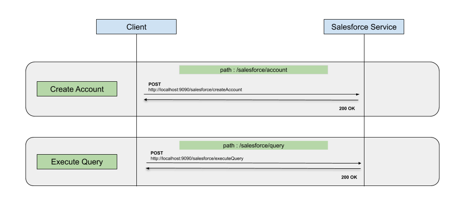

# Working with Salesforce client

## About

Ballerina is an open-source programming language that empowers developers to integrate their system easily with the 
support of connectors. In this guide, we are mainly focusing on using Ballerina Salesforce client.

The Ballerina Salesforce client enables you to perform CRUD operations for SObjects, query using SOQL, search using 
SOSL and describe SObjects and organizational data through the Salesforce REST API. Also it supports insert, upsert, 
update, query and delete operations for CSV, JSON and XML data types which provides in Salesforce bulk API. It handles 
OAuth 2.0 authentication.

You can find other integration modules from [wso2-ballerina](https://github.com/wso2-ballerina) GitHub organization.

## What you'll build

This example explains how to use the Salesforce client to connect with the Salesforce instance and perform the 
following operations:

* Create Account with Contacts & Opportunities
* Execute a SOQL query

<!-- INCLUDE_MD: ../../../../../tutorial-prerequisites.md -->

<!-- INCLUDE_MD: ../../../../../tutorial-get-the-code.md -->

### Implementation

The following diagram illustrates all the required functionality of the Salesforce Service that you are going to build.



### Set up credentials for accessing Salesforce.
   
- Visit [Salesforce](https://www.salesforce.com) and create a Salesforce account.

- Create a connected app and obtain the following credentials: 
    - Base URL (Endpoint)
    - Access Token
    - Client ID
    - Client Secret
    - Refresh Token
    - Refresh Token URL

- **Note**: When you are setting up the connected app, select the following scopes under **Selected OAuth Scopes**:
    - Access and manage your data (api)
    - Perform requests on your behalf at any time (refresh_token, offline_access)
    - Provide access to your data via the Web (web)

- Provide the client ID and client secret to obtain the refresh token and access token. For more information on 
obtaining OAuth2 credentials, see the 
[Salesforce documentation](https://help.salesforce.com/articleView?id=remoteaccess_authenticate_overview.htm).

#### Creating the module structure
- Create a new project.

```bash
$ ballerina new working-with-salesforce-client
```

- Create a module.

```bash
$ ballerina add working_with_salesforce_client
```

- The project structure is created as indicated below.

```
working-with-salesforce-client
    ├── Ballerina.toml
    └── src
        └── working_with_salesforce_client
            ├── Module.md
            ├── main.bal
            ├── resources
            └── tests
                └── resources
```

- Add the project configuration file by creating a `ballerina.conf` file under the root path of the project structure. 
This file should have following configurations. Add the obtained Salesforce configurations to the file.
```
EP_URL=""
ACCESS_TOKEN=""
CLIENT_ID=""
CLIENT_SECRET=""
REFRESH_TOKEN=""
REFRESH_URL=""
```

#### Developing the service

The following code is the completed sample which exposes the following services:

- createAccount: Creates a new Account and related Contacts & Opportunities using the given JSON.
- executeQuery: Execute a given SOQL query and return results as a JSON.

<!-- INCLUDE_CODE: src/guide/main.bal -->

### Testing

First let’s build the module. Navigate to the project root directory and execute the following command.

```bash
$ ballerina build working_with_salesforce_client
```

This creates the executables. Now run the `guide.jar` file created in the above step.

```bash
$ java -jar target/bin/working_with_salesforce_client.jar
```

You will see service the following log.

```log
[ballerina/http] started HTTP/WS listener 0.0.0.0:9090
```

#### Test createAccount resource

Create a file called `account.json` with following JSON content:
```json
{
    "Name": "Levi Straus & Co",
    "BillingCity": "California",
    "Website": "www.levis-clothing.com",
    "Contacts": [
        {
            "FirstName": "Sam",
            "LastName": "Pattinson",
            "Title": "Senior Manager",
            "Department": "Sales",
            "Email": "sampat@levis.com"
        },
        {
            "FirstName": "John",
            "LastName": "Auguero",
            "Title": "Assistant Manager",
            "Department": "Sales",
            "Email": "auguero@levis.com"
        }
    ],
    "Opportunities": [
        {
            "Name": "Mens 501 Summer Collection",
            "Amount": 235000,
            "CloseDate": "2019-05-21",
            "Probability": 100,
            "StageName": "Qualification"
        },
        {
            "Name": "Mens 510 Summer Collection",
            "Amount": 330000,
            "CloseDate": "2019-05-27",
            "Probability": 90,
            "StageName": "Qualification"
        }
    ]
}
```

Invoke the following curl request to create a new Account and related Contacts & Opportunities using the created 
JSON file.
```bash
curl -X POST -H "Content-Type: application/json" -d @account.json http://localhost:9090/salesforce/account
```

You will see the following response.
```json
{
  "accountId":"0012v00002Xaac8AAB",
  "contacts":[
    "0032v00002y28KQAAY", 
    "0032v00002y28KVAAY"
    ], 
  "opportunities":[
    "0062v00001H9RXiAAN", 
    "0062v00001H9RXnAAN"
    ]
}
```

#### Test executeQuery resource

Here we are going to query and retrieve IDs and Names of all the opportunities related to the newly added account.
We can achieve this by running following SOQL query.
```sql
SELECT Id, Name FROM Opportunity WHERE AccountId = '<ACCOUNT_ID_OF_THE_CREATED_ACCOUNT>'
```

Invoke the following curl request to execute the query.
```bash
curl -X POST -H "Content-Type: text/plain" -d "SELECT Id, Name FROM Opportunity WHERE AccountId = '<ACCOUNT_ID_OF_THE_CREATED_ACCOUNT>'" http://localhost:9090/salesforce/query
```

You will see the following response.
```json
{
    "totalSize": 3,
    "done": true,
    "records": [
        {
            "attributes": {
                "type": "Opportunity",
                "url": "/services/data/v46.0/sobjects/Opportunity/0062v00001ErIvIAAV"
            },
            "Id": "0062v00001ErIvIAAV",
            "Name": "Mens 510 Summer Collection"
        },
        {
            "attributes": {
                "type": "Opportunity",
                "url": "/services/data/v46.0/sobjects/Opportunity/0062v00001ErIvDAAV"
            },
            "Id": "0062v00001ErIvDAAV",
            "Name": "Mens 501 Summer Collection"
        }
    ]
}
```
