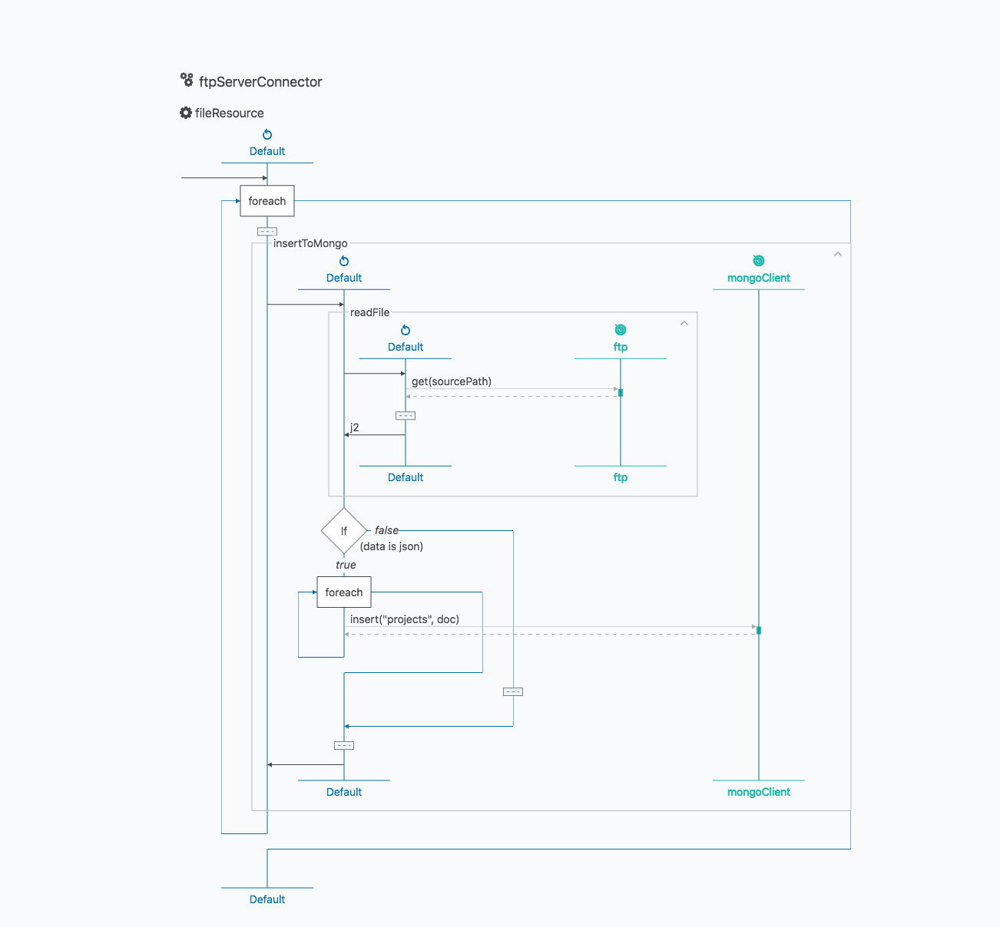

# Importing CSV Data to Mongo DB

## About 
Ballerina is an open-source programming language that empowers developers to integrate their system easily with the support of connectors. In this guide, we are mainly focusing on importing CSV file having contacts into MongoDB using FTP connector.

`wso2/mongodb` module allows you to perform CRUD operations on Mongo DB.<br/> 
The `wso2/ftp` module provides an FTP client and an FTP server listener implementation to facilitate an FTP connection 
to a remote location. You can find other integration modules from the [wso2-ballerina](https://github.com/wso2-ballerina) Github repository. 

## What you'll build

This application listens to a remote FTP location and when a CSV file is added to that FTP location, it will fetch the CSV file, read its contents and insert the content into Mongo DB. Then a 
success message is logged if the operation is successful.



## Prerequisites
Link to download Ballerina integrator.

## Implementation
The Ballerina project should create for the integration use case explained above. Please follow the steps given below. You can learn about the Ballerina project and module by following the [guide](https://ei.docs.wso2.com/en/latest/ballerina-integrator/develop/using-modules/).

1. Create a project
```bash
$ ballerina new insert_data
```
Navigate to the insert_data directory.

2. Add a module
```bash
$ ballerina add import_csv
```

The project structure should look like below.
```shell

├── insert_data
    ├── ballerina.conf    
    ├── Ballerina.toml
    └── src
        └── import_csv
            ├── main.bal
            ├── Module.md
            ├── resources
            └── tests
                └── resources
```

3. Set up remote FTP server and obtain the following credentials:
   - FTP Host
   - FTP Port
   - FTP Username
   - FTP Password
   - Path in the FTP server to which the CSV files are added

    Add the `insert_data/src/import_csv/resources/contacts.csv` file to the FTP path you mentioned above.

4. Add project configuration file by creating `ballerina.conf` file under the root path of the project structure. <br/>
This file should have following Mongo DB and FTP configurations.

```  
MONGO_HOST="<MongoDB_Host>"
MONGO_DB_NAME="<MongoDB_Name>"
MONGO_USERNAME="<MongoDB_Username>"
MONGO_PASSWORD="<MongoDB_Password>"

FTP_HOST="<FTP_Host>"
FTP_PORT=<FTP_PORT>
FTP_USERNAME="<FTP_Username>"
FTP_PASSWORD="<FTP_Password>"
FTP_PATH="<FTP_Location>""
```  

3. Write the integration
You can open the project with VS Code. The integration implementation is written in the `main.bal` file.

  **main.bal**
    <!-- INCLUDE_CODE: src/guide/main.bal -->

 Here `ftpServerConnector` service is running on `remoteServer` which listens to the configured FTP server location.
 When a CSV file added to the FTP server, file content will be retrieved and inserted into Mongo DB.
        
 
## Run the integration
First, let’s build the module. While being in the insert_data directory, execute the following command.

```bash
$ ballerina build import_csv
```

The build command would create an executable jar file. Now run the jar file created in the above step to execute the jar.

```bash
$ java -jar target/bin/import_csv.jar
```

You will see the following log after successfully importing the contacts.csv file to Mongo DB.
```
2019-09-27 12:40:40,882 INFO  [wso2/import_csv] - Added file path  /home/ftp-user/in/mongo/contacts.csv to FTP location 
2019-09-27 12:40:40,953 INFO  [wso2/import_csv] - Successfully inserted data to mongo db 

```
