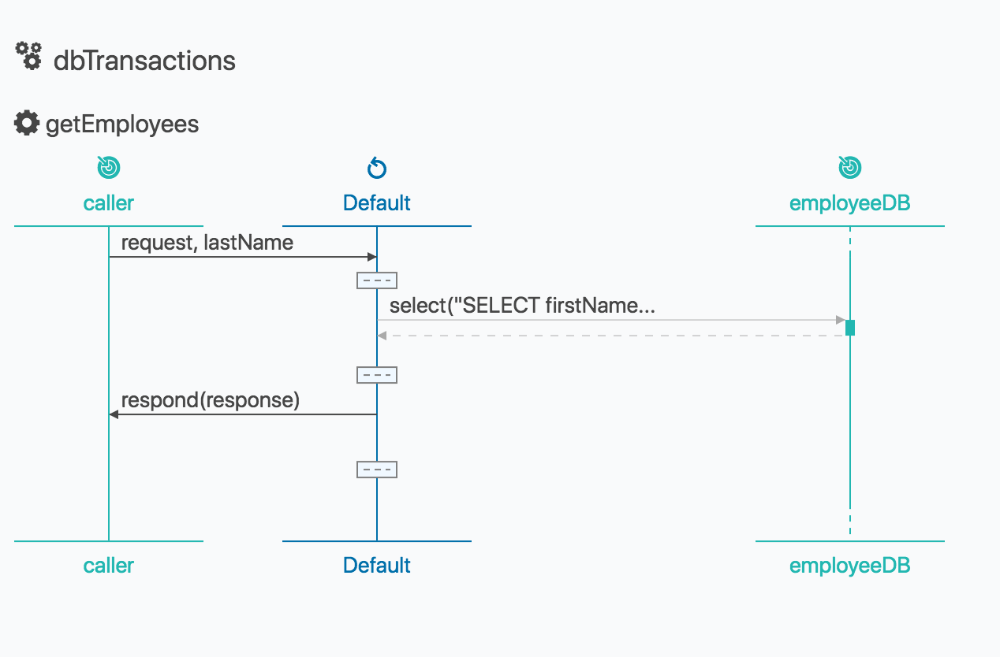

# Retreiving Data from MySQL Database

## About 
Ballerina is an open-source programming language that supports developers to integrate their system easily with the support of connectors. In this guide, we are mainly focusing on how to expose MySQL database as a service in Ballerina and do a select query upon it.

ballerinax/java.jdbc module allows you to perform CRUD operations using JDBC Client. You can find other integrations modules from the [wso2-ballerina](https://github.com/wso2-ballerina) Github repository. 

## What you'll build

Here the caller will send the last name of the employee for whom he want to fetch the first name as a path parameter. Then the select query will be performed on the MySQL database and the results will be returned.



## Prerequisites
Link to download ballerina integrator.

- Download MySQL JDBC driver
- Create a folder called lib as shown in the folder structure and copy the downloaded jdbc_driver.jar into it.
- Add these code segment to ballerina.toml file in the root directory

```ballerina
[platform]
target = "java8"

[[platform.libraries]]
module = "querying_mysql"
path = "./lib/mysql-connector-java-8.0.17.jar"
 ```
- Run the employees.sql script inside resources folder to create the table and insert data required for the guide.

## Implementation
The ballerina project should create for the integration use case explained above. Please follow the steps given below. You can learn about the ballerina project and module in this link.

1. Create a project
```bash
$ ballerina new querying_mysql_db
```
Change directory to the querying_mysql_db.

2. Add a module
```bash
$ ballerina add query_employee
```

The project structure should look like below.
```shell

├── querying_mysql_db
    ├── lib
        └── mysql-connector-java-8.0.17.jar
    ├── ballerina.conf    
    ├── Ballerina.toml
    └── src
        └── query_employee
            ├── main.bal
            ├── Module.md
            ├── resources
            └── tests
                └── resources
```

3. Add project configuration file by creating `ballerina.conf` file under the root path of the project structure. <br/>
This file should have following MYSQL database configurations.
```
MYSQL_URL = <jdbc_url><br/>
MYSQL_USERNAME = <mysql_username> <br/>
MYSQL_PASSWORD = <mysql_password> <br/>
```

4. Write the integration
You can open the project with VSCode. The integration implementaion going to write in the `main.bal` file.

``` ballerina
import ballerina/config;
import ballerina/http;
import ballerina/jsonutils;
import ballerina/log;
import ballerinax/java.jdbc;


jdbc:Client employeeDB = new({
    url: config:getAsString("MYSQL_URL"),
    username: config:getAsString("MYSQL_USERNAME"),
    password: config:getAsString("MYSQL_PASSWORD"),
    poolOptions: { maximumPoolSize: 5 },
    dbOptions: { useSSL: false }
});

listener http:Listener employeeEP = new(9095);

type Employee record {
    int id;
    int age;
    string firstName;
    string lastName;
};

@http:ServiceConfig {
    basePath: "/staff"
}

service dbTransactions on employeeEP {
    @http:ResourceConfig {
        methods: ["GET"],
        path: "/employee/{lastName}"
    }
    resource function getEmployees(http:Caller caller, http:Request request, string lastName) {
        http:Response response = new;
        log:printInfo("The select operation - Select data from a table");
        var selectResult = employeeDB->select("SELECT firstName FROM Employee WHERE lastName = ?",(), lastName);
       
        if (selectResult is table<record {}>) {
            json jsonConversionResult = jsonutils:fromTable(selectResult);
            response.statusCode = http:STATUS_OK;
            response.setJsonPayload(jsonConversionResult);      
        } else {
            response.statusCode = http:STATUS_NOT_FOUND;
            json responseJson = { "Failed": selectResult.reason()};
            response.setJsonPayload(<@untainted> responseJson);        
        }
            var result = caller->respond(response);

            if (result is error) {
                log:printError("Error sending response to the client", err = result);
            }
        }
}
        
```

As username and password are sensitive data, we should not expose those data to outside. Ballerina supports encrypting sensitive data and uses them in the program.

```shell
$ ballerina encrypt
```

The execution of the encrypt action will ask for value and secret key. Once you provide input, it'll output the encrypted value that can directly use in the config file.

```shell
Enter value:

Enter secret:

Re-enter secret to verify:

Add the following to the configuration file:
<key>="@encrypted:{aoIlSvOPeBEZ0COma+Wz2uWznlNn1IWz4StiWQCO6g4=}"

Or provide it as a command line argument:
--<key>=@encrypted:{aoIlSvOPeBEZ0COma+Wz2uWznlNn1IWz4StiWQCO6g4=}
```

Use encrypted value in the `ballerina.conf` file.

```
  MYSQL_URL="<jdbc_url>"<br/>
  MYSQL_USERNAME = "@encrypted:{3SCS/ET4uaJKVZwh+/If3rvU9ImbZSCmrruroMF5Sig=}"
  MYSQL_PASSWORD = "@encrypted:{3SCS/ET4uaJKVZwh+/If3rvU9ImbZSCmrruroMF5Sig=}"
 
```

After that `jdbc:Client` is  created with `employeeDB`.<br/>
The HTTP listener service will run on port 9095  when you start running the program.
    
## Run the integration
First, let’s build the module. While being in the querying_mysql_db directory, execute the following command.

```bash
$ ballerina build query_employee
```

The build command would create an executable jar file. Now run the jar file created in the above step.

```bash
$ java -jar target/bin/query_employee.jar
```

Send the following request where the last name is set as a path param.
```
http://localhost/staff/employee/collins
```

This will return the following response to the client if the request is successful.
```json
[
    {
        "firstName": "thomas"
    },
    {
        "firstName": "linda"
    }
]
```

