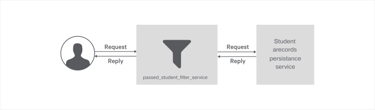

# Message-Filtering  

The Message Filter checks an incoming message against certain criteria that the message should adhere to. If the criteria is not met, the filter will discard the message. Otherwise, it will route the message to the output channel.

> In this guide you will learn about building a message filtering service using Ballerina. 

The following are the sections available in this guide.

- [What you'll build](#what-youll-build)
- [Prerequisites](#prerequisites)
- [Implementation](#implementation)
- [Testing](#testing)
- [Deployment](#deployment)
- [Observability](#observability)

## What you’ll build 
To understand how you can build a message filltering web service using Ballerina, let’s consider a real world use case of a qualified students filtering service based on the marks of subjects.

The following figure illustrates all the required functionalities of the Message Filtering Service that we need to build. 




## Prerequisites
 
- [Ballerina Distribution](https://ballerina.io/learn/getting-started/)
- A Text Editor or an IDE 
> **Tip**: For a better development experience, install one of the following Ballerina IDE plugins: [VSCode](https://marketplace.visualstudio.com/items?itemName=ballerina.ballerina), [IntelliJ IDEA](https://plugins.jetbrains.com/plugin/9520-ballerina)

### Optional requirements

- [Docker](https://docs.docker.com/engine/installation/)
- [Kubernetes](https://kubernetes.io/docs/setup/)

## Implementation

> If you want to skip the basics, you can download the GitHub repo and directly move to the "Testing" section by skipping  "Implementation" section.

### Create the project structure

Ballerina is a complete programming language that supports custom project structures. Use the following package structure for this guide.

```
message-filtering
    ├── guide
       └── message-filtering
           ├── passed_student_filter_service.bal
           └── tests
               └── passed_student_filter_service_test.bal

```

Create the above directories in your local machine and also create empty `.bal` files. Then open the command line and navigate to `message-filtering/guide` and run Ballerina project initializing toolkit.

```bash
   $ ballerina init
```

### Developing the Message Filtering web service

Get started with a Ballerina service; `passed_student_filter_service`, which is the RESTful service that serves student marks filtering requests. `passed_student_filter_service` has a single resource and that resource is filtering the students based on their marks.

You can add the content to your Ballerina service as shown below. In that code segment you can find the implementation of the service and resource skeletons of `passed_student_filter_service`.

##### Skeleton code for passed_student_filter_service.bal

```ballerina
import ballerina/http;
import ballerina/log;

listener http:Listener filterServiceEP = new(9090);

http:Client stdInfoEP = new("http://www.mocky.io");

// REST service to select the passed student from an exam
service filterService on filterServiceEP {

    // Resource that handle HTTP POST request with JSON payload
    // Response with JSON payload
    @http:ResourceConfig {
        methods: ["POST"],
        consumes: ["application/json"],
        produces: ["application/json"]
    }
    resource function filterMarks(http:Caller caller, http:Request request) {

        // Declare boolean flag to set Qualified or Not
        boolean isQualified = false;

        // Set Original payload to a new request object
        http:Request req = new;

        // Get the JSON payload from the request
        var reqPayload = request.getJsonPayload();
        if (reqPayload is json) {
            // Get the information of the subjects
            string stdName = <string>reqPayload.name;
            json[] subjects = <json[]>reqPayload.subjects;

            // Iterating subject array
            foreach var subj in subjects {
                int mark = <int>subj.marks;
                // Check the student exceed the pass mark value
                if (mark >= 60) {
                    isQualified = true;
                } else {
                    isQualified = false;
                }
            }
            req.setJsonPayload(untaint reqPayload);
        } else {
            http:Response errResp = new;
            errResp.statusCode = 400;
            errResp.setJsonPayload({"^error":"Invalid request payload "});
            var err = caller->respond(errResp);
            handleResponseError(err);
            return;
        }
        // Define a variables for response payload and status code
        json resp = {status:""};
        int statusCode;
        // Check whether student is qualified or not
        if (isQualified) {
            // Call qualified student records persistance service
            var response = stdInfoEP->post("/v2/5b2cc4292f00007900ebd395", req);
            if (response is http:Response) {
                statusCode = response.statusCode;
                // Set response status to Qualified
                resp.status = "Qualified";
            } else {
                log:printError("Invalid response", err = response);
            }
        } else {
            // Set response status to Not Qualified
            resp.status = "Not Qualified";
        }

        // Set JSON response
        http:Response res = new;
        res.statusCode = 200;
        res.setJsonPayload(untaint resp);
        var err = caller->respond(res);
        handleResponseError(err);
    }
}

function handleResponseError(error? err) {
    if (err is error) {
        log:printError("Respond failed", err = err);
    }
}
```

You can implement the business logic of message filtering machanism in `filterMarks` resource as per your requirements.


## Testing 

### Invoking the Message Filtering service 

You can run the `passed_student_filter_service` that you developed above in your local environment. Open your command line and navigate to `message-filtering/guide`, and execute the following command.

```
$ ballerina run message-filtering
```

You can test the functionality of the `passed_student_filter_service` by sending an HTTP request for the `filterMarks` operation. For example, we have used the cURL commands to test `filterMarks` operation of `passed_student_filter_service` as follows. 

**Filter Student's marks**

```bash
curl -X POST -v -d '{"name":"Sam","subjects":[{"subject":"Maths","marks": 80},{"subject":"Science", "marks":70}]}' \
http://localhost:9090/filterService/filterMarks -H 'content-type: application/json'

Output :  
< HTTP/1.1 200 OK
< content-type: application/json
< content-length: 22
< server: ballerina/0.981.0
< date: Fri, 22 Jun 2018 23:27:27 +0530
< 
* Connection #0 to host localhost left intact
{"status":"Qualified"}
```

### Writing unit tests 

In Ballerina, the unit test cases should be in the same package inside a folder named 'tests'.  When writing the test functions the below convention should be followed.

Test functions should be annotated with `@test:Config`. See the below example.

```ballerina
   @test:Config
   function testResourceAddOrder() {
```
  
This guide contains unit test case for `filterMarks` resource available in the `passed_student_filter_service` implemented above. 

To run the unit tests, open your command line, navigate to `message-filtering/guide`, and run the following command.

```bash
   $ ballerina test
```

To check the implementation of the test file, refer to the [passed_student_filter_service_test.bal](https://github.com/ballerina-guides/message-filtering/blob/master/guide/message-filtering/tests/passed_student_filter_service_test.bal).


## Deployment

Once you are done with the development, you can deploy the service using any of the methods that are listed below. 

### Deploying locally

As the first step, you can build a Ballerina executable archive (.balx) of the service that you developed above. Navigate to `message-filtering/guide` and run the following command. 

```bash
   $ ballerina build message-filtering
```

Once the `message-filtering.balx` file is created inside the target folder, you can run it with the following command. 

```bash
   $ ballerina run target/message-filtering.balx
```

On successful execution of the service, the following output appears on your command line. 

```
   ballerina: initiating service(s) in 'target/message-filtering.balx'
   ballerina: started HTTP/WS endpoint 0.0.0.0:9090

```

### Deploying on Docker

You can run the service that you developed above as a Docker container. As Ballerina platform includes [Ballerina_Docker_Extension](https://github.com/ballerinax/docker), which offers native support for running Ballerina programs on containers, you just need to put the corresponding Docker annotations on your service code. 

In our `passed_student_filter_service`, we need to import `ballerinax/docker` and use the annotation `@docker:Config` as shown below to enable Docker image generation during the build time. 

##### passed_student_filter_service.bal

```ballerina
import ballerina/http;
import ballerinax/docker;


@docker:Config {
    registry:"ballerina.guides.io",
    name:"passed_student_filter_service",
    tag:"v1.0"
}

@docker:Expose{}

listener http:Listener filterServiceEP = new(9090);

http:Client stdInfoEP = new("http://www.mocky.io");

// REST service to select the passed student from an exam
service filterService on filterServiceEP {
``` 

`@docker:Config` annotation is used to provide the basic Docker image configurations for the sample. `@docker:Expose {}` is used to expose the port. 

Now you can build a Ballerina executable archive (.balx) of the service that we developed above, using the following command. This will also create the corresponding Docker image using the Docker annotations that you have configured above. Navigate to `message-filtering/guide` and run the following command.  

```
   $ ballerina build message-filtering
```

Once you successfully build the Docker image, you can run it with the `docker run` command that is shown in the previous step.  

```bash   
   $ docker run -d -p 9090:9090 ballerina.guides.io/passed_student_filter_service:v1.0
```

Here you can run the Docker image with flag `-p <host_port>:<container_port>` so that you use the host port 9090 and the container port 9090. Therefore, you can access the service through the host port. 

Verify if the Docker container is running with the use of `$ docker ps`. The status of the docker container should be shown as 'Up'. 

You can access the service using the same cURL commands that you used above. 

```bash
   curl -X POST -v -d '{"name":"Sam","subjects":[{"subject":"Maths","marks": 80},{"subject":"Science","marks":40}]}' http://localhost:9090/filterService/filterMarks -H 'content-type: application/json'    
```

### Deploying on Kubernetes

You can run the service that you developed above, on Kubernetes. The Ballerina language offers native support for running Ballerina programs on Kubernetes, with the use of Kubernetes annotations that you can include as part of your service code. Also, it will take care of the creation of the Docker images. So you don't need to explicitly create Docker images prior to deploying it on Kubernetes. 

Refer to [Ballerina_Kubernetes_Extension](https://github.com/ballerinax/kubernetes) for more details and samples on Kubernetes deployment with Ballerina. You can also find details on using Minikube to deploy Ballerina programs. 

Let's now see how we can deploy our `passed_student_filter_service` on Kubernetes.

First you need to import `ballerinax/kubernetes` and use `@kubernetes` annotations as shown below to enable kubernetes deployment for the service you developed above.

> NOTE: Linux users can use Minikube to try this out locally.

#### passed_student_filter_service.bal

```ballerina
import ballerina/http;]
import ballerinax/kubernetes;


@kubernetes:Ingress {
    hostname:"ballerina.guides.io",
    name:"ballerina-guides-passed_student_filter_service",
    path:"/"
}

@kubernetes:Service {
    serviceType:"NodePort",
    name:"ballerina-guides-passed_student_filter_service"
}

@kubernetes:Deployment {
    image:"ballerina.guides.io/passed_student_filter_service:v1.0",
    name:"ballerina-guides-passed_student_filter_service"
}

listener http:Listener filterServiceEP = new(9090);

http:Client stdInfoEP = new("http://www.mocky.io");

// REST service to select the passed student from an exam
service filterService on filterServiceEP {
```

- `@kubernetes:Deployment` is used to specify the Docker image name that should be created as part of building the service.
- `@kubernetes:Service` is specified to create a Kubernetes service that exposes the Ballerina service that is running on a Pod.
- `@kubernetes:Ingress` is used as the external interface to access your service (with path `/` and host name `ballerina.guides.io`).

If you are using Minikube, you need to set a couple of additional attributes to the `@kubernetes:Deployment` annotation.
- `dockerCertPath`: The path to the certificates directory of Minikube (e.g., `/home/ballerina/.minikube/certs`).
- `dockerHost`: The host for the running cluster (e.g., `tcp://192.168.99.100:2376`). The IP address of the cluster can be found by running the `minikube ip` command.

Now you can build a Ballerina executable archive (.balx) of the service that you developed above using the following command. This also creates the corresponding Docker image and the Kubernetes artifacts using the Kubernetes annotations that you have configured above.
  
```
   $ ballerina build message-filtering
```

You can verify that the Docker image that you specified in `@kubernetes:Deployment` is created, by using `$ docker images`. 

Also, the Kubernetes artifacts related your service are generated in `./target/message-filtering/kubernetes`. 

Now you can create the Kubernetes deployment using:

```bash
   $ kubectl apply -f ./target/kubernetes/message-filtering
 
   deployment.extensions "ballerina-guides-passed_student_filter_service" created
   ingress.extensions "ballerina-guides-passed_student_filter_service" created
   service "ballerina-guides-passed_student_filter_service" created
```

You can verify that the Kubernetes deployment, service, and ingress are running properly by using following Kubernetes commands.

```bash
   $ kubectl get service
   $ kubectl get deploy
   $ kubectl get pods
   $ kubectl get ingress
```

If everything is successfully deployed, you can invoke the service either via Node port or ingress. 

Node Port:
 
```bash
   curl -X POST -v -d '{"name":"Sam","subjects":[{"subject":"Maths","marks": 80},{"subject":"Science","marks":40}]}' http://localhost:<Node_Port>/filterService/filterMarks -H 'content-type: application/json'  
```

If you are using Minikube, you should use the IP address of the Minikube cluster obtained by running the `minikube ip` command. The port should be the node port given when running the `kubectl get services` command.
```bash
    $ minikube ip
    192.168.99.100

    $ kubectl get services
    NAME                                             TYPE        CLUSTER-IP       EXTERNAL-IP   PORT(S)          AGE
    ballerina-guides-passed-student-filter-service   NodePort    10.100.226.129   <none>        9090:30659/TCP   3h
```

The endpoint URL for the above case would be as follows: `http://192.168.99.100:30659/filterService/filterMarks`

Ingress:

- Make sure that Nginx backend and controller deployed as mentioned in [here](https://github.com/ballerinax/kubernetes/tree/master/samples#setting-up-nginx).

Add `/etc/hosts` entry to match hostname. 

``` 
   127.0.0.1 ballerina.guides.io
```

Access the service. 

```bash 
   curl -X POST -v -d '{"name":"Sam","subjects":[{"subject":"Maths","marks": 80},{"subject":"Science","marks":40}]}' http://ballerina.guides.io:<Node_Port>/filterService/filterMarks -H 'content-type: application/json'
```

## Observability 
Ballerina is by default observable. Meaning you can easily observe your services, resources, etc. However, observability is disabled by default via configuration. Observability can be enabled by adding the following configurations to the `ballerina.conf` file in `message-filtering/guide/`.

```ballerina
[b7a.observability]

[b7a.observability.metrics]
# Flag to enable Metrics
enabled=true

[b7a.observability.tracing]
# Flag to enable Tracing
enabled=true
```

> **NOTE**: The above configuration is the minimum configuration needed to enable tracing and metrics. With these configurations, default values are loaded as the other configuration parameters of metrics and tracing.

### Tracing 

You can monitor Ballerina services using in built tracing capabilities of Ballerina. We'll use [Jaeger](https://github.com/jaegertracing/jaeger) as the distributed tracing system.

Follow the steps below to use tracing with Ballerina.

- You can add the following configurations for tracing. Note that these configurations are optional if you already have the basic configuration in `ballerina.conf` as described above.

```
   [b7a.observability]

   [b7a.observability.tracing]
   enabled=true
   name="jaeger"

   [b7a.observability.tracing.jaeger]
   reporter.hostname="localhost"
   reporter.port=5775
   sampler.param=1.0
   sampler.type="const"
   reporter.flush.interval.ms=2000
   reporter.log.spans=true
   reporter.max.buffer.spans=1000
```

- Run Jaeger Docker image using the following command.

```bash
   $ docker run -d -p5775:5775/udp -p6831:6831/udp -p6832:6832/udp -p5778:5778 \
   -p16686:16686 p14268:14268 jaegertracing/all-in-one:latest
```

- Navigate to `message-filtering/guide` and run the `passed_student_filter_service` using the following command.

```
   $ ballerina run message-filtering/
```

- Observe the tracing using Jaeger UI using following URL.

```
   http://localhost:16686
```

### Metrics
Metrics and alerts are built-in with Ballerina. Use Prometheus as the monitoring tool.

Follow the below steps to set up Prometheus and view metrics for the Ballerina restful service.

- You can add the following configurations for metrics. Note that these configurations are optional if you already have the basic configuration in `ballerina.conf` as described under the `Observability` section.

```ballerina
   [b7a.observability.metrics]
   enabled=true
   provider="micrometer"

   [b7a.observability.metrics.micrometer]
   registry.name="prometheus"

   [b7a.observability.metrics.prometheus]
   port=9700
   hostname="0.0.0.0"
   descriptions=false
   step="PT1M"
```

- Create a file `prometheus.yml` inside `/tmp/` location. Add the below configurations to the `prometheus.yml` file.

```
   global:
     scrape_interval:     15s
     evaluation_interval: 15s

   scrape_configs:
     - job_name: prometheus
       static_configs:
         - targets: ['172.17.0.1:9797']
```

> **NOTE**: Replace `172.17.0.1` if your local Docker IP differs from `172.17.0.1`
   
- Run the Prometheus Docker image using the following command.

```
   $ docker run -p 19090:9090 -v /tmp/prometheus.yml:/etc/prometheus/prometheus.yml \
   prom/prometheus
```
   
- You can access Prometheus at the following URL.

```
   http://localhost:19090/
```

> **NOTE**:  Ballerina has the following metrics for HTTP server connector by default. You can enter the following expression in Prometheus UI.
-  http_requests_total
-  http_response_time


### Logging

Ballerina has a log package for logging to the console. You can import `ballerina/log` package and start logging. The following section describes how to search, analyze, and visualize logs in real time using Elastic Stack.

Start the Ballerina Service with the following command from `message-filtering/guide`.

```
   $ nohup ballerina run message-filtering/ &>> ballerina.log&
```

> **NOTE**: This writes the console log to the `ballerina.log` file in the `message-filtering/guide` directory.

Start Elasticsearch using the following command

```
   $ docker run -p 9200:9200 -p 9300:9300 -it -h elasticsearch --name \
   elasticsearch docker.elastic.co/elasticsearch/elasticsearch:6.5.1 
```

> **NOTE**: Linux users might need to run `sudo sysctl -w vm.max_map_count=262144` to increase `vm.max_map_count`.
   
Start Kibana plugin for data visualization with Elasticsearch.

```
   $ docker run -p 5601:5601 -h kibana --name kibana --link \
   elasticsearch:elasticsearch docker.elastic.co/kibana/kibana:6.5.1     
```

Configure logstash to format the Ballerina logs.

i) Create a file named `logstash.conf` with the following content.

```
input {  
 beats{ 
     port => 5044 
 }  
}

filter {  
 grok{  
     match => { 
	 "message" => "%{TIMESTAMP_ISO8601:date}%{SPACE}%{WORD:logLevel}%{SPACE}
	 \[%{GREEDYDATA:package}\]%{SPACE}\-%{SPACE}%{GREEDYDATA:logMessage}"
     }  
 }  
}   

output {  
 elasticsearch{  
     hosts => "elasticsearch:9200"  
     index => "store"  
     document_type => "store_logs"  
 }  
}  
```

ii) Save the above `logstash.conf` inside a directory named as `{SAMPLE_ROOT}\pipeline`.
     
iii) Start the logstash container and replace the {SAMPLE_ROOT} with your directory name.
     
```
$ docker run -h logstash --name logstash --link elasticsearch:elasticsearch \
-it --rm -v ~/{SAMPLE_ROOT}/pipeline:/usr/share/logstash/pipeline/ \
-p 5044:5044 docker.elastic.co/logstash/logstash:6.5.1
```
  
Configure filebeat to ship the Ballerina logs.
    
i) Create a file named `filebeat.yml` with the following content.

```
filebeat.prospectors:
- type: log
  paths:
    - /usr/share/filebeat/ballerina.log
output.logstash:
  hosts: ["logstash:5044"]  
```

> **NOTE**: Modify the ownership of `filebeat.yml` file using `$chmod go-w filebeat.yml` 

ii) Save the above `filebeat.yml` inside a directory named as `{SAMPLE_ROOT}\filebeat`.   
        
iii) Start the logstash container, replace the {SAMPLE_ROOT} with your directory name.
     
```
$ docker run -v {SAMPLE_ROOT}/filbeat/filebeat.yml:/usr/share/filebeat/filebeat.yml \
-v {SAMPLE_ROOT}/guide/message-filtering/ballerina.log:/usr/share\
/filebeat/ballerina.log --link logstash:logstash docker.elastic.co/beats/filebeat:6.5.1
```
 
Access Kibana to visualize the logs using the following URL.

```
   http://localhost:5601 
```
  
 
