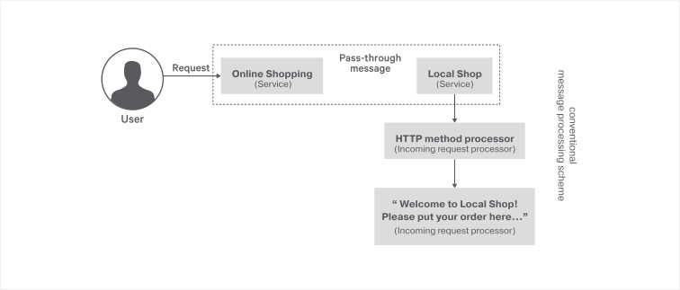

# Pass-through messaging

There are different ways of messaging methods in SOA (Service Oriented Architecture). In this guide, we are focusing on pass-through Messaging between services using an example scenario.

> This guide describes implementing pass-through messaging using Ballerina programming language as simple steps.

The following are the sections available in this guide.

- [What you'll build](#what-youll-build)
- [Prerequisites](#prerequisites)
- [Implementation](#implementation)
- [Testing](#testing)
- [Deployment](#deployment)
- [Observability](#observability)

## What you’ll build

There are different ways of messaging between services such as pass-through messaging, content-based routing of messages, header-based routing of messages, and scatter-gather messaging. There is a delay in messaging while processing an incoming message in all messaging methods excluding pass-through messaging. When routing the message without processing/inspecting the message payload, the most efficient way is the pass-through messaging. Here are some differences between conventional message processing vs pass-through messaging.


Conventional message processing methods include a message processor for processing messages, but pass-through messaging skipped the message processor. It thereby saves the processing time and power and is more efficient when compared to other types.

Now let's understand the scenario described here. The owner needs to expand the business, so he makes online shop that is connected to the local shop, to expand the business. When you connect to the online shop, it will automatically be redirected to the local shop without any latency. To do so, the pass-through messaging method is used.



The two shops are implemented as two separate services named as 'OnlineShopping' and 'LocalShop'. When a user makes a call to 'OnlineShopping' using an HTTP request, the request is redirected to the 'LocalShop' service without processing the incoming request. Also the response from the 'LocalShop' is not be processed in 'OnlineShopping'. If it processes the incoming request or response from the 'LocalShop', it will no longer be a pass-through messaging method. 

So, messaging between 'OnlineShopping' and 'LocalShop' services act as pass-through messaging. The 'LocalShop' service processes the incoming request method such as 'GET' and 'POST'. Then it calls the back-end service, which will give the "Welcome to Local Shop! Please put your order here....." message. So messaging in the 'LocalShop' service is not a pass-through messaging service.

## Prerequisites
 
- [Ballerina Distribution](https://ballerina.io/learn/getting-started/)
- A Text Editor or an IDE 
> **Tip**: For a better development experience, install one of the following Ballerina IDE plugins: [VSCode](https://marketplace.visualstudio.com/items?itemName=ballerina.ballerina), [IntelliJ IDEA](https://plugins.jetbrains.com/plugin/9520-ballerina)

### Optional Requirements

- [Docker](https://docs.docker.com/engine/installation/)
- [Kubernetes](https://kubernetes.io/docs/setup/)

## Implementation

> If you are well aware of the implementation, you can directly clone the GitHub repository to your own device. Using that, you can skip the "Implementation" section and move straight to the "Testing" section.

### Create the project structure

Ballerina is a complete programming language that supports custom project structures. Use the following package structure for this guide.

```
pass-through-messaging
 └── guide
     ├── passthrough
     │   └── passthrough.bal
     │  
     └── tests
         └── passthrough_test.bal

```

Create the above directories in your local machine and also create empty `.bal` files.

Open the terminal and navigate to `pass-through-messaging/guide` and run the Ballerina project initializing toolkit.

```bash
   $ ballerina init
```

### Developing the service

To implement the scenario, let's start by implementing the passthrough.bal file, which is the main file in the implementation. Refer to the code attached below. Inline comments are added for better understanding.

##### passthrough.bal

```ballerina
import ballerina/http;
import ballerina/log;

listener http:Listener OnlineShoppingEP = new(9090);

listener http:Listener LocalShopEP = new(9091);

//Defines a client endpoint for the local shop with online shop link.
http:Client clientEP = new("http://localhost:9091/LocalShop");

//This is a passthrough service.
service OnlineShopping on OnlineShoppingEP {
    //This resource allows all HTTP methods.
    @http:ResourceConfig {
        path: "/"
    }
    resource function passthrough(http:Caller caller, http:Request req) {
        log:printInfo("Request will be forwarded to Local Shop  .......");
        //'Forward()' sends the incoming request unaltered to the backend. Forward function
        //uses the same HTTP method as in the incoming request.
        var clientResponse = clientEP->forward("/", req);
        if (clientResponse is http:Response) {
            //Sends the client response to the caller.
            var result = caller->respond(clientResponse);
            handleError(result);
        } else {
            //Sends the error response to the caller.
            http:Response res = new;
            res.statusCode = 500;
            var payload = clientResponse.detail().message;
            if (payload is error) {
                res.setPayload("Recursive error occurred while reading client response");
                handleError(payload);
            } else {
                res.setPayload(string.convert(payload));
            }
            var result = caller->respond(res);
            handleError(result);
        }
    }
}

//Sample Local Shop service.
service LocalShop on LocalShopEP {
    //The LocalShop only accepts requests made using the specified HTTP methods.
    @http:ResourceConfig {
        methods: ["POST", "GET"],
        path: "/"
    }
    resource function helloResource(http:Caller caller, http:Request req) {
        log:printInfo("You have been successfully connected to local shop  .......");
        // Make the response for the request.
        http:Response res = new;
        res.setPayload("Welcome to Local Shop! Please put your order here.....");
        //Sends the response to the caller.
        var result = caller->respond(res);
        handleError(result);
    }
}

function handleError(error? result) {
    if (result is error) {
        log:printError(result.reason(), err = result);
    }
}

```

## Testing 

### Invoking the service

Navigate to `pass-through-messaging/guide` and run the following command in the command line to start the services in  `passthrough.bal`.

```bash
   $ ballerina run passthrough
```
   
Send a request to the online shopping service.

```bash

 $ curl -v http://localhost:9090/OnlineShopping

```
#### Output

When connecting to the online shopping, the output will be "Welcome to Local Shop! Please put your order here....." from the local shop.

```bash
< HTTP/1.1 200 OK
< content-type: text/plain
< date: Sat, 23 Jun 2018 05:45:17 +0530
< server: ballerina/0.982.0
< content-length: 54
< 
* Connection #0 to host localhost left intact
Welcome to Local Shop! Please put your order here.....
```

To identify the message flow inside the services, there will be INFO in the notification channel.

```bash
2018-06-23 05:45:27,849 INFO  [passthrough] - Request will be forwarded to Local Shop  ....... 
2018-06-23 05:45:27,864 INFO  [passthrough] - You have been successfully connected to local shop  ....... 
```

### Writing unit tests 

In Ballerina, the unit test cases should be in the same package inside a folder named as 'tests'.  When writing the test functions, the below convention should be followed.

Test functions should be annotated with `@test:Config`. See the below example.

```ballerina
   @test:Config
   function testFunc() {
   }
```

This guide contains unit test case for 'LKSubOffice' service and 'UKSubOffice' service in [passthrough_test.bal](https://github.com/ballerina-guides/pass-through-messaging/blob/master/guide/passthrough/tests/passthrough_test.bal) file.

To run the unit tests, navigate to `pass-through-messaging/guide/` and run the following command. 

```bash
   $ ballerina test
```

## Deployment

After the development process, you can deploy the services using below methods by selecting as you wish.

### Deploying locally

As the first step, you can build Ballerina executable archives (.balx) of the services that you developed above. Navigate to `Pass-through-messaging-ballerina-/guide` and run the following command.

```bash
   $ ballerina build
```

Once the .balx files are created inside the target folder, you can run them using the following command. 

```bash
   $ ballerina run target/<Exec_Archive_File_Name>
```

The successful execution of a service will show us something similar to the following output.

```
   Initiating service(s) in 'target/passthrough.balx'
   ballerina: started HTTP/WS endpoint 0.0.0.0:9091
   ballerina: started HTTP/WS endpoint 0.0.0.0:9090   
```

### Deploying on Docker

You can run the service that we developed above as a Docker container.

As Ballerina platform includes [Ballerina_Docker_Extension](https://github.com/ballerinax/docker), which offers native support for running Ballerina programs on containers, you just need to put the corresponding Docker annotations on your service code.

In our `passthrough`, we need to import  `ballerinax/docker` and use the annotation `@docker:Config,@docker:Expose` as shown below to enable Docker image generation during the build time. 

##### passthrough.bal

```ballerina
import ballerina/http;
import ballerina/log;
import ballerinax/docker;

@docker:Expose {}
listener http:Listener OnlineShoppingEP = new(9090);

@docker:Expose {}
listener http:Listener LocalShopEP = new(9091);

//Define end-point for the local shop as online shop link
http:Client clientEP = new("http://localhost:9091/LocalShop");

@docker:Config {
    registry:"ballerina.guides.io",
    name:"passthrough",
    tag:"v1.0"
}
service OnlineShopping on OnlineShoppingEP {
.
.
.
}
service LocalShop on LocalShopEP {
.
.
}
``` 

Now you can build a Ballerina executable archive (.balx) of the service that you developed above using the following command. This also creates the corresponding Docker image using the Docker annotations that you have configured above. Navigate to `pass-through-messaging/guide` and run the following command.  
  
```
   $ballerina build
  .
  .
   Run following command to start docker container:
   docker run -d -p 9090:9090 -p 9091:9091 ballerina.guides.io/passthrough:v1.0

```

Once you successfully build the Docker image, you can run it with the `docker run` command that is shown in the previous step.  

```bash
   $ docker run -d -p 9090:9090 -p 9091:9091 ballerina.guides.io/passthrough:v1.0
```

You can run the Docker image with the flag `-p <host_port>:<container_port>` so that we use the host port 9090 and the container port 9090. Therefore, you can access the service through the host port. 

Verify if the Docker container is running with the use of `$ docker ps`. The status of the Docker container should be shown as 'Up'. 

You can access 'OnlineShopping' service, using the same cURL commands that you've used above. 

```bash
    curl -v http://localhost:9090/OnlineShopping
```

### Deploying on Kubernetes

You can run the service that you developed above on Kubernetes. The Ballerina language offers native support for running Ballerina programs on Kubernetes, with the use of Kubernetes annotations that you can include as part of your service code. Also, it will take care of the creation of Docker images. So you don't need to explicitly create Docker images prior to deploying it on Kubernetes. Refer to [Ballerina_Kubernetes_Extension](https://github.com/ballerinax/kubernetes) for more details and samples on Kubernetes deployment with Ballerina. You can also find details on using Minikube to deploy Ballerina programs. 

Let's now see how to deploy `passthrough` on Kubernetes. First, you need to import `ballerinax/kubernetes` and use `@kubernetes` annotations as shown below to enable Kubernetes deployment for the service you developed above.

> NOTE: Linux users can use Minikube to try this out locally.

##### passthrough.bal

```ballerina
import ballerina/http;
import ballerina/log;
import ballerinax/kubernetes;

@kubernetes:Ingress {
    hostname:"ballerina.guides.io",
    name:"passthrough",
    path:"/"
}
@kubernetes:Service {
    serviceType:"NodePort",
    name:"OnlineShopping"
}
@kubernetes:Deployment {
    image: "ballerina.guides.io/passthrough:v1.0",
    name: "ballerina-guides-pass-through-messaging"
}

listener http:Listener OnlineShoppingEP = new(9090);

listener http:Listener LocalShopEP = new(9091);

//Define end-point for the local shop as online shop link
http:Client clientEP = new("http://localhost:9091/LocalShop");

service OnlineShopping on OnlineShoppingEP {
.
.
.
}
service LocalShop on LocalShopEP {
.
.
}
``` 

Here we have used `@kubernetes:Deployment` to specify the Docker image name, which is created as part of building this service. 

You have also specified `@kubernetes:Service` so that it will create a Kubernetes service, which exposes the Ballerina service that is running on a Pod.  

In addition, you have used `@kubernetes:Ingress`, which is the external interface to access your service (with path `/` and hostname `ballerina.guides.io`)

If you are using Minikube, you need to set a couple of additional attributes to the `@kubernetes:Deployment` annotation.
- `dockerCertPath` - The path to the certificates directory of Minikube (e.g., `/home/ballerina/.minikube/certs`).
- `dockerHost` - The host for the running cluster (e.g., `tcp://192.168.99.100:2376`). The IP address of the cluster can be found by running the `minikube ip` command.

Now you can build a Ballerina executable archive (.balx) of the service that you developed above using the following command. This will also create the corresponding Docker image and the Kubernetes artifacts using the Kubernetes annotations that you have configured above.
  
```
   $ ballerina build passthrough

   Run following command to deploy kubernetes artifacts: 
   kubectl apply -f /home/saneth/Documents/ballerina/sample_pass-through/guide/target/kubernetes/

```

You can verify that the Docker image that you specified in `@kubernetes:Deployment` is created by using the `docker images` command. 

Also, the Kubernetes artifacts related to your service will be generated under `/home/saneth/Documents/ballerina/sample_pass-through/guide/target/kubernetes/`. 

Now you can create the Kubernetes deployment using:

```bash
   $ kubectl apply -f /home/saneth/Documents/ballerina/sample_pass-through/guide/target/kubernetes/ 
 
   deployment.extensions "ballerina-guides-passt-hrough-messaging" configured
   ingress.extensions "passthrough" configured
   service "onlineshopping" configured
   service "localshop" configured
```

You can verify that the Kubernetes deployment, service, and ingress are running properly, by using following Kubernetes commands. 

```bash
   $ kubectl get service
   $ kubectl get deploy
   $ kubectl get pods
   $ kubectl get ingress
```

If everything is successfully deployed, you can invoke the service either via Node port or ingress.

Node Port:
 
```
  curl -v http://localhost:<Node_Port>/OnlineShopping 
```

If you are using Minikube, you should use the IP address of the Minikube cluster obtained by running the `minikube ip` command. The port should be the node port given when running the `kubectl get services` command.
```bash
    $ minikube ip
    192.168.99.100

    $ kubectl get services
    NAME                               TYPE        CLUSTER-IP       EXTERNAL-IP   PORT(S)          AGE
    ballerina-guides-order-service   NodePort    10.100.226.129     <none>        9090:30659/TCP   3h
```

The endpoint URL for the above case would be as follows: `http://192.168.99.100:30659/OnlineShopping` 

Ingress:

- Make sure that Nginx backend and controller deployed as mentioned in [here](https://github.com/ballerinax/kubernetes/tree/master/samples#setting-up-nginx).

Add `/etc/hosts` entry to match hostname. 

``` 
   127.0.0.1 ballerina.guides.io
```

Access the service.

```bash
   curl -v http://ballerina.guides.io/OnlineShopping
```


## Observability 
Ballerina is by default observable. This means you can easily observe your services, resources, etc. However, observability is disabled by default via configuration. Observability can be enabled by adding the following configurations to the `ballerina.conf` file in `pass-through-messaging/guide/`.

```ballerina
[b7a.observability]

[b7a.observability.metrics]
# Flag to enable Metrics
enabled=true

[b7a.observability.tracing]
# Flag to enable Tracing
enabled=true
```

> **NOTE**: The above configuration is the minimum configuration needed to enable tracing and metrics. With these configurations, default values are loaded as the other configuration parameters of metrics and tracing.

### Tracing 

You can monitor Ballerina services using inbuilt tracing capabilities of Ballerina. Let's use [Jaeger](https://github.com/jaegertracing/jaeger) as the distributed tracing system.

Follow the steps below to use tracing with Ballerina.

You can add the following configurations for tracing. Note that these configurations are optional if you already have the basic configuration in `ballerina.conf` as described above.

```
   [b7a.observability]

   [b7a.observability.tracing]
   enabled=true
   name="jaeger"

   [b7a.observability.tracing.jaeger]
   reporter.hostname="localhost"
   reporter.port=5775
   sampler.param=1.0
   sampler.type="const"
   reporter.flush.interval.ms=2000
   reporter.log.spans=true
   reporter.max.buffer.spans=1000
```

Run the Jaeger Docker image using the following command.

```bash
   $ docker run -d -p5775:5775/udp -p6831:6831/udp -p6832:6832/udp -p5778:5778 \
   -p16686:16686 -p14268:14268 jaegertracing/all-in-one:latest
```

Navigate to `pass-through-messaging/guide` and run the `passthrough` using following command 

```
   $ ballerina run passthrough/
```

Observe the tracing using Jaeger UI using the following URL.

```
   http://localhost:16686
```

### Metrics

Metrics and alerts are built-in with ballerina. We will use Prometheus as the monitoring tool. Follow the steps below to set up Prometheus and view metrics for 'passthrough'.

You can add the following configurations for metrics. Note that these configurations are optional if you already have the basic configuration in `ballerina.conf` as described under the `Observability` section.

```ballerina
   [b7a.observability.metrics]
   enabled=true
   provider="micrometer"

   [b7a.observability.metrics.micrometer]
   registry.name="prometheus"

   [b7a.observability.metrics.prometheus]
   port=9700
   hostname="0.0.0.0"
   descriptions=false
   step="PT1M"
```

Create a file `prometheus.yml` inside the `/tmp/` location. Add the below configurations to the `prometheus.yml` file.

```
   global:
     scrape_interval:     15s
     evaluation_interval: 15s

   scrape_configs:
     - job_name: prometheus
       static_configs:
         - targets: ['172.17.0.1:9797']
```

> **NOTE**: Replace `172.17.0.1` if your local Docker IP differs from `172.17.0.1`
   
Run the Prometheus docker image using the following command

```
   $ docker run -p 19090:9090 -v /tmp/prometheus.yml:/etc/prometheus/prometheus.yml \
   prom/prometheus
```
   
You can access Prometheus at the following URL.

```
   http://localhost:19090/
```

> **NOTE**: Ballerina will by default have the following metrics for HTTP server connector. You can enter the following expression in Prometheus UI.
>    -  http_requests_total
>    -  http_response_time

### Logging

Ballerina has a log package for logging to the console. You can import `ballerina/log` package and start logging. The following section describes how to search, analyze, and visualize logs in real time using Elastic Stack.

Start the Ballerina service with the following command from `pass-through-messaging/guide`

```
   $ nohup ballerina run trip-management/ &>> ballerina.log&
```

> **NOTE**: This writes the console log to the `ballerina.log` file in the `pass-through-messaging/guide` directory.

Start Elasticsearch using the following command.

```
   $ docker run -p 9200:9200 -p 9300:9300 -it -h elasticsearch --name \
   elasticsearch docker.elastic.co/elasticsearch/elasticsearch:6.5.1 
```

> **NOTE**: Linux users might need to run `sudo sysctl -w vm.max_map_count=262144` to increase `vm.max_map_count`.
   
Start Kibana plugin for data visualization with Elasticsearch.

```
   $ docker run -p 5601:5601 -h kibana --name kibana --link \
   elasticsearch:elasticsearch docker.elastic.co/kibana/kibana:6.5.1     
```

Configure logstash to format the Ballerina logs.

i) Create a file named `logstash.conf` with the following content.

```
input {  
 beats{ 
     port => 5044 
 }  
}

filter {  
 grok{  
     match => { 
	 "message" => "%{TIMESTAMP_ISO8601:date}%{SPACE}%{WORD:logLevel}%{SPACE}
	 \[%{GREEDYDATA:package}\]%{SPACE}\-%{SPACE}%{GREEDYDATA:logMessage}"
     }  
 }  
}   

output {  
 elasticsearch{  
     hosts => "elasticsearch:9200"  
     index => "store"  
     document_type => "store_logs"  
 }  
}  
```

ii) Save the above `logstash.conf` inside a directory named as `{SAMPLE_ROOT}\pipeline`.
     
iii) Start the logstash container, replace the `{SAMPLE_ROOT}` with your directory name.
     
```
$ docker run -h logstash --name logstash --link elasticsearch:elasticsearch \
-it --rm -v ~/{SAMPLE_ROOT}/pipeline:/usr/share/logstash/pipeline/ \
-p 5044:5044 docker.elastic.co/logstash/logstash:6.5.1
```
  
Configure filebeat to ship the Ballerina logs.
    
i) Create a file named `filebeat.yml` with the following content.

```
filebeat.prospectors:
- type: log
  paths:
    - /usr/share/filebeat/ballerina.log
output.logstash:
  hosts: ["logstash:5044"]  
```

> **NOTE**: Modify the ownership of `filebeat.yml` file using `$chmod go-w filebeat.yml`.

ii) Save the above `filebeat.yml` inside a directory named as `{SAMPLE_ROOT}\filebeat`   
        
iii) Start the logstash container, replace the `{SAMPLE_ROOT}` with your directory name.
     
```
$ docker run -v {SAMPLE_ROOT}/filbeat/filebeat.yml:/usr/share/filebeat/filebeat.yml \
-v {SAMPLE_ROOT}/guide/passthrough/ballerina.log:/usr/share\
/filebeat/ballerina.log --link logstash:logstash docker.elastic.co/beats/filebeat:6.5.1
```
 
Access Kibana to visualize the logs using the following URL.

```
   http://localhost:5601 
```
