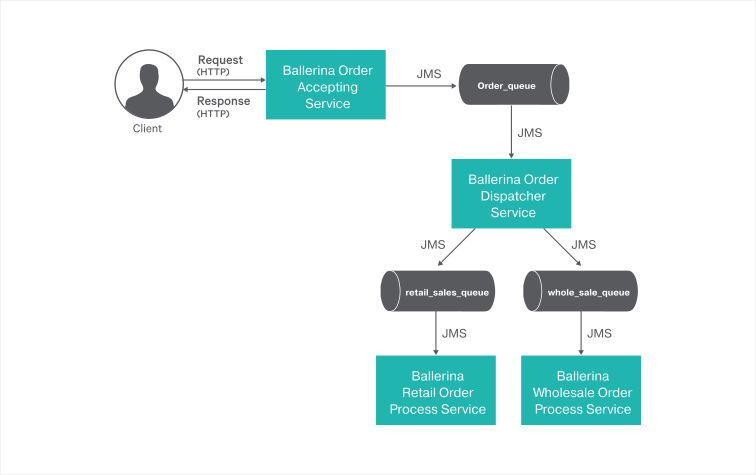

# Messaging with ActiveMQ

This guide demonstrates how to use ActiveMQ as the message broker for messaging in Ballerina.

> Let’s take a look at a sample scenario to understand how to do the following using ActiveMQ as the message broker in Ballerina:
> - Create a one-way JMS producer (i.e., one way messaging, also known as fire and forget mode).
> - Create a JMS consumer.

The high level sections of this guide are as follows:

- [What you'll build](#what-youll-build)
- [Prerequisites](#prerequisites)
- [Implementation](#implementation)
- [Testing](#testing)
- [Deployment](#deployment)
- [Observability](#observability)


## What you'll build
As the sample scenario let’s consider a real-world use case of an online order management system where the general message flow is as follows:
1. Users place their orders through the system.
2. A Ballerina service accepts the order requests that are placed, and sends the requests to a message broker queue. 
3. An order dispatcher Ballerina service routes the order requests to appropriate queues depending on the message content (i.e., the dispatcher validates the order type using message content and routes the message)
4. The respective Ballerina service consumes messages from each queue.

The following diagram illustrates the scenario:



## Prerequisites
- [Ballerina Distribution](https://ballerina.io/learn/getting-started/)
- A Text Editor or an IDE 
> **Tip**: For a better development experience, install one of the following Ballerina IDE plugins: [VSCode](https://marketplace.visualstudio.com/items?itemName=ballerina.ballerina), [IntelliJ IDEA](https://plugins.jetbrains.com/plugin/9520-ballerina)
- [Apache ActiveMQ](http://activemq.apache.org/getting-started.html))
  * After you install ActiveMQ, copy the .jar files from the `<AMQ_HOME>/lib` directory to the `<BALLERINA_HOME>/bre/lib` directory.
   * If you use ActiveMQ version 5.12.0, you only have to copy `activemq-client-5.12.0.jar`, `geronimo-j2ee-management_1.1_spec-1.0.1.jar`, and `hawtbuf-1.11.jar` from the `<AMQ_HOME>/lib` directory to the `<BALLERINA_HOME>/bre/lib` directory.


### Optional Requirements
- [Docker](https://docs.docker.com/engine/installation/)

## Implementation
> If you want to skip the basics and move directly to the [Testing](#testing) section, you can download the project from git and skip the [Implementation](#implementation) instructions.

### Creating the project structure
Ballerina is a complete programming language that supports custom project structures. 

To implement the scenario in this guide, you can use the following package structure:

```
messaging-with-activemq
 └── guide
      ├── order_accepting_service
      │    ├── order_accepting_service.bal
      │    └── tests
      │         └── order_accepting_service_test.bal
      │ 
      │── order_dispatcher_service
      │    └── order_dispatcher_service.bal
      │   	
      └── retail_order_process_service
      │    └── retail_order_process_service.bal
      │ 
      └── wholesale_order_process_service
	       └── wholesale_order_process_service.bal	
```
     
- Create the above directories in your local machine and also create the empty .bal files.
- Then open a terminal, navigate to messaging-with-activemq/guide, and run the Ballerina project initializing toolkit.

```ballerina
   $ ballerina init
```
Now that you have created the project structure, the next step is to develop the service.

### Developing the service
First you need to implement `order_accepting_service.bal` to act as an HTTP endpoint that accepts requests from clients, and then publishes the request messages to a JMS destination. 
Then implement `order_dispatcher_service.bal` to process each message that the `Order_Queue` receives, and route orders to the appropriate destination queues depending on the message content. 
Next, implement `retail_order_process_service.bal` and `wholesale_order_process_service.bal` as listener services for the `retail_Queue` and `Wholesale_Queue` respectively.

Take a look at the code samples below to understand how to implement each service. 

**order_accepting_service.bal**
```ballerina
import ballerina/log;
import ballerina/http;
import ballerina/jms;

// Type definition for an order
type Order record {
    string customerID?;
    string productID?;
    string quantity?;
    string orderType?;
};

// Initialize a JMS connection with the provider
// 'providerUrl' and 'initialContextFactory' vary based on the JMS provider you use
// 'Apache ActiveMQ' has been used as the message broker in this example
jms:Connection jmsConnection = new({
        initialContextFactory: "org.apache.activemq.jndi.ActiveMQInitialContextFactory",
        providerUrl: "tcp://localhost:61616"
    });

// Initialize a JMS session on top of the created connection
jms:Session jmsSession = new(jmsConnection, {
        acknowledgementMode: "AUTO_ACKNOWLEDGE"
    });

// Initialize a queue sender using the created session
jms:QueueSender jmsProducer = new(jmsSession, queueName = "Order_Queue");

//export http listner port on 9090
listener http:Listener httpListener = new(9090);

// Order Accepting Service, which allows users to place order online
@http:ServiceConfig { basePath: "/placeOrder" }
service orderAcceptingService on httpListener {
    // Resource that allows users to place an order 
    @http:ResourceConfig { methods: ["POST"], consumes: ["application/json"],
        produces: ["application/json"] }
    resource function place(http:Caller caller, http:Request request) returns error? {
        http:Response response = new;
        Order newOrder = {};
        json reqPayload = {};

        // Try parsing the JSON payload from the request
        var payload = request.getJsonPayload();
        if (payload is json) {
            reqPayload = payload;
        } else {
            response.statusCode = 400;
            response.setJsonPayload({ "Message": "Invalid payload - Not a valid JSON payload" });
            _ = check caller->respond(response);
            return;
        }

        json customerID = reqPayload.customerID;
        json productID = reqPayload.productID;
        json quantity = reqPayload.quantity;
        json orderType = reqPayload.orderType;

        // If payload parsing fails, send a "Bad Request" message as the response
        if (customerID == null || productID == null || quantity == null || orderType == null) {
            response.statusCode = 400;
            response.setJsonPayload({ "Message": "Bad Request - Invalid payload" });
            _ = check caller->respond(response);
            return;
        }

        // Order details
        newOrder.customerID = customerID.toString();
        newOrder.productID = productID.toString();
        newOrder.quantity = quantity.toString();
        newOrder.orderType = orderType.toString();

        json responseMessage;
        var orderDetails = json.convert(newOrder);
        // Create a JMS message
        if (orderDetails is json) {
            var queueMessage = jmsSession.createTextMessage(orderDetails.toString());
            // Send the message to the JMS queue
            if (queueMessage is jms:Message) {
                _ = check jmsProducer->send(queueMessage);
                // Construct a success message for the response
                responseMessage = { "Message": "Your order is successfully placed" };
                log:printInfo("New order added to the JMS queue; customerID: '" + newOrder.customerID +
                        "', productID: '" + newOrder.productID + "';");
            } else {
                responseMessage = { "Message": "Error occured while placing the order" };
                log:printError("Error occured while adding the order to the JMS queue");
            }
        } else {
            responseMessage = { "Message": "Error occured while placing the order" };
            log:printError("Error occured while placing the order");
        }
        // Send response to the user
        response.setJsonPayload(responseMessage);
        _ = check caller->respond(response);
    }
}
```
**order_dispatcher_service.bal**

```ballerina
import ballerina/log;
import ballerina/jms;
import ballerina/io;

// Initialize a JMS connection with the provider
// 'Apache ActiveMQ' has been used as the message broker
jms:Connection conn = new({
        initialContextFactory: "org.apache.activemq.jndi.ActiveMQInitialContextFactory",
        providerUrl: "tcp://localhost:61616"
    });

// Initialize a JMS session on top of the created connection
jms:Session jmsSession = new(conn, {
        // Optional property. Defaults to AUTO_ACKNOWLEDGE
        acknowledgementMode: "AUTO_ACKNOWLEDGE"
    });

// Initialize a queue receiver using the created session
listener jms:QueueReceiver jmsConsumer = new(jmsSession, queueName = "Order_Queue");

// Initialize a retail queue sender using the created session
jms:QueueSender jmsProducerRetail = new(jmsSession, queueName = "Retail_Queue");

// Initialize a wholesale queue sender using the created session
jms:QueueSender jmsProducerWholesale = new(jmsSession, queueName = "Wholesale_Queue");

// JMS service that consumes messages from the JMS queue
// Bind the created consumer to the listener service
service orderDispatcherService on jmsConsumer {
    // Triggered whenever an order is added to the 'Order_Queue'
    resource function onMessage(jms:QueueReceiverCaller consumer, jms:Message message) returns error? {

        log:printInfo("New order received from the JMS Queue");
        // Retrieve the string payload using native function
        var orderDetails = message.getTextMessageContent();
        if (orderDetails is string) {
            log:printInfo("validating  Details: " + orderDetails);
            //Converting String content to JSON
            io:StringReader reader = new io:StringReader(orderDetails);
            var result = reader.readJson();
            var closeResult = reader.close();

            if (result is json) {
                //Retrieving JSON attribute "OrderType" value
                json orderType = result.orderType;
                //filtering and routing messages using message orderType
                if (orderType.toString() == "retail") {
                    // Create a JMS message
                    var queueMessage = jmsSession.createTextMessage(orderDetails);
                    if (queueMessage is jms:Message) {
                        // Send the message to the Retail JMS queue
                        _ = check jmsProducerRetail->send(queueMessage);
                        log:printInfo("New Retail order added to the Retail JMS Queue");
                    } else {
                        log:printError("Error while adding the retail order to the JMS queue");
                    }
                } else if (orderType.toString() == "wholesale"){
                    // Create a JMS message
                    var queueMessage = jmsSession.createTextMessage(orderDetails);
                    if (queueMessage is jms:Message) {
                        // Send the message to the Wolesale JMS queue
                        _ = check jmsProducerWholesale->send(queueMessage);
                        log:printInfo("New Wholesale order added to the Wholesale JMS Queue");
                    } else {
                        log:printError("Error while adding the wholesale order to the JMS queue");
                    }
                } else {
                    //ignoring invalid orderTypes
                    log:printInfo("No any valid order type recieved, ignoring the message, order type recieved - " +
                            orderType.toString());
                }
            } else {
                log:printError("Error occured while processing the order");
            }
        } else {
            log:printError("Invalid order details, error occured while processing the order");
        }
    }
}
```
**retail_order_process_service.bal**
```ballerina
import ballerina/log;
import ballerina/jms;
import ballerina/io;

// Initialize a JMS connection with the provider
// 'Apache ActiveMQ' has been used as the message broker
jms:Connection conn = new({
        initialContextFactory: "org.apache.activemq.jndi.ActiveMQInitialContextFactory",
        providerUrl: "tcp://localhost:61616"
    });

// Initialize a JMS session on top of the created connection
jms:Session jmsSession = new(conn, {
        // Optional property. Defaults to AUTO_ACKNOWLEDGE
        acknowledgementMode: "AUTO_ACKNOWLEDGE"
    });

// Initialize a retail queue receiver using the created session
listener jms:QueueReceiver jmsConsumer = new(jmsSession, queueName = "Retail_Queue");

// JMS service that consumes messages from the JMS queue
// Bind the created consumer to the listener service
service orderDispatcherService on jmsConsumer {
    // Triggered whenever an order is added to the 'Order_Queue'
    resource function onMessage(jms:QueueReceiverCaller consumer, jms:Message message) {

        log:printInfo("New order received from the JMS Queue");
        // Retrieve the string payload using native function
        var orderDetails = message.getTextMessageContent();
        //Convert String Payload to the JSON
        if (orderDetails is string) {
            io:StringReader reader = new io:StringReader(orderDetails);
            var result = reader.readJson();
            var closeResult = reader.close();
            if (result is json) {
                log:printInfo("New retail order has been processed successfully; Order ID: '"
                        + result.customerID.toString() + "', Product ID: '"
                        + result.productID.toString() + "', Quantity: '"
                        + result.quantity.toString() + "';");
            } else {
                log:printError("Error occured while processing the order");
            }
        } else {
            log:printError("Invalid order details, error occured while processing the oder");
        }
    }
}
```
**wholesale_order_process_service.bal**
```ballerina
import ballerina/log;
import ballerina/jms;
import ballerina/io;

// Initialize a JMS connection with the provider
// 'Apache ActiveMQ' has been used as the message broker
jms:Connection conn = new({
        initialContextFactory: "org.apache.activemq.jndi.ActiveMQInitialContextFactory",
        providerUrl: "tcp://localhost:61616"
    });

// Initialize a JMS session on top of the created connection
jms:Session jmsSession = new(conn, {
        // Optional property. Defaults to AUTO_ACKNOWLEDGE
        acknowledgementMode: "AUTO_ACKNOWLEDGE"
    });

// Initialize a retail queue receiver using the created session
listener jms:QueueReceiver jmsConsumer = new(jmsSession, queueName = "Wholesale_Queue");

// JMS service that consumes messages from the JMS queue
// Bind the created consumer to the listener service
service orderDispatcherService on jmsConsumer {
    // Triggered whenever an order is added to the 'Order_Queue'
    resource function onMessage(jms:QueueReceiverCaller consumer, jms:Message message) {

        log:printInfo("New order received from the JMS Queue");
        // Retrieve the string payload using native function
        var orderDetails = message.getTextMessageContent();
        if (orderDetails is string) {
            //Convert String Payload to the JSON
            io:StringReader reader = new io:StringReader(orderDetails);
            var result = reader.readJson();
            var closeResult = reader.close();
            if (result is json) {
                log:printInfo("New wholesale order has been processed successfully; Order ID: '"
                        + result.customerID.toString() + "', Product ID: '"
                        + result.productID.toString() + "', Quantity: '"
                        + result.quantity.toString() + "';");
            } else {
                log:printError("Error occured while processing the order");
            }
        } else {
            log:printError("Invalid order details, error occured while processing the order");
        }
    }
}

```

## Testing

### Invoking the service
Follow the steps below to invoke the service.

- On a new terminal, navigate to `<AMQ_HOME>/bin`, and execute the following command to start the ActiveMQ server.

```
   $ ./activemq start
```
- Navigate to messaging-with-activemq/guide, and execute the following commands via separate terminals to start each service:
 
```ballerina
   $ ballerina run order_accepting_service
   $ ballerina run order_dispatcher_service
   $ ballerina run retail_order_process_service
   $ ballerina run wholesale_order_process_service
```
- You can use the following requests to simulate placing retail and wholesale orders:

```
curl -d '{"customerID":"C001","productID":"P001","quantity":"4","orderType":"retail"}' -H "Content-Type: application/json" -X POST http://localhost:9090/placeOrder/place
 
curl -d '{"customerID":"C002","productID":"P002","quantity":"40000","orderType":"wholesale"}' -H "Content-Type: application/json" -X POST http://localhost:9090/placeOrder/place
 
```
#### Output
You will see the following log, which confirms that the `order_accepting_service` has received the request.

```
ballerina: started HTTP/WS endpoint 0.0.0.0:9090
2018-08-21 08:17:17,701 INFO  [] - New order added to the JMS Queue; customerID: 'C001', productID: 'P001';
```
Order dispatcher service routes the messages.
```
2018-08-21 08:16:17,704 INFO  [ballerina/jms] - Message receiver created for queue Order_Queue 
2018-08-21 08:17:17,703 INFO  [] - New order received from the JMS Queue 
2018-08-21 08:17:17,704 INFO  [] - validating  Details: {"customerID":"C001","productID":"P001","quantity":"4","orderType":"retail"} 
2018-08-21 08:17:17,959 INFO  [] - New Retail order added to the Retail JMS Queue 
```
Retail order service consumes the message
```
ballerina: initiating service(s) in 'retail_order_process_service.bal'
2018-08-21 08:16:28,586 INFO  [ballerina/jms] - Message receiver created for queue Retail_Queue 
2018-08-21 08:17:17,956 INFO  [] - New order received from the JMS Queue 
2018-08-21 08:17:18,173 INFO  [] - New retail order has been processed successfully; Order ID: 'C001', Product ID: 'P001', Quantity: '4'; 
```

### Writing unit tests
In Ballerina, unit test cases should be in the same package inside a directory named `tests`.  When writing test functions, follow the below convention:

- Annotate test functions with `@test:Config`. See the following example:

```ballerina
   @test:Config
   function testResourcePickup() {
```
## Deployment
Once you are done with the development, you can deploy the services using any of the methods listed below. 

### Deploying locally
To deploy locally, navigate to messaging-with-activemq/guide, and execute the following command.

```ballerina
   $ ballerina build
```
This builds a Ballerina executable archive (.balx) of the services that you developed. 

Once the .balx files are created inside the target folder, you can use the following command to run the .balx files:

```ballerina
   $ ballerina run <Exec_Archive_File_Name>
```
Successful execution of a service displays an output similar to the following:

```
ballerina: initiating service(s) in 'order_accepting_service.balx'
ballerina: initiating service(s) in 'order_dispatcher_service.balx'
ballerina: initiating service(s) in 'retail_order_process_service.balx'
ballerina: initiating service(s) in 'wholesale_order_process_service.balx'
```

### Deploying on Docker
If necessary you can run the service that you developed above as a Docker container.

The Ballerina language includes a [Ballerina_Docker_Extension](https://github.com/ballerinax/docker), which offers native support to run Ballerina programs on containers.

To run a service as a Docker container, add the corresponding Docker annotations to your service code.

Since `ActiveMQ` is a prerequisite in this guide, there are a few more steps you need follow to run the service you developed in a Docker container. The steps are as follows: 

- Execute the following command to pull the ActiveMQ 5.12.0 Docker image.

```bash
   docker pull consol/activemq-5.12
```

- Execute the following command to launch the Docker image:

```bash
   docker run -d --name='activemq' -it --rm -P consol/activemq-5.12:latest
```
- Execute the following command to check whether the ActiveMQ container is up and ruining.

```bash
   docker ps 
``` 
You will see an output similar to the following:

```
f80fa55fe8c9        consol/activemq-5.12:latest   "/bin/sh -c '/opt/ap…"   8 hours ago         Up 8 hours          0.0.0.0:32779->1883/tcp, 0.0.0.0:32778->5672/tcp, 0.0.0.0:32777->8161/tcp, 0.0.0.0:32776->61613/tcp, 0.0.0.0:32775->61614/tcp, 0.0.0.0:32774->61616/tcp   activemq
```
Now you can deploy the `order_acepting_service` on Docker. 
You need to import `ballerinax/docker` and use the annotation `@docker:Config` as shown below to enable Docker image generation at build time. 

**order_acepting_service**
```ballerina
import ballerina/log;
import ballerina/http;
import ballerina/jms;
import ballerinax/docker;   

// Type definition for a order
type Order record {
    string customerID;
    string productID;
    string quantity;
    string orderType;
};

// Initialize a JMS connection with the provider
// 'providerUrl' and 'initialContextFactory' vary based on the JMS provider you use
// 'Apache ActiveMQ' has been used as the message broker in this example
jms:Connection jmsConnection = new({
        initialContextFactory: "org.apache.activemq.jndi.ActiveMQInitialContextFactory",
        providerUrl: "tcp://172.17.0.2:61616" 
    });

// Initialize a JMS session on top of the created connection
jms:Session jmsSession = new(jmsConnection, {
        acknowledgementMode: "AUTO_ACKNOWLEDGE"
    });

// Initialize a queue sender using the created session
jms:QueueSender jmsProducer = new(jmsSession, queueName = "Order_Queue");


@docker:Config {
    registry:"ballerina.guides.io",
    name:"order_accepting_service.bal",
    tag:"v1.0"
}

@docker:CopyFiles {
    files:[{source:<path_to_JMS_broker_jars>,
            target:"/ballerina/runtime/bre/lib"}]
}

@docker:Expose{}
listener http:Listener httpListener = new(9090);

// Order Accepting Service, which allows users to place order online
@http:ServiceConfig {basePath:"/placeOrder"}
service orderAcceptingService on httpListener {
    // Resource that allows users to place an order 
    @http:ResourceConfig { methods: ["POST"], consumes: ["application/json"],
        produces: ["application/json"] }
    resource function place(http:Caller caller, http:Request request) {
        http:Response response;
        Order newOrder = {};
```

- Follow the same approach to configure the other services. i.e order_dispatcher_service.bal, wholesale_order_process_service.bal, retail_order_process_service.bal 
> **NOTE**: You may need to change @docker:Config names depending on the respective services.

-Use the `@docker:Config` annotation to provide the basic Docker image configurations for the sample.
-Use the `@docker:CopyFiles` annotation to copy the JMS broker jar files into the Ballerina bre/lib folder.
> **NOTE**: You can provide multiple files as an array to field files of the CopyFiles Docker annotation,
-Use the `@docker:Expose {}` annotation to expose the port. 

- Next, navigate to `messaging-with-activemq/guide` and execute the following command to build a Ballerina executable archive (.balx) of the service that you developed above. 

```ballerina

   $ ballerina build

```
This also creates the corresponding Docker image using the Docker annotations that you have configured.  
Then execute the following commands to start the Docker containers:

```
docker run -d -p 9090:9090 ballerina.guides.io/order_accepting_service.bal:v1.0
docker run -d  ballerina.guides.io/order_dispatcher_service.bal:v1.0
docker run -d  ballerina.guides.io/wholesale_order_process_service.bal:v1.0
docker run -d  ballerina.guides.io/retail_order_process_service.bal:v1.0
```

-  Execute the `` $ docker ps`` command to verify that the Docker container is running. The status of the Docker container should display as ‘Up’. 

- If necessary you can access the service using the same curl commands that you used before.

```bash
   $ curl -d '{"customerID":"C001","productID":"P001","quantity":"4","orderType":"retail"}' -H "Content-Type: application/json" -X POST http://localhost:9090/placeOrder/place
```

## Observability
Ballerina is observable by default. This means that you can easily observe your services and resources using Ballerina. For more information, see [how-to-observe-ballerina-code](https://ballerina.io/learn/how-to-observe-ballerina-code/).
> **NOTE**: Observability is disabled by default via configuration in Ballerina. 
However, observability is disabled by default via configuration. 
To enable observability, add the following configurations to the `ballerina.conf` file in messaging-with-activemq/guide, and then start the Ballerina service.

```
[b7a.observability]

[b7a.observability.metrics]
# Flag to enable Metrics
enabled=true

[b7a.observability.tracing]
# Flag to enable Tracing
enabled=true
```
> **NOTE**: The above configuration is the minimum configuration required to enable tracing and metrics. With these configurations, the default values load as configuration parameters of metrics and tracing.

### Tracing
You can monitor Ballerina services using the built-in tracing capabilities of Ballerina. You can use [Jaeger](https://github.com/jaegertracing/jaeger) as the distributed tracing system.

Follow the steps below to use tracing with Ballerina.

- Add the following configurations for tracing: 
> **NOTE**: The following configurations are optional if you already have the basic configuration in the `ballerina.conf` file as described in the [Observability](#observability) section.
```
   [b7a.observability]

   [b7a.observability.tracing]
   enabled=true
   name="jaeger"

   [b7a.observability.tracing.jaeger]
   reporter.hostname="localhost"
   reporter.port=5775
   sampler.param=1.0
   sampler.type="const"
   reporter.flush.interval.ms=2000
   reporter.log.spans=true
   reporter.max.buffer.spans=1000
   ```
- Execute the following command to run the Jaeger Docker image:

```
   $ docker run -d -p5775:5775/udp -p6831:6831/udp -p6832:6832/udp -p5778:5778 \
   -p16686:16686 p14268:14268 jaegertracing/all-in-one:latest
```
- Navigate to `messaging-with-activemq/guide` and execute the following command to run the `order_accepting_service`: 

```
   $ ballerina run order_accepting_service/
```
Use the Jaeger UI via the following URL to observe tracing:
```
   http://localhost:16686
```

### Metrics
Metrics and alerts are built-in with Ballerina. You can use Prometheus as the monitoring tool.
Follow the steps below to set up Prometheus and view metrics for the `order_accepting_service` service.

You can add the following configurations for metrics. 
> **NOTE**: The following configurations are optional if you already have the basic configuration in the `ballerina.conf` file as described in the [Observability](#observability) section.

```
   [b7a.observability.metrics]
   enabled=true
   provider="micrometer"

   [b7a.observability.metrics.micrometer]
   registry.name="prometheus"

   [b7a.observability.metrics.prometheus]
   port=9700
   hostname="0.0.0.0"
   descriptions=false
   step="PT1M"
```

- Create a file named `prometheus.yml` inside the `/tmp/` directory, and add the following configurations to the `prometheus.yml` file:

```
   global:
     scrape_interval:     15s
     evaluation_interval: 15s

   scrape_configs:
     - job_name: prometheus
       static_configs:
         - targets: ['172.17.0.1:9797']
```
> **NOTE** : Be sure to replace `172.17.0.1` if your local Docker IP is different from `172.17.0.1`

- Execute the following command to run the Prometheus Docker image:

```
   $ docker run -p 19090:9090 -v /tmp/prometheus.yml:/etc/prometheus/prometheus.yml \
   prom/prometheus
```
You can access Prometheus via the following URL:

```
   http://localhost:19090/
```
> **NOTE**: Ballerina has the following metrics by default for the HTTP server connector. You can enter following expression in the Prometheus UI:
>    -  http_requests_total
>    -  http_response_time

### Logging
The Ballerina log package provides various functions that you can use to print log messages on the console depending on your requirement. You can import the ballerina/log package and start logging. The following section describes how to search, analyze, and visualise logs in real time using Elastic Stack.

Navigate to `messaging-with-activemq/guide` and start the Ballerina service using the following command:

```
   $ nohup ballerina run order_accepting_service/ &>> ballerina.log&
```
> **NOTE**: This writes console logs to the `ballerina.log` file in the `messaging-with-activemq/guide` directory.

Execute the following command to start Elasticsearch:

```
   $ docker run -p 9200:9200 -p 9300:9300 -it -h elasticsearch --name \
   elasticsearch docker.elastic.co/elasticsearch/elasticsearch:6.2.2 
```
> **NOTE**: Linux users may need to run `sudo sysctl -w vm.max_map_count=262144` to increase `vm.max_map_count`

Execute the following command to start the Kibana plugin for data visualisation with Elasticsearch:
```
   $ docker run -p 5601:5601 -h kibana --name kibana --link \
   elasticsearch:elasticsearch docker.elastic.co/kibana/kibana:6.2.2     
```
* Follow the steps below to configure logstash to format Ballerina logs:

1. Create a file named `logstash.conf` with the following content:
```
input {  
 beats{ 
     port => 5044 
 }  
}

filter {  
 grok{  
     match => { 
"message" => "%{TIMESTAMP_ISO8601:date}%{SPACE}%{WORD:logLevel}%{SPACE}
\[%{GREEDYDATA:package}\]%{SPACE}\-%{SPACE}%{GREEDYDATA:logMessage}"
     }  
 }  
}   

output {  
 elasticsearch{  
     hosts => "elasticsearch:9200"  
     index => "store"  
     document_type => "store_logs"  
 }  
}  
```
2. Save the `logstash.conf` file inside a directory named `{SAMPLE_ROOT}\pipeline`
      
3. Execute the following command to start the logstash container.
> **NOTE**: Be sure to replace {SAMPLE_ROOT} with your directory name.

```
$ docker run -h logstash --name logstash --link elasticsearch:elasticsearch \
-it --rm -v ~/{SAMPLE_ROOT}/pipeline:/usr/share/logstash/pipeline/ \
-p 5044:5044 docker.elastic.co/logstash/logstash:6.2.2
```
* Follow the steps below to configure filebeat to ship Ballerina logs:

1. Create a file named `filebeat.yml` with the following content:
  
```
filebeat.prospectors:
- type: log
  paths:
    - /usr/share/filebeat/ballerina.log
output.logstash:
  hosts: ["logstash:5044"]  
```
> **NOTE**: You can use the `$chmod go-w filebeat.yml` command to modify the ownership of the `filebeat.yml` file. 

  2. Save the `filebeat.yml` file inside a directory named `{SAMPLE_ROOT}\filebeat`.
        
  3. Execute the following command to start the logstash container.
> **NOTE**: Be sure to replace {SAMPLE_ROOT} with your directory name.
  
```
$ docker run -v {SAMPLE_ROOT}/filbeat/filebeat.yml:/usr/share/filebeat/filebeat.yml \
-v {SAMPLE_ROOT}/guide/order_accepting_service/ballerina.log:/usr/share\
/filebeat/ballerina.log --link logstash:logstash docker.elastic.co/beats/filebeat:6.2.2
```

- Use the following URL to access Kibana and visualize logs:

```
   http://localhost:5601 
```
