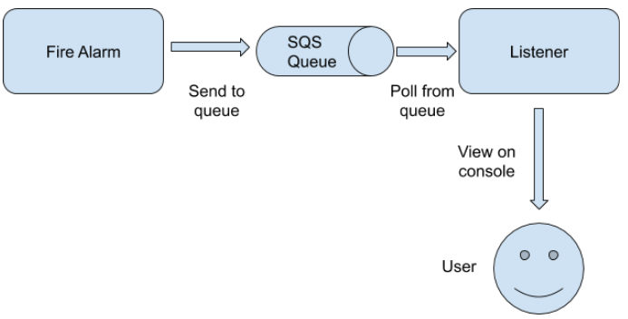

# Messaging with SQS

This guide demonstrates how to use Amazon SQS Connector to notify alerts.

The high level sections of this guide are as follows:

- [What you'll build](#What-youll-build)
- [Prerequisites](#Prerequisites)
- [Implementation](#Implementation)
  - [Creating the project structure](#Creating-the-project-structure)
  - [Developing the scenario](#Developing-the-scenario)
- [Deployment](#Deployment)
  - [Deploying locally](#Deploying-locally)
  - [Deploying on Docker](#Deploying-on-Docker)

## What you'll build

Let's consider a scenario where a fire alarm sends fire alerts to an Amazon SQS queue. As message duplication is not an issue, an Amazon SQS Standard Queue is used as the queue. A fire alarm listener is polling the messages in the SQS queue. When fire alerts are available, it will consume the messages from the queue and remove the messages from the queue. Consumed messages are showed in the console to the User. 

Here, the fire alarm is sending fire alerts periodically from a Ballerina worker where listener polls in another worker. Both sent messages and received messages are printed in the console. 

As there can be multiple alert messages available in the queue, the listener is configured to consume more than one message at a time.

The following diagram illustrates the scenario:




## Prerequisites
- [Ballerina Distribution](https://ballerina.io/learn/getting-started/)
- A Text Editor or an IDE 
  > **Tip**: For a better development experience, install one of the following Ballerina IDE plugins: [VSCode](https://marketplace.visualstudio.com/items?itemName=ballerina.ballerina), [IntelliJ IDEA](https://plugins.jetbrains.com/plugin/9520-ballerina)
- [Amazon SQS Account](https://aws.amazon.com/sqs/)


## Implementation
> If you want to skip the basics and move directly to the [Testing](#testing) section, you can download the project from GitHub and skip the [Implementation](#implementation) instructions.

Take a look at the code samples below to understand how to implement the scenario. 

The following code creates a new queue in Amazon SQS with the configuration provided in a file.

**create_notification_queue.bal**
<!-- INCLUDE_CODE: guide/create_notification_queue.bal -->

Following code generates fire alert notifications periodically and are sent to the above created SQS queue.

**notify_fire.bal**
<!-- INCLUDE_CODE: guide/notify_fire.bal -->

Following code listens to the SQS queue and if there are any notifications, it would receive from the queue and delete the existing messages in the queue.

**listen_to_fire_alarm.bal**
<!-- INCLUDE_CODE: guide/listen_to_fire_alarm.bal -->

In the following code, the main method would implement the workers related to creating a queue, sending a message to the queue consuming and receiving / deleting messages form the queue.

**main.bal**
<!-- INCLUDE_CODE: guide/main.bal -->

### Creating the project structure

Ballerina is a complete programming language that supports custom project structures. To implement the scenario in this guide, you can use the following package structure:

```
  messaging-with-sqs
  |__guide
        |
        ├── create_notification_queue.bal
        ├── notify_fire.bal
        ├── listen_to_fire_alarm.bal
        └── main.bal
```
 
- Create the above directories in your local machine and also create the empty .bal files.
- Then open a terminal, navigate to the guide directory, and run the Ballerina project initializing toolkit.

```bash
   $ ballerina init
```
Now that you have created the project structure, the next step is to develop the scenario.

### Developing the scenario

1. First you need to configure parameters in `create_notification_queue.bal` which will create a new queue. 
2. Then you need to configure/develop `notify_fire.bal` which will send periodic fire alerts to the created SQS queue.  
3. Then you need to configure/develop `listen_to_fire_alarm.bal` which will listen to the above created queue with polling.  
4. Finally you need to configure/develop `listen_to_fire_alarm.bal` which will implement the different workers for each of the above cases and run the system.

## Deployment

Once you are done with the development, you can deploy the scenario using any of the methods listed below.

### Deploying locally

To deploy locally, navigate to messaging-with-sqs/guide, and execute the following command.

```bash
  $ ballerina build
```
This builds a Ballerina executable archive (.balx) of the services in the target folder. You can run this by using the `ballerina run` command.

```bash
  $ ballerina run <Exec_Archive_File_Name>
```

Then you will see the SQS queue creation, sending fire alerts to the queue and consuming process of queues and subsequent deletion process on console.

### Deploying on Docker

If necessary you can run the service that you developed above as a Docker container. The Ballerina language includes a `Ballerina_Docker_Extension` that offers native support to run Ballerina programs on containers.

To run a service as a Docker container, add the corresponding Docker annotations to your service code.
