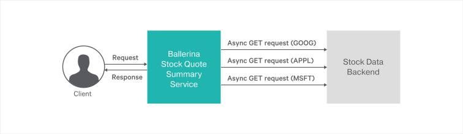

# Asynchronous Invocations

[Asynchronous invocations](https://en.wikipedia.org/wiki/Asynchronous_method_invocation) or the asynchronous pattern is a design pattern in which the call site is not blocked while waiting for the code invoked to finish. Instead, the calling thread can use the result when the reply arrives.

> In this guide you will learn about building a web service with asynchronous RESTful calls. 

The following are the sections available in this guide.

- [What you'll build](#what-youll-build)
- [Prerequisites](#prerequisites)
- [Implementation](#implementation)
- [Testing](#testing)
- [Deployment](#deployment)
- [Observability](#observability)

## What you’ll build 

To understand how you can use asynchronous invocations with Ballerina, let’s consider a Stock Quote Summary service.

- The Stock Quote Summary service calls a remote backend to get the stock data.
- The Ballerina Stock Quote Summary service calls the remote backends of three separate endpoints asynchronously.
- Finally, the quote summary service appends all the results from three backends and sends the responses to the client.


The following figure illustrates the scenario of the Stock Quote Summary service with asynchronous invocations. 

&nbsp;
&nbsp;
&nbsp;
&nbsp;



&nbsp;
&nbsp;
&nbsp;
&nbsp;


- **Request Stock Summary** : You can send an HTTP GET request to the `http://localhost:9090/quote-summary` URL and retrieve the stock quote summary.

## Prerequisites
 
- [Ballerina Distribution](https://ballerina.io/learn/getting-started/)
- A Text Editor or an IDE 
> **Tip**: For a better development experience, install one of the following Ballerina IDE plugins: [VSCode](https://marketplace.visualstudio.com/items?itemName=ballerina.ballerina), [IntelliJ IDEA](https://plugins.jetbrains.com/plugin/9520-ballerina)

### Optional requirements

- [Docker](https://docs.docker.com/engine/installation/)
- [Kubernetes](https://kubernetes.io/docs/setup/)

## Implementation


> If you want to skip the basics, you can download the git repo and directly move to the **Testing** section by skipping the **Implementation** section.


### Create the project structure

Ballerina is a complete programming language that can have any custom project structure that you require. For this example, let's use the following module structure.

```
asynchronous-invocation
    └── guide
        ├── stock_quote_data_backend
        │   ├── stock_backend.bal
        │   └── tests
        │       └── stock_backend_test.bal
        ├── stock_quote_summary_service
        │   ├── async_service.bal
        │   └── tests
        │       └── async_service_test.bal
        └── tests
            └── integration_test.bal
```

- Create the above directories in your local machine and also create empty `.bal` files.

- Then open the terminal and navigate to `asynchronous-invocation/guide` and run Ballerina project initializing toolkit.
```bash
   $ ballerina init
```

### Implement the Stock Quote Summary service with asynchronous invocations


- We can get started with the Stock Quote Summary service, which is the RESTful service that serves the stock quote summary requests. This service receives the requests via the HTTP GET method from the clients.

- The Stock Quote Summary service calls three separate remote resources asynchronously.

- The Ballerina language supports function calls and client connector actions in order to execute asynchronously. The `start` keyword allows you to invoke the function asychronously. The `future` type allows you to have the result in the future. The program can proceed without any blocking after the asynchronous function invocation. The following statement calls the endpoint asynchronously.

  `future <http:Response|error> responseFuture = start nasdaqServiceEP -> get("/nasdaq/quote/MSFT");`

- Finally, the service appends all three responses and returns the stock quote summary to the client. To get the results from an asynchronous call, the `wait` keyword needs to be used. `wait` blocks invocations until the previously started asynchronous invocations are completed.
The following statement receives the response from the future type.

  ` var response1 = wait f1;`

##### async_service.bal
```ballerina
import ballerina/http;
import ballerina/log;
import ballerina/runtime;

# Attributes associated with the service endpoint is defined here.
listener http:Listener asyncServiceEP = new(9090);

# Service is to be exposed via HTTP/1.1.
@http:ServiceConfig {
    basePath:"/quote-summary"
}
service AsyncInvoker on asyncServiceEP {

    # Resource for the GET requests of quote service.
    #
    # + caller - Represents the remote client's endpoint
    # + req - Represents the client request
    @http:ResourceConfig {
        methods:["GET"],
        path:"/"
    }
    resource function getQuote(http:Caller caller, http:Request req) {
        // Endpoint for the stock quote backend service
        http:Client nasdaqServiceEP = new("http://localhost:9095");
        http:Response finalResponse = new;
        string responseStr = "";

        log:printInfo(" >> Invoking services asynchrnounsly...");

        // 'start' allows you to invoke a functions  asynchronously. Following three
        // remote invocation returns without waiting for response.

        // Calling the backend to get the stock quote for GOOG asynchronously
        future<http:Response|error> f1 = start nasdaqServiceEP->get("/nasdaq/quote/GOOG");

        log:printInfo(" >> Invocation completed for GOOG stock quote! Proceed without
        blocking for a response.");

        // Calling the backend to get the stock quote for APPL asynchronously
        future<http:Response|error> f2 = start nasdaqServiceEP
        -> get("/nasdaq/quote/APPL");

        log:printInfo(" >> Invocation completed for APPL stock quote! Proceed without
        blocking for a response.");

        // Calling the backend to get the stock quote for MSFT asynchronously
        future<http:Response|error> f3 = start nasdaqServiceEP
        -> get("/nasdaq/quote/MSFT");

        log:printInfo(" >> Invocation completed for MSFT stock quote! Proceed without
        blocking for a response.");

        // Initialize empty json to add results from backed call
        json responseJson = ();

        // ‘wait` blocks until the previously started async function returns.
        // Append the results from all the responses of stock data backend
        var response1 = wait f1;
        if (response1 is http:Response) {
            var payload = response1.getTextPayload();
            if (payload is string) {
                responseStr = payload;
            } else {
                log:printError("Failed to retrive the payload");
            }
            // Add the response from /GOOG endpoint to responseJson file
            responseJson["GOOG"] = responseStr;
        } else {
            string errorMsg = <string>response1.detail().message;
            log:printError(errorMsg);
            responseJson["GOOG"] = errorMsg;
        }

        var response2 = wait f2;
        if (response2 is http:Response) {
            var payload = response2.getTextPayload();
            if (payload is string) {
                responseStr = payload;
            } else {
                log:printError("Failed to retrive the payload");
            }
            // Add the response from /APPL endpoint to responseJson file
            responseJson["APPL"] = responseStr;
        } else {
            string errorMsg = <string>response2.detail().message;
            log:printError(errorMsg);
            responseJson["APPL"] = errorMsg;
        }

        var response3 = wait f3;
        if (response3 is http:Response) {
            var payload = response3.getTextPayload();
            if (payload is string) {
                responseStr = payload;
            } else {
                log:printError("Failed to retrive the payload");
            }
            // Add the response from /MSFT endpoint to responseJson file
            responseJson["MSFT"] = responseStr;

        } else {
            string errorMsg = <string>response3.detail().message;
            log:printError(errorMsg);
            responseJson["MSFT"] = errorMsg;
        }

        // Send the response back to the client
        finalResponse.setJsonPayload(untaint responseJson);
        log:printInfo(" >> Response : " + responseJson.toString());
        var result = caller -> respond(finalResponse);
        if (result is error){
            log:printError("Error sending response", err = result);
        }
    }
}

```

### Mock remote service: stock_quote_data_backend

You can use any third-party remote service for the remote backend service. For ease of explanation, we have developed the mock stock quote remote backend with Ballerina. This mock stock data backend has the following resources and the respective responses.
 - resource path `/GOOG` with response `"GOOG, Alphabet Inc., 1013.41"` 
 - resource path `/APPL` with response `"APPL, Apple Inc., 165.22"` 
 - resource path `/MSFT` with response `"MSFT, Microsoft Corporation, 95.35"` 

NOTE: You can find the complete implementation of the stock_quote_data_backend [here](stock_quote_data_backend/stock_backend.bal)


## Testing 

### Invoking stock quote summary service

- First, you need to run `stock_quote_data_backend`. To do this, navigate to the `<SAMPLE_ROOT>` directory and run the following command in the terminal.
```
$ ballerina run stock_quote_data_backend/
```
NOTE: To run the Ballerina service, you need to have Ballerina installed in you local machine.

- Then, you need to run `stock_quote_summary_service`. To do this, navigate to the `<SAMPLE_ROOT>` directory and run the following command in the terminal.


```
$ ballerina run stock_quote_summary_service/
```

- Now you can execute the following curl commands to call the stock quote summary service.

**Get stock quote summary for GOOG, APPL and MSFT** 

```
curl http://localhost:9090/quote-summary

Output :  
{
    "GOOG": "GOOG, Alphabet Inc., 1013.41",
    "APPL": "APPL, Apple Inc., 165.22",
    "MSFT": "MSFT, Microsoft Corporation, 95.35"
}
```

**Console output for stock_quote_summary_service(with asynchronous calls)**
```
 INFO  [ballerina/log] -  >> Invoking services asynchrnounsly...
 INFO  [ballerina/log] -  >> Invocation completed for GOOG stock quote! Proceed without
        blocking for a response.
 INFO  [ballerina/log] -  >> Invocation completed for APPL stock quote! Proceed without
        blocking for a response.
 INFO  [ballerina/log] -  >> Invocation completed for MSFT stock quote! Proceed without
        blocking for a response.
 INFO  [ballerina/log] -  >> Response : {
    "GOOG": "GOOG, Alphabet Inc., 1013.41",
    "APPL": "APPL, Apple Inc., 165.22",
    "MSFT": "MSFT, Microsoft Corporation, 95.35"
    }
```

### Writing unit tests 


In Ballerina, the unit test cases should be in the same module inside a folder named as 'tests'.  When writing the test functions the below convention should be followed.
- Test functions should be annotated with `@test:Config`. See the below example.
```ballerina
   @test:Config
   function testQuoteService() {
```
  
This guide contains unit test cases for all the modules inside the `asynchronous-invocation/guide` directory.


To check the implementation of the test file, refer tests folder in the [git repository](https://github.com/ballerina-guides/asynchronous-invocation).


## Deployment

Once you are done with the development, you can deploy the service using any of the methods that are listed below. 

### Deploying locally


- As the first step, you can build a Ballerina executable archive (.balx) of the service that is developed above. To do this, navigate to the `<SAMPLE_ROOT>/` directory and run the following commands. It points to the directory in which the service you developed is located, and creates an executable binary out of that.


```
$ ballerina build stock_quote_summary_service
```

```
$ ballerina build stock_quote_data_backend
```

- Once the `stock_quote_summary_service.balx` and `build stock_quote_data_backend.balx` are created inside the target directory, issue the following command to execute them. 

```
$ ballerina run target/stock_quote_summary_service.balx
```

```
$ ballerina run target/stock_quote_data_backend.balx
```

- Once the service is successfully executed, the following output is displayed. 
```
$ ballerina run target/stock_quote_summary_service.balx
Initiating service(s) in 'target/stock_quote_summary_service.balx'
[ballerina/http] started HTTP/WS endpoint 0.0.0.0:9090
```

```
$ ballerina run target/stock_quote_data_backend.balx
Initiating service(s) in 'target/stock_quote_data_backend.balx'
[ballerina/http] started HTTP/WS endpoint 0.0.0.0:9095

```

### Deploying on Docker

You can run the service that we developed above as a Docker container. As Ballerina platform includes [Ballerina_Docker_Extension](https://github.com/ballerinax/docker), which offers native support for running ballerina programs on containers, you just need to put the corresponding Docker annotations on your service code.

- In our async_service, we need to import  `ballerinax/docker` and use the annotation `@docker:Config` as shown below to enable Docker image generation during the build time.

##### async_service.bal
```ballerina
import ballerina/http;
import ballerina/log;
import ballerina/runtime;
import ballerinax/docker;

@docker:Config {
    registry:"ballerina.guides.io",
    name:"async_service",
    tag:"v1.0"
}

@docker:Expose{}
listener http:Listener asyncServiceEP = new (9090);

# Service is to be exposed via HTTP/1.1.
@http:ServiceConfig {
    basePath: "/quote-summary"
}
service AsyncInvoker on asyncServiceEP {
``` 

- `@docker:Config` annotation is used to provide the basic Docker image configurations for the sample. `@docker:Expose {}` is used to expose the port.

- Now you can build a Ballerina executable archive (.balx) of the service that we developed above, using the following command. It points to the service file that we developed above and it will create an executable binary out of that. 
This will also create the corresponding Docker image using the Docker annotations that you have configured above. Navigate to `asynchronous-invocation/guide` and run the following command.
```
   $ ballerina build stock_quote_summary_service
```

- Once you successfully build the Docker image, you can run it with the `docker run` command that is shown in the previous step.
```   
   $ docker run -d -p 9090:9090 ballerina.guides.io/async_service:v1.0
```

  Here we run the Docker image with flag `-p <host_port>:<container_port>` so that we  use  the host port 9090 and the container port 9090. Therefore you can access the service through the host port.

- Verify Docker container is running with the use of `$ docker ps`. The status of the Docker container should be shown as 'Up'.
- You can access the service using the same curl commands that we've used above. 
```
curl http://localhost:9090/quote-summary
```

### Deploying on Kubernetes

- You can run the service that we developed above, on Kubernetes. The Ballerina language offers native support for running a ballerina programs on Kubernetes, with the use of Kubernetes annotations that you can include as part of your service code. Also, it will take care of the creation of the Docker images. So you don't need to explicitly create Docker images prior to deploying it on Kubernetes. Refer to [Ballerina_Kubernetes_Extension](https://github.com/ballerinax/kubernetes) for more details and samples on Kubernetes deployment with Ballerina. You can also find details on using Minikube to deploy Ballerina programs.

- Let's now see how we can deploy our `stock_quote_summary_service` on Kubernetes.

- First we need to import `ballerinax/kubernetes` and use `@kubernetes` annotations as shown below to enable kubernetes deployment for the service we developed above. 

> NOTE: Linux users can use Minikube to try this out locally.

##### async_service.bal

```ballerina
import ballerina/http;
import ballerina/log;
import ballerina/runtime;
import ballerinax/kubernetes;

@kubernetes:Ingress {
    hostname:"ballerina.guides.io",
    name:"ballerina-guides-asynchronous-invocation",
    path:"/"
}

@kubernetes:Service {
    serviceType:"NodePort",
    name:"ballerina-guides-asynchronous-invocation"
}

@kubernetes:Deployment {
    image:"ballerina.guides.io/asynchronous-invocation:v1.0",
    name:"ballerina-guides-asynchronous-invocation"
}

listener http:Listener asyncServiceEP = new (9090);

# Service is to be exposed via HTTP/1.1.
@http:ServiceConfig {
    basePath: "/quote-summary"
}
service AsyncInvoker on asyncServiceEP {
``` 

- Here we have used `@kubernetes:Deployment` to specify the Docker image name which will be created as part of building this service.
- We have also specified `@kubernetes:Service` so that it will create a Kubernetes service which will expose the Ballerina service that is running on a Pod.  
- In addition we have used `@kubernetes:Ingress` which is the external interface to access your service (with path `/` and host name `ballerina.guides.io`)

If you are using Minikube, you need to set a couple of additional attributes to the `@kubernetes:Deployment` annotation.
- `dockerCertPath` - The path to the certificates directory of Minikube (e.g., `/home/ballerina/.minikube/certs`).
- `dockerHost` - The host for the running cluster (e.g., `tcp://192.168.99.100:2376`). The IP address of the cluster can be found by running the `minikube ip` command.
 
- Now you can build a Ballerina executable archive (.balx) of the service that we developed above, using the following command. It points to the service file that we developed above and it will create an executable binary out of that. 
This will also create the corresponding Docker image and the Kubernetes artifacts using the Kubernetes annotations that you have configured above.
  
```
   $ ballerina build stock_quote_summary_service
  
   Run following command to deploy kubernetes artifacts:  
   kubectl apply -f ./target/stock_quote_summary_service/kubernetes
```

- You can verify that the Docker image that we specified in `@kubernetes:Deployment` is created, by using `$ docker images`.
- Also the Kubernetes artifacts related our service, will be generated in `./target/stock_quote_summary_service/kubernetes`. 
- Now you can create the Kubernetes deployment using:

```
   $ kubectl apply -f ./target/stock_quote_summary_service/kubernetes 
 
   deployment.extensions "ballerina-guides-asynchronous-invocation" created
   ingress.extensions "ballerina-guides-asynchronous-invocation" created
   service "ballerina-guides-asynchronous-invocation" created
```

- You can verify Kubernetes deployment, service and ingress are running properly, by using following Kubernetes commands.

```
   $ kubectl get service
   $ kubectl get deploy
   $ kubectl get pods
   $ kubectl get ingress
```

- If everything is successfully deployed, you can invoke the service either via Node port or ingress. 

Node Port:
 
```
  curl http://localhost:9090/quote-summary
```
If you are using Minikube, you should use the IP address of the Minikube cluster obtained by running the `minikube ip` command. The port should be the node port given when running the `kubectl get services` command.

Ingress:

Add `/etc/hosts` entry to match hostname. For Minikube, the IP address should be the IP address of the cluster.
``` 
127.0.0.1 ballerina.guides.io
```

Access the service 
``` 
  curl http://localhost:9090/quote-summary
```

## Observability 
Ballerina is by default observable. Meaning you can easily observe your services, resources, etc.
However, observability is disabled by default via configuration. Observability can be enabled by adding following configurations to `ballerina.conf` file and starting the ballerina service using it. A sample configuration file can be found in `asynchronous-invocation/guide/stock_quote_summary_service`.

```ballerina
[b7a.observability]

[b7a.observability.metrics]
# Flag to enable Metrics
enabled=true

[b7a.observability.tracing]
# Flag to enable Tracing
enabled=true
```

To start the ballerina service using the configuration file, run the following command

```
   $ ballerina run --config stock_quote_summary_service/ballerina.conf stock_quote_summary_service/
```
NOTE: The above configuration is the minimum configuration needed to enable tracing and metrics. With these configurations default values are load as the other configuration parameters of metrics and tracing.

### Tracing 

You can monitor ballerina services using in built tracing capabilities of Ballerina. We'll use [Jaeger](https://github.com/jaegertracing/jaeger) as the distributed tracing system.
Follow the following steps to use tracing with Ballerina.

- You can add the following configurations for tracing. Note that these configurations are optional if you already have the basic configuration in `ballerina.conf` as described above.
```
   [b7a.observability]

   [b7a.observability.tracing]
   enabled=true
   name="jaeger"

   [b7a.observability.tracing.jaeger]
   reporter.hostname="localhost"
   reporter.port=5775
   sampler.param=1.0
   sampler.type="const"
   reporter.flush.interval.ms=2000
   reporter.log.spans=true
   reporter.max.buffer.spans=1000
```

- Run Jaeger Docker image using the following command
```bash
   $ docker run -d -p5775:5775/udp -p6831:6831/udp -p6832:6832/udp -p5778:5778 -p16686:16686 \
   -p14268:14268 jaegertracing/all-in-one:latest
```

- Navigate to `asynchronous-invocation/guide` and run the asynchronous-invocation using the following command
```
   $ ballerina run --config stock_quote_summary_service/ballerina.conf stock_quote_summary_service/
```

- Observe the tracing using Jaeger UI using following URL
```
   http://localhost:16686
```

### Metrics
Metrics and alarts are built-in with ballerina. We will use Prometheus as the monitoring tool.
Follow the below steps to set up Prometheus and view metrics for Ballerina restful service.

- You can add the following configurations for metrics. Note that these configurations are optional if you already have the basic configuration in `ballerina.conf` as described under `Observability` section.

```ballerina
   [b7a.observability.metrics]
   enabled=true
   reporter="prometheus"

   [b7a.observability.metrics.prometheus]
   port=9797
   host="0.0.0.0"
```

- Create a file `prometheus.yml` inside `/tmp/` location. Add the below configurations to the `prometheus.yml` file.
```
   global:
     scrape_interval:     15s
     evaluation_interval: 15s

   scrape_configs:
     - job_name: prometheus
       static_configs:
         - targets: ['172.17.0.1:9797']
```

   NOTE : Replace `172.17.0.1` if your local Docker IP differs from `172.17.0.1`
   
- Run the Prometheus Docker image using the following command
```
   $ docker run -p 19090:9090 -v /tmp/prometheus.yml:/etc/prometheus/prometheus.yml \
   prom/prometheus
```

- Navigate to `asynchronous-invocation/guide` and run the asynchronous-invocation using the following command
```
  $ ballerina run --config stock_quote_summary_service/ballerina.conf stock_quote_summary_service/
```

- You can access Prometheus at the following URL
```
   http://localhost:19090/
```

NOTE:  Ballerina will by default have following metrics for HTTP server connector. You can enter following expression in Prometheus UI
-  http_requests_total
-  http_response_time


### Logging

Ballerina has a log module for logging to the console. You can import ballerina/log module and start logging. The following section will describe how to search, analyze, and visualize logs in real time using Elastic Stack.

- Start the Ballerina Service with the following command from `asynchronous-invocation/guide`
```
   $ nohup ballerina run stock_quote_summary_service/ &>> ballerina.log&
```
   NOTE: This will write the console log to the `ballerina.log` file in the `asynchronous-invocation/guide` directory

- Start Elasticsearch using the following command

- Start Elasticsearch using the following command
```
   $ docker run -p 9200:9200 -p 9300:9300 -it -h elasticsearch --name \
   elasticsearch docker.elastic.co/elasticsearch/elasticsearch:6.5.1 
```

   NOTE: Linux users might need to run `sudo sysctl -w vm.max_map_count=262144` to increase `vm.max_map_count` 
   
- Start Kibana plugin for data visualization with Elasticsearch
```
   $ docker run -p 5601:5601 -h kibana --name kibana --link \
   elasticsearch:elasticsearch docker.elastic.co/kibana/kibana:6.5.1     
```

- Configure logstash to format the ballerina logs

i) Create a file named `logstash.conf` with the following content
```
input {  
 beats{ 
     port => 5044 
 }  
}

filter {  
 grok{  
     match => { 
	 "message" => "%{TIMESTAMP_ISO8601:date}%{SPACE}%{WORD:logLevel}%{SPACE}
	 \[%{GREEDYDATA:package}\]%{SPACE}\-%{SPACE}%{GREEDYDATA:logMessage}"
     }  
 }  
}   

output {  
 elasticsearch{  
     hosts => "elasticsearch:9200"  
     index => "store"  
     document_type => "store_logs"  
 }  
}  
```

ii) Save the above `logstash.conf` inside a directory named as `{SAMPLE_ROOT}\pipeline`
     
iii) Start the logstash container, replace the {SAMPLE_ROOT} with your directory name
     
```
$ docker run -h logstash --name logstash --link elasticsearch:elasticsearch \
-it --rm -v ~/{SAMPLE_ROOT}/pipeline:/usr/share/logstash/pipeline/ \
-p 5044:5044 docker.elastic.co/logstash/logstash:6.5.1
```
  
 - Configure filebeat to ship the ballerina logs
    
i) Create a file named `filebeat.yml` with the following content
```
filebeat.prospectors:
- type: log
  paths:
    - /usr/share/filebeat/ballerina.log
output.logstash:
  hosts: ["logstash:5044"]  
```
NOTE : Modify the ownership of filebeat.yml file using `$chmod go-w filebeat.yml` 

ii) Save the above `filebeat.yml` inside a directory named as `{SAMPLE_ROOT}\filebeat`   
        
iii) Start the logstash container, replace the {SAMPLE_ROOT} with your directory name
     
```
$ docker run -v {SAMPLE_ROOT}/filebeat/filebeat.yml:/usr/share/filebeat/filebeat.yml \
-v {SAMPLE_ROOT}/guide/stock_quote_summary_service/ballerina.log:/usr/share\
/filebeat/ballerina.log --link logstash:logstash docker.elastic.co/beats/filebeat:6.5.1
```
 
 - Access Kibana to visualize the logs using following URL
```
   http://localhost:5601 
```
