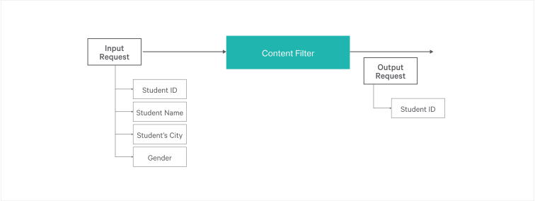
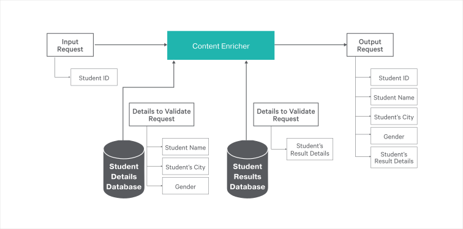

# EIP-Message-Transformation

There are different ways of message transformation methods in EIP (Enterprise Integration Patterns). In this guide, we are focusing on 'content filter', 'claim check' and 'content enricher' message transformation methods between services using an example scenario.

> This guide describes implementing three message transformation patterns using Ballerina programming language as simple steps.

The following are the sections available in this guide.

- [What you'll build](#what-youll-build)
- [Prerequisites](#prerequisites)
- [Implementation](#implementation)
- [Testing](#testing)
- [Deployment](#deployment)
- [Observability](#observability)

## What you’ll build
When it comes to data communication, the major challenge is formats of storage mechanisms vary among the systems. 


Also, the message producers and consumers use different techniques according to their requirement. So message transformation plays an important role in coupling those message producers and the message consumers. 
Additionally, the performance impact while message transformation is also an important fact in the real world. Here we discuss main three message transformation patterns in Integration as content filter, content enricher, and claim check.

### Content filter
The content filter EIP is important when we need to manage a large message in order to get a few data from it. It removes unimportant data items from a message and leaves only the important ones. In addition to removing data elements, Content Filter can be used to simplify a message structure.



In our sample scenario, input request contains a lot of student's details. So, content filter uses to simplify the input request such as request contains only student ID. Additional data such as student name, student's city, and gender will be dropped to ensure the performance of message transformation.

### Content Enricher
The Content Enricher EIP facilitates communication with another system if the message originator does not have all the required data items available. It accesses an external data source to augment a message with missing information.



Content enricher EIP uses to enrich the request data, in our example, it is used to enrich the student's details. We used two databases as student's results details and student's personal details. Using student's ID, it maps the details which belong to a particular student from the tables and send those to the enricher. Then enricher added particular data to the request.

### Claim check
The Claim Check EIP reduces the data volume of messages sent across a system without sacrificing information content. It stores the entire message at the initial stage of a sequence of processing steps, and it extracts only the parts required by the following steps. Once processing is completed, it retrieves the stored message and performs any operations. This pattern ensures better performance since large chunks of unwanted data is reduced to lightweight bits before being processed.


The ultimate goal of the claim check EIP in our scenario is to validate the student's ID. Check luggage used to send unwanted data which not uses invalidation process, to the student's detail database. After the validation of the student's ID, the original data will add to the request again.

### Sample scenario
The sample scenario used to demonstrate the above three EI Patterns. Student sends a request with content student ID, student name, Student's city and gender. Then ‘content filter’ filters the student name, student's city and gender from the request and added them to a students details database. The filtered request contains only the student ID. Then filtered request goes to the 'Student ID validator'. It validates the incoming request and sends the validated request. Then validated request goes to the 'content enricher'. Content enricher uses used two databases as student's results details and student's personal details.
Using student's ID, it maps the details which belong to a particular student from the tables and added particular data to the request. While adding the enriching data, it processes the data using JSON to JSON transformation. The output request of the scenario contains student ID, student name, Student's city, gender and student's results details.


## Prerequisites
 
- [Ballerina Distribution](https://ballerina.io/learn/getting-started/)
- A Text Editor or an IDE 
> **Tip**: For a better development experience, install one of the following Ballerina IDE plugins: [VSCode](https://marketplace.visualstudio.com/items?itemName=ballerina.ballerina), [IntelliJ IDEA](https://plugins.jetbrains.com/plugin/9520-ballerina)

### Optional Requirements

- [Docker](https://docs.docker.com/engine/installation/)
- [Kubernetes](https://kubernetes.io/docs/setup/)

## Implementation

### Create the project structure

Ballerina is a complete programming language that supports custom project structures. Use the following package structure for this guide.

```
 └── guide
     └── message_transformation
         └── message_transformation.bal
         └── tests
             └── message_transformation_test.bal

```

Create the above directories in your local machine and also create empty `.bal` files.

Open the terminal and navigate to `eip-message-transformation/guide` and run the Ballerina project initializing toolkit.

```bash
   $ ballerina init
```
### Developing the SQL data

Ballerina language has built-in support for writing web services. The `service` keyword in Ballerina simply defines a web service. Inside the service block, we can have all the required resources. You can define a resource inside the service. You can implement the business logic inside a resource using Ballerina language syntax.
We can use the schema of the following database to store the student's data and student's results data.

The StudentDetailsDB database is used to store the student's data in the StudentDetails table as shown below,
``` 
+---------+--------------+------+-----+---------+-------+
| Field   | Type         | Null | Key | Default | Extra |
+---------+--------------+------+-----+---------+-------+
| id      | int(11)      | NO   | PRI | NULL    |       |
| name    | varchar(255) | YES  |     | NULL    |       |
| address | varchar(255) | YES  |     | NULL    |       |
| gender  | varchar(255) | YES  |     | NULL    |       |
+---------+--------------+------+-----+---------+-------+
```
The  StudentResultsDB database is used to store the student's results data in the StudentResults as shown below,

``` 
+-----------+------------+------+-----+---------+-------+
| Field     | Type       | Null | Key | Default | Extra |
+-----------+------------+------+-----+---------+-------+
| ID        | int(11)    | NO   | PRI | NULL    |       |
| Com_Maths | varchar(1) | YES  |     | NULL    |       |
| Physics   | varchar(1) | YES  |     | NULL    |       |
| Chemistry | varchar(1) | YES  |     | NULL    |       |
+-----------+------------+------+-----+---------+-------+
```
The student's data is added through the request in the following service. However, the student's result data must be located in the database as shown below,
```
+-----+-----------+---------+-----------+
| ID  | Com_Maths | Physics | Chemistry |
+-----+-----------+---------+-----------+
| 100 | A         | A       | A         |
| 101 | A         | A       | B         |
| 102 | A         | A       | C         |
| 103 | A         | B       | A         |
| 104 | A         | B       | B         |
| 105 | A         | B       | C         |
| 106 | A         | C       | A         |
| 107 | A         | C       | B         |
| 108 | A         | C       | C         |
+-----+-----------+---------+-----------+
```

### Developing the service

To implement the scenario, let's start by implementing the message_transformation.bal file, which is the main file in the implementation. This file includes 4 main services as contentfilter, validate, enricher, and backend. Refer to the code attached below. Inline comments are added for better understanding.

> In the below service you have to change below configurations according to your MySQL configuration details, 
>```
>   host: "localhost",
>   port: 3306,
>   username: "root",
>   password: "",
>```

##### message_transformation.bal

```ballerina
import ballerina/http;
import ballerina/io;
import ballerina/log;
import ballerina/mysql;

//Connect the student details table
mysql:Client studentDetailsDB = new({
    host: "localhost",
    port: 3306,
    name: "StudentDetailsDB",
    username: "root",
    password: "",
    dbOptions: { useSSL: false }
});

//Connect the student's results details table
mysql:Client studentResultsDB = new ({
    host: "localhost",
    port: 3306,
    name: "StudentResultsDB",
    username: "root",
    password: "",
    dbOptions: { useSSL: false }
});

//Define listeners for the service endpoints
listener http:Listener contentfilterEP = new(9090);

listener http:Listener claimvalidateEP = new(9094);

listener http:Listener contentenricherEP = new(9092);

listener http:Listener backendEP = new(9093);

//Define endpoints for services
http:Client validatorEP = new("http://localhost:9094/validater");

http:Client enricherEP = new("http://localhost:9092/enricher");

http:Client clientEP = new("http://localhost:9093/backend");

//define the global variables
json payload1;
json payload2;

service contentfilter on contentfilterEP {
    resource function filter(http:Caller caller, http:Request req) {
        http:Request filteredReq = req;
        var jsonMsg = filteredReq.getJsonPayload();

        if (jsonMsg is json) {
            http:Response res = new;
            if (!checkForValidData(jsonMsg, res)) {
                respondAndHandleError(caller, res, "Error sending response");
            } else {
                //Assign user input values to variables
                int IdValue = checkpanic int.convert(jsonMsg["id"]);
                string nameString = checkpanic string.convert(jsonMsg["name"]);
                string cityString = checkpanic string.convert(jsonMsg["city"]);
                string genderString = checkpanic string.convert(jsonMsg["gender"]);
                //Add values to the student details table
                var ret = studentDetailsDB->update(
                        "INSERT INTO StudentDetails(id, name, city, gender) values (?, ?, ?, ?)", IdValue,
                        nameString, cityString, genderString);
                handleUpdate(ret, "Add details to the table");
                json iddetails = { id: IdValue };
                //Set filtered payload to the request
                filteredReq.setJsonPayload(untaint iddetails);
                //Forward request to the nesxt ID validating service
                var clientResponse = validatorEP->forward("/validate", filteredReq);
                forwardResponse(caller, clientResponse);
            }
        } else {
            createAndSendErrorResponse(caller, untaint jsonMsg, "Error while content reading");
        }
    }
}

service validater on claimvalidateEP {
    resource function validate(http:Caller caller, http:Request filteredReq) {
        http:Request validatededReq = filteredReq;
        //Get the payload in the request (Student ID)
        var jsonMsg = filteredReq.getJsonPayload();
        if (jsonMsg is json) {
            int idValue = <int>jsonMsg["id"];
            //validate the student's ID
            //In this example student's ID should be in between 100 to 110
            if (100 <= idValue && idValue <= 110) {
                //Print the validity
                log:printInfo("The  Student ID is successfully validated");
                //Forward the request to the enricher service
                var clientResponse = enricherEP->forward("/enrich", validatededReq);
                forwardResponse(caller, clientResponse);
            } else {
                error err = error("Student ID: " + idValue + " is not found");
                http:Response res = new;
                res.statusCode = 500;
                res.setPayload(untaint err.reason());
                respondAndHandleError(caller, res, "Error sending response");
            }
        } else {
            createAndSendErrorResponse(caller, untaint jsonMsg, "Error while content reading");
        }
    }
}

//The content enricher service
service enricher on contentenricherEP {
    resource function enrich(http:Caller caller, http:Request validatedReq) {
        http:Request enrichedReq = validatedReq;
        var jsonMsg = validatedReq.getJsonPayload();
        if (jsonMsg is json) {
            //Get the student's ID value
            int idvalue = <int>jsonMsg["id"];
            //Select details from the data table according to the student's ID
            var selectRet = studentDetailsDB->select("SELECT * FROM StudentDetails", ());
            payload1 = untaint convertTableToJson(selectRet, "Select data from StudentDetails table failed", "Error in student table to json conversion");
            //Select student's results from the student results data table, according to the student's ID
            var selectRet1 = studentResultsDB->select(
                    "select Com_Maths,Physics,Chemistry from StudentResults where ID = ?", (), idvalue);
            payload2 = untaint convertTableToJson(selectRet1, "Select data from StudentResults table failed", "Error in StudentDetails table to json conversion");

            //Define new json variable
            json pay = payload1[0];
            //Add extra values to the jason payload
            pay.fname = pay.name;
            //remove values from the jason payload
            pay.remove("name");
            //Add results to the same payload
            pay.results = payload2[0];
            //Set enriched payload to the request
            enrichedReq.setJsonPayload(pay);
        } else {
            createAndSendErrorResponse(caller, untaint jsonMsg, "Error sending response");
        }

        //Forward enriched request to the client endpoint
        var clientResponse = clientEP->forward("/backend", enrichedReq);
        forwardResponse(caller, clientResponse);
    }
}

service backend on backendEP {
    resource function backend(http:Caller caller, http:Request enrichedReq) {
        //Get the requset payload
        var jsonMsg = enrichedReq.getJsonPayload();
        if (jsonMsg is json) {
            //Send payload as response
            http:Response res = new;
            res.setJsonPayload(untaint jsonMsg);
            respondAndHandleError(caller, res, "Error sending response");
        } else {
            createAndSendErrorResponse(caller, untaint jsonMsg, "Error sending response");
        }
    }
}

function forwardResponse(http:Caller caller, http:Response|error forwardingResponse) {
    if (forwardingResponse is http:Response) {
        respondAndHandleError(caller, forwardingResponse, "Error sending response");
    } else {
        createAndSendErrorResponse(caller, forwardingResponse, "Error sending response");
    }
}

function createAndSendErrorResponse(http:Caller caller, error sourceError, string respondErrorMsg) {
    http:Response response = new;
    response.statusCode = 500;
    response.setPayload(<string> sourceError.detail().message);
    respondAndHandleError(caller, response, respondErrorMsg);
}

function respondAndHandleError(http:Caller caller, http:Response response, string respondErrorMsg) {
    var respondRet = caller->respond(response);
    if (respondRet is error) {
        log:printError(respondErrorMsg, err = respondRet);
    }
}

function convertTableToJson(table<record{}>|error tableOrError, string dataRetrievalErrorMsg, string conversionErrorMsg) returns json? {
    if (tableOrError is table<record{}>) {
        json | error convertedJson = json.convert(tableOrError);
        if (convertedJson is json) {
            return convertedJson;
        } else {
            log:printError(conversionErrorMsg, err = convertedJson);
        }
    } else {
        log:printError(dataRetrievalErrorMsg, err = tableOrError);
    }
}

//Function to handle the user input
function checkForValidData(json msg, http:Response res) returns boolean {
    error? err = ();
    //Check input through the regular expressions
    if (!(checkpanic msg.id.toString().matches("\\d+"))) {
        err = createError("student ID containts invalid data");
    } else if (!(checkpanic msg.name.toString().matches("[a-zA-Z]+"))) {
        err = createError("student Name containts invalid data");
    } else if (!(checkpanic msg.city.toString().matches("^[a-zA-Z]+([\\-\\s]?[a-zA-Z0-9]+)*$"))) {
        err = createError("student city containts invalid data");
    } else if (!(checkpanic msg.gender.toString().matches("[a-zA-Z]+"))) {
        err = createError("student gender containts invalid data");
    }
    if (err is error) {
        res.statusCode = 400;
        res.setPayload(<string> (err.detail().message));
        return false;
    } else {
        return true;
    }
}

function createError(string message) returns error {
    return error(message);
}

function handleUpdate(sql:UpdateResult|error returned, string message) {
    if (returned is sql:UpdateResult) {
        log:printInfo(message + " status: " + returned.updatedRowCount);
    } else {
        log:printInfo(message + " failed: " + <string>returned.detail().message);
    }
}

```

## Testing 

### Before you begin
* Run the SQL script `initialize.sql` provided in the resources folder, to initialize the databases and to create the required tables.
```
   $mysql -u <username> -p <file location>/Initialize.sql 
``` 
NOTE : You can find the SQL script(`Initialize.sql`) [here](resources/Initialize.sql)

### Invoking the service

Navigate to `message_transformation` and run the following command in the command line to start `message_transformation.bal`.

```bash
   $ ballerina run message_transformation.bal
```
   
Send a request to the contentfilter service.

```bash

 $ curl -v http://localhost:9090/contentfilter/filter -d '{"id" : 105, "name" : "ballerinauser", "city" : "Colombo 03", "gender" : "male"}' -H "Content-Type:application/json" -X POST

```
#### Output

The request goes through the contentfilter service and forwards it to validator service. Then validator validates the data and forward it to enricher service. The enricher service enriches the request data and forwards it to backend service. The backend service returns the requested content as below to the contentfilter service.

```bash
*   Trying 127.0.0.1...
* Connected to localhost (127.0.0.1) port 9090 (#0)
> POST /contentfilter HTTP/1.1
> Host: localhost:9090
> User-Agent: curl/7.47.0
> Accept: */*
> Content-Type:application/json
> Content-Length: 80
> 
* upload completely sent off: 80 out of 80 bytes
< HTTP/1.1 200 OK
< content-type: application/json
< date: Fri, 3 Aug 2018 07:56:28 +0530
< server: ballerina/0.980.1
< content-length: 128
< 
* Connection #0 to host localhost left intact
{"id":105,"city":"Colombo 03","gender":"male","fname":"ballerinauser","results":{"Com_Maths":"A","Physics":"B","Chemistry":"C"}}
```
### Writing unit tests 

In Ballerina, the unit test cases should be in the same package inside a folder named as 'tests'.  When writing the test functions, the below convention should be followed.

Test functions should be annotated with `@test:Config`. See the below example.

```ballerina
   @test:Config
   function testFunc() {
   }
```

This guide contains unit test case for contentfilter service in [message_transformation_test.bal](https://github.com/sanethmaduranga/Simple-pass-through-messaging-ballerina-/blob/master/guide/tests/passthrough_test.bal) file.

To run the unit tests, navigate to `eip-message-transformation/guide` and run the following command. 

```bash
   $ ballerina test
```
## Deployment

After the development process, you can deploy the services using below methods by selecting as you wish.

### Deploying locally

As the first step, you can build Ballerina executable archives (.balx) of the services that you developed above. Navigate to `eip-message-transformation/guide` and run the following command.

```bash
   $ ballerina build
```

Once the .balx files are created inside the target folder, you can run them using the following command. 

```bash
   $ ballerina run target/message_transformation.balx
```

The successful execution of a service will show us something similar to the following output.

```
   ballerina: initiating service(s) in 'target/message_transformation.balx'
   
```

### Deploying on Docker

You can run the service that we developed above as a Docker container. As Ballerina platform includes [Ballerina_Docker_Extension](https://github.com/ballerinax/docker), which offers native support for running Ballerina programs on containers, you just need to put the corresponding docker annotations on your service code. Since this guide requires MySQL as a prerequisite, you need a couple of more steps to configure MySQL in the Docker container.   

First, let's see how to configure MySQL in the Docker container.

  * Initially, you need to pull the MySQL docker image using the below command.
```
    $docker pull mysql:5.7.22
```

  * Then run the MySQL as root user with container name `docker_mysql` and password being `root` to easily follow this guide. 
```
    $docker run --name docker_mysql -e MYSQL_ROOT_PASSWORD=root -d mysql:5.7.22
```

  * Check whether the MySQL container is up and running using the following command.
```
    $docker ps
```

  * Navigate to the sample root directory and run the below command to copy the database script file to the MySQL Docker container, which will be used to create the required database.
```
    $docker cp ./resources/Initialize.sql <CONTAINER_ID>:/
```

  * Run the SQL script file in the container to create the required database using the below command.
```
    $docker exec <CONTAINER_ID> /bin/sh -c 'mysql -u root -proot </Initialize.sql'    
```

Now let's add the required docker annotations in our employee_db_service. You need to import  `` ballerinax/docker; `` and add the docker annotations as shown below to enable docker image generation during the build time. 

##### message_transformation.bal

```ballerina
import ballerina/http;
import ballerina/log;
import ballerina/mime;
import ballerina/io;
import ballerina/sql;
import ballerina/mysql;
import ballerinax/docker;

//Connect the student details table
mysql:Client studentDetailsDB = new({
    host: "localhost",
    port: 3306,
    name: "StudentDetailsDB",
    username: "root",
    password: "",
    dbOptions: { useSSL: false }
});

//Connect the student's results details table
mysql:Client studentResultsDB = new ({
    host: "localhost",
    port: 3306,
    name: "StudentResultsDB",
    username: "root",
    password: "",
    dbOptions: { useSSL: false }
});

@docker:Config {
    registry:"ballerina.guides.io",
    name:"message_transformation",
    tag:"v1.0",
    baseImage:"ballerina/ballerina-platform:0.980.0"
}
@docker:CopyFiles {
    files:[{source:<path_to_JDBC_jar>,
            target:"/ballerina/runtime/bre/lib"}]
}

//@docker:Expose {}
//Define listeners for the service endpoints
listener http:Listener contentfilterEP = new(9090);

listener http:Listener claimvalidateEP = new(9094);

listener http:Listener contentenricherEP = new(9092);

listener http:Listener backendEP = new(9093);

//Define endpoints for services
http:Client validatorEP = new("http://localhost:9094/validater");

http:Client enricherEP = new("http://localhost:9092/enricher");

http:Client clientEP = new("http://localhost:9093/backend");

//Define the global variables
json payload1 = "";
json payload2 = "";

//service for the content filter pattern
service contentfilter on contentfilterEP {
.
.
}
//the student ID validate service
service validater on claimvalidateEP {
.
.
}
//The content enricher service
service enricher on contentenricherEP {
.
.
}
//client endpoint service to display the request payload
service backend on backendEP {
.
.
}
```

 - `@docker:Config` annotation is used to provide the basic docker image configurations for the sample. `@docker:CopyFiles` is used to copy the MySQL jar file into the Ballerina bre/lib folder. Make sure to replace the `<path_to_JDBC_jar>` with your JDBC jar's path. `@docker:Expose {}` is used to expose the port. Finally, you need to change the host field in the  `mysql:Client` definition to the IP address of the MySQL container. You can obtain this IP address using the below command.

```
   $docker inspect -f '{{range .NetworkSettings.Networks}}{{.IPAddress}}{{end}}' <Container_ID>
```

 - Now you can build a Ballerina executable archive (.balx) of the service that we developed above, using the following command. It points to the service file that we developed above and it will create an executable binary out of that. 
This will also create the corresponding docker image using the docker annotations that you have configured above. Navigate to the `eip-message-transformation/guide/` folder and run the following command.

```
   $ballerina build message_transformation
   
Compiling source
    message_transformation.bal

Generating executable
    ./target/message_transformation.balx
        @docker                  - complete 3/3 

        Run the following command to start docker container:
        docker run -d -p 9090:9090 ballerina.guides.io/message_transformation:v1.0
```

- Once you successfully build the docker image, you can run it with the `` docker run`` command that is shown in the previous step.  

```   
   $docker run -d -p 9090:9090 ballerina.guides.io/message_transformation:v1.0
```

- Here we run the docker image with flag`` -p <host_port>:<container_port>`` so that we use the host port 9090 and the container port 9090. Therefore you can access the service through the host port. 

- Verify docker container is running with the use of `` $ docker ps``. The status of the docker container should be shown as 'Up'. 

- You can access the service using the same curl commands that we've used above. 
 
```
curl -v http://localhost:9090/contentfilter/filter -d '{"id" : 105, "name" : "ballerinauser", "city" : "Colombo 03", "gender" :    "male"}' -H "Content-Type:application/json" -X POST
```

### Deploying on Kubernetes

- You can run the service that we developed above, on Kubernetes. The Ballerina language offers native support for running a Ballerina program on Kubernetes, with the use of Kubernetes annotations that you can include as part of your service code. Also, it will take care of the creation of the docker images. So you don't need to explicitly create docker images prior to deploying it on Kubernetes. Refer to [Ballerina_Kubernetes_Extension](https://github.com/ballerinax/kubernetes) for more details and samples on Kubernetes deployment with Ballerina. You can also find details on using Minikube to deploy Ballerina programs. 

Since this guide requires MySQL as a prerequisite, you need a couple of more steps to create a MySQL pod and use it with our sample.  

First, let's look at how we can create a MySQL pod in Kubernetes. If you are working with minikube, it will be convenient to use the minikube's in-built docker daemon and push the MySQL docker image we are about to build to the minikube's docker registry. This is because during the next steps, in the case of minikube, the docker image we build for employee_database_service will also be pushed to minikube's docker registry. Having both images in the same registry will reduce the configuration steps.
Run the following command to start using minikube's in-built docker daemon.

```bash
minikube docker-env
```
    
   * Navigate to the eip-message-transformation/resources directory and run the below command.
```
     $docker build -t mysql-ballerina:1.0  .
```

   *  Then run the following command from the same directory to create the MySQL pod by creating a deployment and service for MySQL. You can find the deployment descriptor and service descriptor in the `./resources/kubernetes` folder.
```
      $kubectl create -f ./kubernetes/
```

Now we need to import `` ballerinax/kubernetes; `` and use `` @kubernetes `` annotations as shown below to enable Kubernetes deployment for the service we developed above. 

##### message_transformation.bal

```ballerina
import ballerina/http;
import ballerina/log;
import ballerina/mime;
import ballerina/io;
import ballerina/sql;
import ballerina/mysql;
import ballerinax/kubernetes;

//Connect the student details table
mysql:Client studentDetailsDB = new({
    host: "localhost",
    port: 3306,
    name: "StudentDetailsDB",
    username: "root",
    password: "",
    dbOptions: { useSSL: false }
});

//Connect the student's results details table
mysql:Client studentResultsDB = new ({
    host: "localhost",
    port: 3306,
    name: "StudentResultsDB",
    username: "root",
    password: "",
    dbOptions: { useSSL: false }
});

@kubernetes:Ingress {
    hostname:"ballerina.guides.io",
    name:"message_transformation",
    path:"/"
}
@kubernetes:Service {
    serviceType:"NodePort",
    name:"contentfilter"
}
@kubernetes:Service {
    serviceType:"NodePort",
    name:"validate"
}
@kubernetes:Service {
    serviceType:"NodePort",
    name:"enricher"
}
@kubernetes:Service {
    serviceType:"NodePort",
    name:"backend"
}
@kubernetes:Deployment {
    image:"ballerina.guides.io/message_transformation_service:v1.0",
    name:"ballerina-guides-message-transformation-service",
    baseImage:"ballerina/ballerina-platform:0.991.0",
    copyFiles:[{target:"/ballerina/runtime/bre/lib",
        source:<path_to_JDBC_jar>}]
}

//Define listeners for the service endpoints
listener http:Listener contentfilterEP = new(9090);

listener http:Listener claimvalidateEP = new(9094);

listener http:Listener contentenricherEP = new(9092);

listener http:Listener backendEP = new(9093);

//Define endpoints for services
http:Client validatorEP = new("http://localhost:9094/validater");

http:Client enricherEP = new("http://localhost:9092/enricher");

http:Client clientEP = new("http://localhost:9093/backend");

//define the global variables
json payload1;
json payload2;

//service for the content filter pattern
service contentfilter on contentfilterEP {
.
.
}
//the student ID validate service
service validater on claimvalidateEP {
.
.
}
//The content enricher service
service enricher on contentenricherEP {
.
.
}
//client endpoint service to display the request payload
service backend on backendEP {
.
.
}
```
- Here we have used ``  @kubernetes:Deployment `` to specify the docker image name which will be created as part of building this service. `copyFiles` field is used to copy the MySQL jar file into the Ballerina bre/lib folder. Make sure to replace the `<path_to_JDBC_jar>` with your JDBC jar's path.
- Please note that if you are using minikube it is required to add the `` dockerHost `` and `` dockerCertPath `` configurations under ``  @kubernetes:Deployment ``.
eg:
``` ballerina
@kubernetes:Deployment {
    image:"ballerina.guides.io/message_transformation_service:v1.0",
    name:"ballerina-guides-message-transformation-service",
    baseImage:"ballerina/ballerina-platform:0.991.0",
    copyFiles:[{target:"/ballerina/runtime/bre/lib",
        source:<path_to_JDBC_jar>}]
    dockerHost:"tcp://<MINIKUBE_IP>:<DOCKER_PORT>",
    dockerCertPath:"<MINIKUBE_CERT_PATH>"
}
```

- We have also specified `` @kubernetes:Service `` so that it will create a Kubernetes service which will expose the Ballerina service that is running on a Pod.  
- In addition, we have used `` @kubernetes:Ingress `` which is the external interface to access your service (with path `` /`` and hostname ``ballerina.guides.io``).

- Now you can build a Ballerina executable archive (.balx) of the service that we developed above, using the following command. It points to the service file that we developed above and it will create an executable binary out of that. 
This will also create the corresponding docker image and the Kubernetes artifacts using the Kubernetes annotations that you have configured above.
  
```
   $ballerina build message_transformation

   Compiling source
       message_transformation.bal

   Generating executable
       ./target/message_transformation.balx
           @kubernetes:Service                      - complete 1/1
           @kubernetes:Ingress                      - complete 1/1
           @kubernetes:Deployment                   - complete 1/1
           @kubernetes:Docker                       - complete 3/3 

           Run following command to deploy kubernetes artifacts: 
           kubectl apply -f ./target/message_transformation/kubernetes/
```

- You can verify that the docker image that we specified in `` @kubernetes:Deployment `` is created, by using `` docker images ``. 
- Also the Kubernetes artifacts related our service, will be generated in `` ./target/message_transformation/kubernetes``. 
- Now you can create the Kubernetes deployment using:

```
   $kubectl apply -f ./target/message_transformation/kubernetes 

```

- You can verify if Kubernetes deployment, service and ingress are running properly by using following Kubernetes commands. 

```
   $kubectl get service
   $kubectl get deploy
   $kubectl get pods
   $kubectl get ingress
```

- If everything is successfully deployed, you can invoke the service either via Node port or ingress. 

Node Port:
 
```
   curl -v http://localhost:9090/contentfilter -d '{"id" : 105, "name" : "ballerinauser", "city" : "Colombo 03", "gender" : "male"}' -H "Content-Type:application/json" -X POST 
```

Ingress:

Add `/etc/hosts` entry to match hostname. 

``` 
   127.0.0.1 ballerina.guides.io
```

Access the service 

``` 
    curl -v http://localhost:9090/contentfilter -d '{"id" : 105, "name" : "ballerinauser", "city" : "Colombo 03", "gender" : "male"}' -H "Content-Type:application/json" -X POST
```
## Observability 
Ballerina is by default observable. Meaning you can easily observe your services, resources, etc. Refer to [how-to-observe-ballerina-code](https://ballerina.io/learn/how-to-observe-ballerina-code/) for more information.
However, observability is disabled by default via configuration. Observability can be enabled by adding the following configurations to `ballerina.conf` file and then the Ballerina service will start to use it.

```ballerina
[b7a.observability]

[b7a.observability.metrics]
# Flag to enable Metrics
enabled=true

[b7a.observability.tracing]
# Flag to enable Tracing
enabled=true
```
> **NOTE**: The above configuration is the minimum configuration needed to enable tracing and metrics. With these configurations, default values are loaded as the other configuration parameters of metrics and tracing.

### Tracing
You can monitor Ballerina services using inbuilt tracing capabilities of Ballerina. Let's use [Jaeger](https://github.com/jaegertracing/jaeger) as the distributed tracing system.

Follow the steps below to use tracing with Ballerina.

You can add the following configurations for tracing. Note that these configurations are optional if you already have the basic configuration in `ballerina.conf` as described above.

```
   [b7a.observability]

   [b7a.observability.tracing]
   enabled=true
   name="jaeger"

   [b7a.observability.tracing.jaeger]
   reporter.hostname="localhost"
   reporter.port=5775
   sampler.param=1.0
   sampler.type="const"
   reporter.flush.interval.ms=2000
   reporter.log.spans=true
   reporter.max.buffer.spans=1000
```

Run the Jaeger Docker image using the following command.

```bash
   $ docker run -d -p5775:5775/udp -p6831:6831/udp -p6832:6832/udp -p5778:5778 \
   -p16686:16686 -p14268:14268 jaegertracing/all-in-one:latest
```

Navigate to `eip-message-transformation/guide` and run the `message_transformation` using following command.

```
   $ ballerina run message_transformation/
```

Observe the tracing using Jaeger UI using the following URL.

```
   http://localhost:16686
```

### Metrics
Metrics and alerts are built-in with Ballerina. We will use Prometheus as the monitoring tool. Follow the steps below to set up Prometheus and view metrics for 'passthrough'.

You can add the following configurations for metrics. Note that these configurations are optional if you already have the basic configuration in `ballerina.conf` as described under the `Observability` section.

```ballerina
   [b7a.observability.metrics]
   enabled=true
   provider="micrometer"

   [b7a.observability.metrics.micrometer]
   registry.name="prometheus"

   [b7a.observability.metrics.prometheus]
   port=9700
   hostname="0.0.0.0"
   descriptions=false
   step="PT1M"
```

Create a file `prometheus.yml` inside the `/tmp/` location. Add the below configurations to the `prometheus.yml` file.

```
   global:
     scrape_interval:     15s
     evaluation_interval: 15s

   scrape_configs:
     - job_name: prometheus
       static_configs:
         - targets: ['172.17.0.1:9797']
```

> **NOTE**: Replace `172.17.0.1` if your local Docker IP differs from `172.17.0.1`
   
Run the Prometheus docker image using the following command

```
   $ docker run -p 19090:9090 -v /tmp/prometheus.yml:/etc/prometheus/prometheus.yml \
   prom/prometheus
```
   
You can access Prometheus at the following URL.

```
   http://localhost:19090/
```

> **NOTE**: By default, Ballerina has the following metrics for HTTP server connector. You can enter the following expression in Prometheus UI.
>    -  http_requests_total
>    -  http_response_time

### Logging
Ballerina has a log package for logging into the console. You can import `ballerina/log` package and start logging. The following section describes how to search, analyze, and visualize logs in real time using Elastic Stack.

Start the Ballerina service with the following command from `eip-message-transformation/guide`.

```
   $ nohup ballerina run message_transformation/ &>> ballerina.log&
```

> **NOTE**: This writes the console log to the `ballerina.log` file in the `eip-message-transformation/guide` directory.

Start Elasticsearch using the following command.

```
   $ docker run -p 9200:9200 -p 9300:9300 -it -h elasticsearch --name \
   elasticsearch docker.elastic.co/elasticsearch/elasticsearch:6.2.2 
```

> **NOTE**: Linux users might need to run `sudo sysctl -w vm.max_map_count=262144` to increase `vm.max_map_count`.
   
Start Kibana plugin for data visualization with Elasticsearch.

```
   $ docker run -p 5601:5601 -h kibana --name kibana --link \
   elasticsearch:elasticsearch docker.elastic.co/kibana/kibana:6.2.2     
```

* Configure logstash to format the Ballerina logs.

     1. Create a file named `logstash.conf` with the following content.

```
input {  
 beats{ 
     port => 5044 
 }  
}

filter {  
 grok{  
     match => { 
     "message" => "%{TIMESTAMP_ISO8601:date}%{SPACE}%{WORD:logLevel}%{SPACE}
     \[%{GREEDYDATA:package}\]%{SPACE}\-%{SPACE}%{GREEDYDATA:logMessage}"
     }  
 }  
}   

output {  
 elasticsearch{  
     hosts => "elasticsearch:9200"  
     index => "store"  
     document_type => "store_logs"  
 }  
}  
```

   2. Save the above `logstash.conf` inside a directory named as `{SAMPLE_ROOT}\pipeline`.
     
   3. Start the logstash container, replace the `{SAMPLE_ROOT}` with your directory name.
     
```
$ docker run -h logstash --name logstash --link elasticsearch:elasticsearch \
-it --rm -v ~/{SAMPLE_ROOT}/pipeline:/usr/share/logstash/pipeline/ \
-p 5044:5044 docker.elastic.co/logstash/logstash:6.2.2
```
  
* Configure filebeat to ship the Ballerina logs.
    
  1. Create a file named `filebeat.yml` with the following content.

```
filebeat.prospectors:
- type: log
  paths:
    - /usr/share/filebeat/ballerina.log
output.logstash:
  hosts: ["logstash:5044"]  
```

> **NOTE**: Modify the ownership of `filebeat.yml` file using `$chmod go-w filebeat.yml`.

  2. Save the above `filebeat.yml` inside a directory named as `{SAMPLE_ROOT}\filebeat`   
        
  3. Start the logstash container, replace the `{SAMPLE_ROOT}` with your directory name.
     
```
$ docker run -v {SAMPLE_ROOT}/filbeat/filebeat.yml:/usr/share/filebeat/filebeat.yml \
-v {SAMPLE_ROOT}/guide/passthrough/ballerina.log:/usr/share\
/filebeat/ballerina.log --link logstash:logstash docker.elastic.co/beats/filebeat:6.2.2
```
 
Access Kibana to visualize the logs using the following URL.

```
   http://localhost:5601 
```

