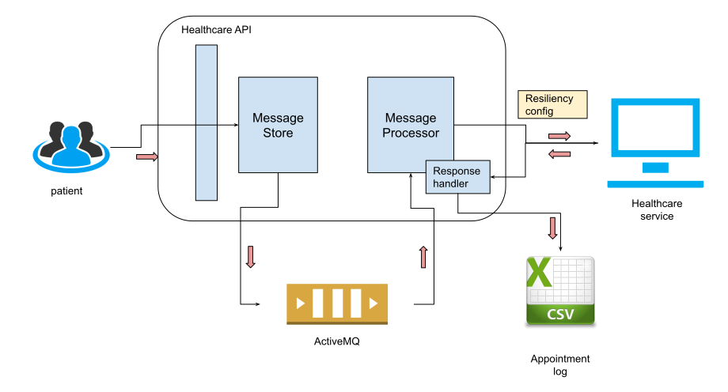

# Storing and forwarding messages

This example demonstrates how we can forward a message to an HTTP endpoint in a reliable manner. It uses `messageStore`
module to store message and forward it to HTTP endpoint with required resiliency measures. 

The high level sections of this guide are as follows:

- [Storing and forwarding messages](#Storing-and-forwarding-messages)
  - [What you'll build](#What-youll-build)
  - [Prerequisites](#Prerequisites)
  - [Implementation](#Implementation)
    - [Creating the project structure](#Creating-the-project-structure)
    - [Developing the service](#Developing-the-service)
  - [Deployment](#Deployment)
    - [Deploying locally](#Deploying-locally)
    - [Deploying on Docker](#Deploying-on-Docker)
  - [Testing](#Testing)
      - [Output](#Output)

## What you'll build

Let's consider a real world scenario where customers use a doctor channeling service. It facilitates channeling doctors 
at different hospitals registered in the system. The system need to process appointment requests in a reliable manner. 
However, the HTTP service that exposes the doctor channeling facility is not reliable. It is a legacy system that is 
hosted in a different network. Thus, sometimes there can be network issues when reaching the service. Owing to service
being legacy, it cannot process a lot of requests in parallel as well. The designers should be careful to regulate the 
traffic coming into this service. 

It is evident that we cannot expose the service directly to the users given the nature of the service. Thus we need to add
reliability the service using `store-and-forward` pattern. 

Messages coming in will be stored into a `message store` reliably, which is a queue of `ActiveMQ` instance. Then `message processor` 
will pick them up and forward to the doctor channeling service. Only if the forwarding is successful, message is removed from the 
queue. 

The following diagram illustrates the scenario:



## Prerequisites

- [Ballerina Distribution](https://ballerina.io/learn/getting-started/)
- A Text Editor or an IDE 
> **Tip**: For a better development experience, install one of the following Ballerina IDE plugins: [VSCode](https://marketplace.visualstudio.com/items?itemName=ballerina.ballerina), [IntelliJ IDEA](https://plugins.jetbrains.com/plugin/9520-ballerina)
- [Apache ActiveMQ](http://activemq.apache.org/getting-started.html))
 * After you install ActiveMQ, copy the .jar files from the `<AMQ_HOME>/lib` directory to the `<BALLERINA_HOME>/bre/lib` directory.
 * If you use ActiveMQ version 5.12.0, you only have to copy `activemq-client-5.12.0.jar`, `geronimo-j2ee-management_1.1_spec-1.0.1.jar`, and `hawtbuf-1.11.jar` from the `<AMQ_HOME>/lib` directory to the `<BALLERINA_HOME>/bre/lib` directory.


 ## Implementation
> If you want to skip the basics and move directly to the [Testing](#testing) section, you can download the project from git and skip the [Implementation](#implementation) instructions.

Take a look at the code samples below to understand how to implement each service. 


**message_storing_service.bal**
<!-- INCLUDE_CODE: guide/message_storing_service.bal -->

**reliable_message_forwarder.bal**
<!-- INCLUDE_CODE: guide/reliable_message_forwarder.bal -->


### Creating the project structure

Ballerina is a complete programming language that supports custom project structures. To implement the scenario in this 
guide, you can use the following package structure:

```
  storing-and-forwarding-messages
  |__guide
        |
        ├── message_storing_service.bal
        └── reliable_message_forwarder.bal
```

- Create the above directories in your local machine and also create the empty .bal files.
- Then open a terminal, navigate to , and run the Ballerina project initializing toolkit.

```bash
   $ ballerina init
```
Now that you have created the project structure, the next step is to develop the service.

### Developing the services

//TODO: how to import message store module?

1. First you need to implement `message_storing_service.bal` which will listen for HTTP messages over port 9091 and store messages. 
2. Then you need to implement `reliable_message_forwarder.bal` which will listen to messages on the store and forward them HTTP Hospital service backend.

## Deployment

Once you are done with the development, you can deploy the services using any of the methods listed below.

### Deploying locally

To deploy locally, navigate to asynchronous-messaging/guide, and execute the following command.

```bash
  $ ballerina build
```
This builds a Ballerina executable archive (.balx) of the services in the target folder. 
You can run them by 

```bash
  $ ballerina run <Exec_Archive_File_Name>
```

### Deploying on Docker

If necessary you can run the service that you developed above as a Docker container. The Ballerina language includes a Ballerina_Docker_Extension, which offers native support to run Ballerina programs on containers.

To run a service as a Docker container, add the corresponding Docker annotations to your service code.

Since ActiveMQ is a prerequisite in this guide, there are a few more steps you need to follow to run the service you developed in a Docker container.
Please navigate to (dockerhub) [https://hub.docker.com/r/webcenter/activemq] and follow the instructions. 


## Testing
Follow the steps below to invoke the service.

- Start `healthcare service` by  running healthcare.balx downloaded from [here](). TODO: fix the link
```bash
  $ ballerina run healthcare.balx
```

- On a new terminal, navigate to `<AMQ_HOME>/bin`, and execute the following command to start the ActiveMQ server.

```bash
  $ ./activemq start
```

- Navigate to `storing-and-forwarding-messages/guide`, and execute the following two commands in two separate terminals to start each service.

```bash
  $ ballerina run message_storing_service.bal
  $ ballerina run reliable_message_forwarder.bal 
```

- Create a file called input.json with following json request to simulate placing doctor appointments.

```json
  {
    "patient": {
      "name": "John Doe",
      "dob": "1940-03-19",
      "ssn": "234-23-525",
      "address": "California",
      "phone": "8770586755",
      "email": "johndoe@gmail.com"
    },
    "doctor": "thomas collins",
    "hospital": "grand oak community hospital",
    "appointment_date": "2025-04-02"
  }
```

- Send the message using curl 

```bash
  curl -v -X POST --data @input.json http://localhost:9091/healthcare/appointment --header "Content-Type:application/json"
```

- You will receive a response with HTTP Status code `202`. The CSV file with appointment detail will get updated with a new 
  record containing the information of the appointment made. 

  ```
  2019-07-05 17:34:22,387 INFO  [] - Response received Response status code= 200: {"appointmentNumber":1, "doctor":{"name":"thomas collins", "hospital":"grand oak community hospital", "category":"surgery", "availability":"9.00 a.m - 11.00 a.m", "fee":7000.0}, "patient":{"name":"John Doe", "dob":"1940-03-19", "ssn":"234-23-525", "address":"California", "phone":"8770586755", "email":"johndoe@gmail.com"}, "fee":7000.0, "confirmed":false, "appointmentDate":"2025-04-02"}
  ```

- In this example retry configuration for message processor is as follows. 

    ```
    //forwarding retry 
    retryInterval: 3000,
    retryHTTPStatusCodes:[500,400],
    maxRedeliveryAttempts: 5,
    ```
  
  To test reliable delivery, shutdown `healthcare service`. Then send the above curl message. Message processor will try to 
  deliver the message five times and then route it to DLC store. You will see following log message and message is forwarded
  to DLC Store (check message count of queue `myDLCStore` using ActiveMQ console).  

  ```
  2019-07-05 17:42:40,877 WARN  [wso2/messageStore] - Maximum retires breached when forwarding message to HTTP endpoint http://localhost:9090/grandoaks/categories/surgery/reserve. Forwarding message to DLC Store
  ``` 

  If you start back the `healthcare` service within 15 seconds, message will be delivered to the service and appointment file
  will get updated. 


