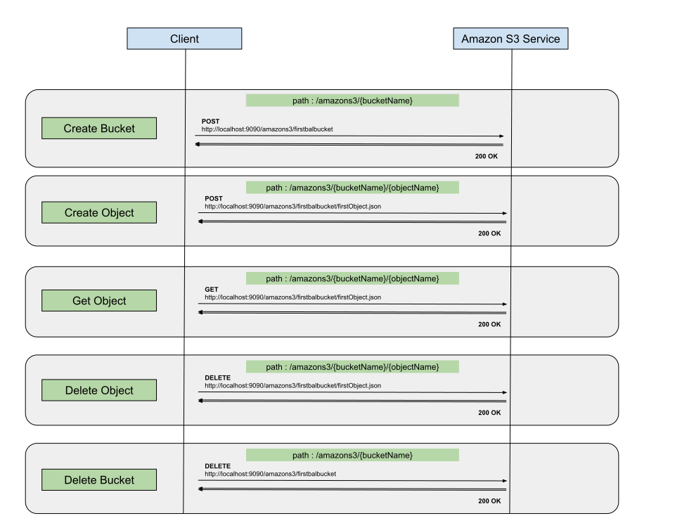

# Working with Amazon S3 client

## Overview
The Ballerina Amazon S3 client enables you to connect to the Amazon Simple Storage Service API. It allows users to interact 
with the Amazon S3 API to create, store, download, and use data with other services. 

This example explains how to use the S3 client to connect with the Amazon S3 instance and perform the following operations:
* Create Bucket
* List Buckets
* Create Object
* List Objects
* Get Object
* Delete Object
* Delete Bucket

## Prerequisites
- [Ballerina Distribution](https://ballerina.io/learn/getting-started/)
- A Text Editor or an IDE 
> **Tip**: For a better development experience, install one of the following Ballerina IDE plugins: [VSCode](https://marketplace.visualstudio.com/items?itemName=ballerina.ballerina), [IntelliJ IDEA](https://plugins.jetbrains.com/plugin/9520-ballerina)
- Obtain the credentials such as Access Key and Secret Access Key (API Secret) from Amazon S3 by following the steps below:
    1. Create an Amazon S3 account by visiting [https://aws.amazon.com/s3/](https://aws.amazon.com/s3/).
    2. Create a new access key, which includes a new secret access key.
        - To create a new secret access key for your root account, use the [security credentials](https://console.aws.amazon.com/iam/home?#security_credential) page. Expand the Access Keys section, and then click Create New Root Key.
        - To create a new secret access key for an IAM user, open the [IAM console](https://console.aws.amazon.com/iam/home?region=us-east-1#home). Click Users in the Details pane, click the appropriate IAM user, and then click Create Access Key on the Security Credentials tab.
    3. Download the newly created credentials, when prompted to do so in the key creation wizard.

Let's get started with a simple Ballerina program to integrate with Amazon S3.  

### Implementation
The following diagram illustrates all the required functionality of the Amazon S3 Service that you are going to build.



#### Creating the module structure
Ballerina is a complete programming language that can have any custom project structure as you wish. Although the 
language allows you to have any module structure, you can use the following simple module structure for this project.

```
working_with_amazons3_client_project
  └── src 
       └── working_with_amazons3_client_module
              └── working_with_amazons3_client.bal
  └── ballerina.conf
```
To create a new project you can use the ballerina new command as follows.
```
$ ballerina new working_with_amazons3_client_project
```
<b>NOTE : </b>Ballerina project cannot reside in another ballerina project. If you run ballerina new inside a ballerina 
project directory or in a sub-path of a ballerina project it will give an error.

Navigate to  `working_with_amazons3_client_project` directory and create the module `working_with_amazons3_client_module` 
using following command.

```
$ ballerina add working_with_amazons3_client_module
```

In the working_with_amazons3_client-module directory where you have your sample, create a `ballerina.conf` file and add the 
details you obtained above within the quotes.

```
ACCESS_KEY_ID = ""
SECRET_ACCESS_KEY = ""
```
Now that you have created the project structure, the next step is to develop the service.

#### Developing the service

The following code is the completed sample which exposes the following services:
- createBucket: Creates a new bucket on Amazon S3 instance with the provided name.
- createObject: Creates a new object on an existing Amazon S3 bucket.
- getObject: Retrieves an object from an Amazon S3 bucket.
- deleteObject: Deletes an existing object from an Amazon S3 bucket.
- deleteBucket: Deletes specified bucket from Amazon S3 instance.

```ballerina

import ballerina/config;
import ballerina/http;
import ballerina/log;

import wso2/amazons3;

// Constants for error codes and messages.
const string ERROR_CODE = "Sample Error";
const string RESPOND_ERROR_MSG = "Error in responding to client.";
const string CLIENT_CREATION_ERROR_MSG = "Error while creating the AmazonS3 client.";
const string BUCKET_CREATION_ERROR_MSG = "Error while creating bucket on Amazon S3.";
const string BUCKETS_RETRIEVING_ERROR_MSG = "Error while listing buckets on Amazon S3";
const string PAYLOAD_EXTRACTION_ERROR_MSG = "Error while extracting the payload from request.";
const string PAYLOAD_CONVERTION_ERROR_MSG = "Error occured while converting bucket list to json";
const string OBJECT_CREATION_ERROR_MSG = "Error while creating object on Amazon S3.";
const string OBJECTS_RETIEVING_ERROR_MSG = "Error while listing objects on bucket : ";
const string OBJECT_DELETION_ERROR_MSG = "Error while deleting object from Amazon S3.";
const string BUCKET_DELETION_ERROR_MSG = "Error while deleting bucket from Amazon S3.";
const string INVALID_PAYLOAD_MSG = "Invalid request payload";

// Create Amazons3 client configuration with the above accesskey and secretKey values.
amazons3:ClientConfiguration amazonS3Config = {
    accessKeyId: config:getAsString("ACCESS_KEY_ID"),
    secretAccessKey: config:getAsString("SECRET_ACCESS_KEY")
};

// Create AmazonS3 client with the above amazonS3Config.
amazons3:AmazonS3Client|error amazonS3Client = new(amazonS3Config);

@http:ServiceConfig {
    basePath: "/amazons3"
}
service amazonS3Service on new http:Listener(9090) {
    @http:ResourceConfig {
        methods: ["POST"],
        path: "/{bucketName}"
    }
    // Function to create a new bucket.
    resource function createBucket(http:Caller caller, http:Request request, string bucketName) {
        // Assign amazonS3Client global variable to a local variable
        amazons3:AmazonS3Client|error s3Client = amazonS3Client;
        if (s3Client is amazons3:AmazonS3Client) {
            // Define new response.
            http:Response backendResponse = new();
            // Invoke createBucket remote function from amazonS3Client.
            error? response = s3Client->createBucket(<@untainted> bucketName);
            if (response is error) {
                // Send the error response.
                createAndSendErrorResponse(caller, <@untainted> <string>response.detail()?.message,
                                BUCKET_CREATION_ERROR_MSG);
            } else {
                // If there is no error, then bucket created successfully. Send the success response.
                backendResponse.setTextPayload(<@untainted> string `${bucketName} created on Amazon S3.`,
                                contentType = "text/plain");
                respondAndHandleError(caller, backendResponse, RESPOND_ERROR_MSG);
            }
        } else {
            // Send the error response.
            createAndSendErrorResponse(caller, <string>s3Client.detail()?.message, CLIENT_CREATION_ERROR_MSG);
        }
    }

    @http:ResourceConfig {
        methods: ["GET"],
        path: "/"
    }
    // Function to list buckets.
    resource function listBuckets(http:Caller caller, http:Request request) {
        // Assign amazonS3Client global variable to a local variable
        amazons3:AmazonS3Client|error s3Client = amazonS3Client;
        if (s3Client is amazons3:AmazonS3Client) {
            // Define new response.
            http:Response backendResponse = new();
            // Invoke listBuckets remote function from amazonS3Client.
            var response = s3Client->listBuckets();
            if (response is error) {
                // Send the error response.
                createAndSendErrorResponse(caller, <@untainted> <string>response.detail()?.message,
                                BUCKETS_RETRIEVING_ERROR_MSG);
            } else {
                // If there is no error, then bucket list retrieved successfully. Send the bucket list.
                var list = json.constructFrom(response);
                if (list is json) {
                    backendResponse.setJsonPayload(<@untainted> list, contentType = "application/json");
                    respondAndHandleError(caller, backendResponse, RESPOND_ERROR_MSG);
                } else {
                    createAndSendErrorResponse(caller, <@untainted> <string>list.detail()?.message,
                                PAYLOAD_CONVERTION_ERROR_MSG);
                }
            }
        } else {
            // Send the error response.
            createAndSendErrorResponse(caller, <string>s3Client.detail()?.message, CLIENT_CREATION_ERROR_MSG);
        }
    }


    @http:ResourceConfig {
        methods: ["POST"],
        path: "/{bucketName}/{objectName}"
    }
    // Function to create a new object into an existing bucket.
    resource function createObject(http:Caller caller, http:Request request, string bucketName, string objectName) {
        // Assign amazonS3Client global variable to a local variable
        amazons3:AmazonS3Client|error s3Client = amazonS3Client;
        if (s3Client is amazons3:AmazonS3Client) {
            // Define new response.
            http:Response backendResponse = new();
            // Extract the object content from request payload.
            string|xml|json|byte[]|error objectContent = extractRequestContent(request);
            if objectContent is error {
                // Send the error response.
                createAndSendErrorResponse(caller, <@untainted> <string>objectContent.detail()?.message,
                                PAYLOAD_EXTRACTION_ERROR_MSG);
            } else {
                // Invoke createObject remote function from amazonS3Client.
                error? response = s3Client->createObject(<@untainted> bucketName, <@untainted> objectName,
                                                    <@untainted> objectContent);
                if (response is error) {
                    // Send the error response.
                    createAndSendErrorResponse(caller, <@untainted> <string>response.detail()?.message,
                                    OBJECT_CREATION_ERROR_MSG);
                } else {
                    // If there is no error, then object created successfully. Send the success response.
                    backendResponse.setTextPayload(<@untainted> string `${objectName} created on Amazon S3 bucket : ${bucketName}.`,
                                                contentType = "text/plain");
                    respondAndHandleError(caller, backendResponse, RESPOND_ERROR_MSG);
                }
            }
        } else {
            // Send the error response.
            createAndSendErrorResponse(caller, <string>s3Client.detail()?.message, CLIENT_CREATION_ERROR_MSG);
        }
    }

    @http:ResourceConfig {
        methods: ["GET"],
        path: "/{bucketName}/{objectName}"
    }
    // Function to get object.
    resource function getObject(http:Caller caller, http:Request request, string bucketName, string objectName) {
        // Assign amazonS3Client global variable to a local variable
        amazons3:AmazonS3Client|error s3Client = amazonS3Client;
        if (s3Client is amazons3:AmazonS3Client) {
            // Define new response.
            http:Response backendResponse = new();
            //Get the response content type from query params.
            string? params = request.getQueryParamValue("responseContentType");
            string responseContentType = <string> params;

            // Invoke getObject remote function from amazonS3Client.
            var response = s3Client->getObject(<@untainted> bucketName, <@untainted> objectName);
            if (response is amazons3:S3Object) {
                // S3Object will be returned on success.
                // Set the object content to the payload with the expected content type.
                backendResponse.setBinaryPayload(<@untainted> <byte[]>response["content"], contentType = <@untainted> responseContentType);
                respondAndHandleError(caller, backendResponse, RESPOND_ERROR_MSG);
            } else {
                // Send the error response.
                createAndSendErrorResponse(caller, <@untainted> <string>response.detail()?.message,
                                 "Error while creating object on Amazon S3.");
            }
        } else {
            // Send the error response.
            createAndSendErrorResponse(caller, <string>s3Client.detail()?.message, CLIENT_CREATION_ERROR_MSG);
        }
    }

    @http:ResourceConfig {
        methods: ["GET"],
        path: "/{bucketName}"
    }
    // Function to list objects.
    resource function listObjects(http:Caller caller, http:Request request, string bucketName) {
        // Assign amazonS3Client global variable to a local variable
        amazons3:AmazonS3Client|error s3Client = amazonS3Client;
        if (s3Client is amazons3:AmazonS3Client) {
            // Define new response.
            http:Response backendResponse = new();
            // Invoke listObjects remote function from amazonS3Client.
            var response = s3Client->listObjects(<@untainted> bucketName);
            if (response is error) {
                // Send the error response.
                createAndSendErrorResponse(caller, <@untainted> <string>response.detail()?.message,
                                OBJECTS_RETIEVING_ERROR_MSG + "${bucketName}.");
            } else {
                // If there is no error, then object list retrieved successfully. Send the object list.
                var list = json.constructFrom(response);
                if (list is json) {
                    backendResponse.setJsonPayload(<@untainted> list, contentType = "application/json");
                    respondAndHandleError(caller, backendResponse, RESPOND_ERROR_MSG);
                } else {
                    createAndSendErrorResponse(caller, <@untainted> <string>list.detail()?.message,
                                PAYLOAD_CONVERTION_ERROR_MSG);
                }
            }
        } else {
            // Send the error response.
            createAndSendErrorResponse(caller, <string>s3Client.detail()?.message, CLIENT_CREATION_ERROR_MSG);
        }
    }

    @http:ResourceConfig {
        methods: ["DELETE"],
        path: "/{bucketName}/{objectName}"
    }
    // Function to delete object.
    resource function deleteObject(http:Caller caller, http:Request request, string bucketName, string objectName) {
        // Assign amazonS3Client global variable to a local variable
        amazons3:AmazonS3Client|error s3Client = amazonS3Client;
        if (s3Client is amazons3:AmazonS3Client) {
            // Define new response.
            http:Response backendResponse = new();
            error? response = s3Client->deleteObject(<@untainted> bucketName, <@untainted> objectName);
            if (response is error) {
                // Send the error response.
                createAndSendErrorResponse(caller, <@untainted> <string>response.detail()?.message,
                                        OBJECT_DELETION_ERROR_MSG);
            } else {
                // If there is no error, then object deleted successfully. Send the success response.
                backendResponse.setTextPayload(<@untainted> string `${objectName} deleted from Amazon S3 bucket : ${bucketName}.`,
                                        contentType = "text/plain");
                respondAndHandleError(caller, backendResponse, RESPOND_ERROR_MSG);
            }
        } else {
            // Send the error response.
            createAndSendErrorResponse(caller, <string>s3Client.detail()?.message, CLIENT_CREATION_ERROR_MSG);
        }
    }

    @http:ResourceConfig {
        methods: ["DELETE"],
        path: "/{bucketName}"
    }
    // Function to delete bucket.
    resource function deleteBucket(http:Caller caller, http:Request request, string bucketName) {
        // Assign amazonS3Client global variable to a local variable
        amazons3:AmazonS3Client|error s3Client = amazonS3Client;
        if (s3Client is amazons3:AmazonS3Client) {
            // Define new response.
            http:Response backendResponse = new();
            // Invoke deleteBucket remote function from amazonS3Client.
            error? response = s3Client->deleteBucket(<@untainted> bucketName);
            if (response is error) {
                // Send the error response.
                createAndSendErrorResponse(caller, <@untainted> <string>response.detail()?.message,
                                        BUCKET_DELETION_ERROR_MSG);
            } else {
                // If there is no error, then bucket deleted successfully. Send the success response.
                backendResponse.setTextPayload(<@untainted> string `${bucketName} deleted from Amazon S3.`,
                                        contentType = "text/plain");
                respondAndHandleError(caller, backendResponse, RESPOND_ERROR_MSG);
            }
        } else {
            // Send the error response.
            createAndSendErrorResponse(caller, <string>s3Client.detail()?.message, CLIENT_CREATION_ERROR_MSG);
        }
    }
}

// Function to extract the object content from request payload
function extractRequestContent(http:Request request) returns @tainted string|xml|json|byte[]|error {
    string contentTypeStr = request.getContentType();
    if (equalsIgnoreCase(contentTypeStr, "application/json")) {
        var jsonObjectContent = request.getJsonPayload();
        if (jsonObjectContent is json) {
            return jsonObjectContent;
        }
    }
    if (equalsIgnoreCase(contentTypeStr, "application/xml")) {
        var xmlObjectContent = request.getXmlPayload();
        if (xmlObjectContent is xml) {
            return xmlObjectContent;
        }
    }
    if (equalsIgnoreCase(contentTypeStr, "text/plain")) {
        var textObjectContent = request.getTextPayload();
        if (textObjectContent is string) {
            return textObjectContent;
        }
    }
    var binaryObjectContent = request.getBinaryPayload();
    if (binaryObjectContent is byte[]) {
        return binaryObjectContent;
    } else {
        error err = error(ERROR_CODE, message = INVALID_PAYLOAD_MSG);
        return err;
    }
}

// Function to create the error response.
function createAndSendErrorResponse(http:Caller caller, string errorMessage, string respondErrorMsg) {
    http:Response response = new;
    //Set 500 status code.
    response.statusCode = 500;
    //Set the error message to the error response payload.
    response.setPayload(<string> errorMessage);
    respondAndHandleError(caller, response, respondErrorMsg);
}

// Function to send the response back to the client and handle the error.
function respondAndHandleError(http:Caller caller, http:Response response, string respondErrorMsg) {
    // Send response to the caller.
    var respond = caller->respond(response);
    if (respond is error) {
        log:printError(respondErrorMsg, err = respond);
    }
}

function equalsIgnoreCase(string str1, string str2) returns boolean {
    if (str1.toUpperAscii() == str2.toUpperAscii()) {
        return true;
    } else {
        return false;
    }
}
```
### Deployment

#### Deploying locally
You can deploy the services that you developed above in your local environment. You can create the Ballerina executable archives (.balx) first as follows.

**Building**

Navigate to `working_with_amazons3_client_project` and execute the following command.
```bash
$ ballerina build working_with_amazons3_client_module
```

### Testing

- Navigate to `working_with_amazons3_client_project`, and execute the following command to start the service:

```bash
$ ballerina run src/working_with_amazons3_client_module/working_with_amazons3_client.bal
```

#### Test createBucket service
- Invoke the following curl request to create a new bucket.
```
curl -v -X POST http://localhost:9090/amazons3/firstbalbucket
```
You see the response as follows:
```
firstbalbucket created on Amazon S3.
```

#### Test list Bucket service
- Invoke the following curl request to list buckets.
```
curl -X GET http://localhost:9090/amazons3
```

#### Test createObject service
##### (I) JSON Content
Create a file called `content.json` with following JSON content:
```json
{
    "name": "John Doe",
    "dob": "1940-03-19",
    "ssn": "234-23-525",
    "address": "California",
    "phone": "8770586755",
    "email": "johndoe@gmail.com",
    "doctor": "thomas collins",
    "hospital": "grand oak community hospital",
    "cardNo": "7844481124110331",
    "appointment_date": "2025-04-02"
}
```
- Invoke the following curl request to create a new object in the newly created bucket.
```
curl -v -X POST --data @content.json http://localhost:9090/amazons3/firstbalbucket/firstObject.json --header "Content-Type:application/json"
```
You see the response as follows:
```
firstObject.json created on Amazon S3 bucket : firstbalbucket.
```

##### (II) Binary Content
Let's upload an image (sample.jpg) to the s3 bucket we created above. 
- Invoke the following curl request to create a new object in the newly created bucket.
```
curl -v -X POST http://localhost:9090/amazons3/firstbalbucket/image.jpg -H 'Content-Type: image/jpg' -T sample.jpg
```
You see the response as follows:
```
image.jpg created on Amazon S3 bucket : firstbalbucket.
```

#### Test list Objects Service
- Invoke the following curl request to list objects in a bucket.
```
curl -X GET http://localhost:9090/amazons3/firstbalbucket
```

#### Test getObject service
##### (I) JSON Content
- Set the `responseContentType` as `application/json` to retrieve a JSON object and invoke the following curl request to get the newly created object.
```
curl -v -X GET http://localhost:9090/amazons3/firstbalbucket/firstObject.json?responseContentType=application/json
```
You see the response as follows:
```json
{
    "name": "John Doe",
    "dob": "1940-03-19",
    "ssn": "234-23-525",
    "address": "California",
    "phone": "8770586755",
    "email": "johndoe@gmail.com",
    "doctor": "thomas collins",
    "hospital": "grand oak community hospital",
    "cardNo": "7844481124110331",
    "appointment_date": "2025-04-02"
}
```

##### (II) Binary Content
- Set the `responseContentType` as image/jpg and use following URL to open newly created image on browser.
```
http://localhost:9090/amazons3/firstbalbucket/image.jpg?responseContentType=image/jpg
```

- Set the `responseContentType` as application/octet-stream and use the following URL to download newly created image.
```
http://localhost:9090/amazons3/firstbalbucket/image.jpg?responseContentType=application/octet-stream
```

#### Test deleteObject service
- Invoke the following curl request to delete the above object.
```
curl -v -X DELETE http://localhost:9090/amazons3/firstbalbucket/firstObject.json
```
You see the response as follows:
```
firstObject.json deleted on Amazon S3 bucket : firstbalbucket.
```

#### Test deleteBucket service
- Invoke the following curl request to delete the above bucket.
```
curl -v -X DELETE http://localhost:9090/amazons3/firstbalbucket
```
You see the response as follows:
```
firstbalbucket deleted from Amazon S3
```
