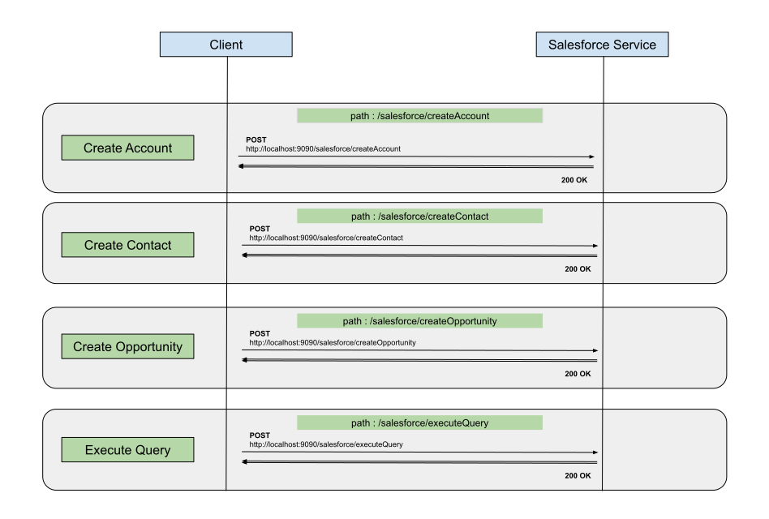

# Working with Salesforce client

## Overview
The Ballerina Salesforce client enables you to perform CRUD operations for SObjects, query using SOQL, search using 
SOSL and describe SObjects and organizational data through the Salesforce REST API.

This example explains how to use the Salesforce client to connect with the Salesforce instance and perform the 
following operations:

* Create Account with Contacts & Opportunities
* Create a Contact for a given Account ID
* Create a Opportunity for a given Account ID
* Execute a SOQL query

## Prerequisites
- [Ballerina Distribution](https://ballerina.io/learn/getting-started/)
- A Text Editor or an IDE 
> **Tip**: For a better development experience, install one of the following Ballerina IDE plugins: 
[VSCode](https://marketplace.visualstudio.com/items?itemName=ballerina.ballerina), 
[IntelliJ IDEA](https://plugins.jetbrains.com/plugin/9520-ballerina)
- Create a Salesforce account and create a connected app by visiting [Salesforce](https://www.salesforce.com) 
and obtain the following parameters:
    - Base URl (Endpoint)
    - Client Id
    - Client Secret
    - Access Token
    - Refresh Token
    - Refresh URL

- Visit 
[here](https://help.salesforce.com/articleView?id=remoteaccess_authenticate_overview.htm) for more information on 
obtaining OAuth2 credentials.

Let's get started with a simple Ballerina program to integrate with Salesforce API.

### Implementation
The following diagram illustrates all the required functionality of the Salesforce Service that you are going to build.



#### Creating the module structure
Ballerina is a complete programming language that can have any custom project structure as you wish. Although the 
language allows you to have any module structure, you can use the following simple module structure for this project.
```
working-with-salesforce-client
    └── src
         └── guide
               └── tests
               └── resources
               └── ballerina.conf
               └── working_with_salesforce_client.bal
```
- In the `working-with-salesforce-client/src/guide` directory there is a `ballerina.conf` file, which you should enter
all the confugurations related to the guide. Add the following details you obtained above within the quotes.
``` ballerina
EP_URL = ""
ACCESS_TOKEN = ""
CLIENT_ID = ""
CLIENT_SECRET = ""
REFRESH_TOKEN = ""
REFRESH_URL = ""
```

- Open a terminal, navigate to `working-with-salesforce-client` directory, and run the following Ballerina command to 
run the `guide` module.
```bash
$ ballerina run --config src/guide/ballerina.conf guide
```

Then you will see salesforce service is up and running in the port 9090.

#### Developing the service

The following code is the completed sample which exposes the following services:
- createAccount: Creates a new Account and related Contacts & Opportunities using the given JSON.
- createContact: Creates a new Contact using given Contact details.
- createOpportunity: Creates a new Opportunity using given Opportunity details.
- executeQuery: Execute a given SOQL query and return results as a JSON.

<!-- INCLUDE_CODE: guide/src/working_with_salesforce_client.bal -->

### Deployment

#### Deploying locally
You can deploy the services that you developed above in your local environment. You can create the Ballerina executable 
archives (.balx) first as follows.

**Building**

Navigate to `working-with-salesforce-client` and execute the following command.
```bash
$ ballerina build guide
```

After the build is successful, there will be a `working_with_amazons3_client.balx` file inside the target directory. 
You can execute it as follows.

```bash
$ ballerina run working_with_amazons3_client.balx
```

### Testing

- Navigate to `working-with-salesforce-client`, and execute the following command to start the service:

```bash
$ ballerina run working_with_amazons3_client.bal
```

#### Test createAccount service

- Create a file called `account.json` with following JSON content:
```json
{
    "Name": "Levi Straus & Co",
    "BillingCity": "California",
    "Website": "www.levis-clothing.com",
    "Contacts": [
        {
            "FirstName": "Sam",
            "LastName": "Pattinson",
            "Title": "Senior Manager",
            "Department": "Sales",
            "Email": "sampat@levis.com"
        },
        {
            "FirstName": "John",
            "LastName": "Auguero",
            "Title": "Assistant Manager",
            "Department": "Sales",
            "Email": "auguero@levis.com"
        }
    ],
    "Opportunities": [
        {
            "Name": "Mens 501 Summer Collection",
            "Amount": 235000,
            "CloseDate": "2019-05-21",
            "Probability": 100,
            "StageName": "Qualification"
        },
        {
            "Name": "Mens 510 Summer Collection",
            "Amount": 330000,
            "CloseDate": "2019-05-27",
            "Probability": 90,
            "StageName": "Qualification"
        }
    ]
}
```

- Invoke the following curl request to create a new Account and related Contacts & Opportunities using the created 
JSON file.
```bash
curl -X POST -H "Content-Type: application/json" -d @account.json http://localhost:9090/salesforce/createAccount
```

- You see the response as follows:
```
Account created successfully with id: <ACCOUNT_ID>
```

#### Test createContact service

Create a file called `contact.json` with following JSON content & Add the Account ID of the above created Account.
```json
{
    "AccountId": "<ACCOUNT_ID_OF_THE_CREATED_ACCOUNT>",
    "FirstName": "Augustus",
    "LastName": "Lorraine",
    "Title": "Senior Manager",
    "Department": "Delivery",
    "Email": "augustus@levis.com"
}
```

- Invoke the following curl request to create a new Contact for the newly created Account.
```bash
curl -X POST -H "Content-Type: application/json" -d @contact.json http://localhost:9090/salesforce/createContact
```
You see the response as follows:
```
{"contactId":"0032v00002qX9q7AAC"}
```

#### Test createOpportunity service

Create a file called `opportunity.json` with following JSON content & Add the Account ID of the above created Account.
```json
{
	"AccountId": "<ACCOUNT_ID_OF_THE_CREATED_ACCOUNT>",
	"Name": "Women's 502 Spring & Summer Collection",
	"Amount": 17750.00,
	"CloseDate": "2019-04-11",
	"Probability": 95,
	"StageName": "Qualification"
}
```

- Invoke the following curl request to create a new Opportunity for the newly created Account.
```bash
curl -X POST -H "Content-Type: application/json" -d @opportunity.json http://localhost:9090/salesforce/createOpportunity
```

You see the response as follows:
```
{"opportunityId":"0062v00001EvX75AAF"}
```

#### Test executeQuery service

Here we are going to query and retrieve IDs and Names of all the opportunities related to the newly added account.
We can achieve this by running following SOQL query.
```sql
SELECT Id, Name FROM Opportunity WHERE AccountId = '<ACCOUNT_ID_OF_THE_CREATED_ACCOUNT>'
```

- Invoke the following curl request to execute the query.
```bash
curl -X POST -H "Content-Type: text/plain" -d "SELECT Id, Name FROM Opportunity WHERE AccountId = '<ACCOUNT_ID_OF_THE_CREATED_ACCOUNT>'" http://localhost:9090/salesforce/executeQuery
```

You see the response as follows:
```json
{
    "totalSize": 3,
    "done": true,
    "records": [
        {
            "attributes": {
                "type": "Opportunity",
                "url": "/services/data/v46.0/sobjects/Opportunity/0062v00001ErIvIAAV"
            },
            "Id": "0062v00001ErIvIAAV",
            "Name": "Mens 510 Summer Collection"
        },
        {
            "attributes": {
                "type": "Opportunity",
                "url": "/services/data/v46.0/sobjects/Opportunity/0062v00001EvX75AAF"
            },
            "Id": "0062v00001EvX75AAF",
            "Name": "Women's 502 Spring & Summer Collection"
        },
        {
            "attributes": {
                "type": "Opportunity",
                "url": "/services/data/v46.0/sobjects/Opportunity/0062v00001ErIvDAAV"
            },
            "Id": "0062v00001ErIvDAAV",
            "Name": "Mens 501 Summer Collection"
        }
    ]
}
```
